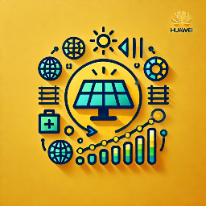

# Huawei Solar Energy Management (HSEM) for Home Assistant

[![GitHub Release][releases-shield]][releases]
[![GitHub Downloads][downloads-shield]][downloads]
[![License][license-shield]][license]
[![BuyMeCoffee][buymecoffeebadge]][buymecoffee]
[![codecov][codecov-shield]][codecov]

## Introduction

**Huawei Solar Energy Management (HSEM)** is a modular, secure, and highly configurable Home Assistant integration for optimizing Huawei solar batteries, inverters, and related energy devices. HSEM automates battery charging/discharging, grid export/import, and adapts to dynamic energy prices, solar forecasts, and EV charging events.

---

## Features

### Core Optimization
- **MILP-based planner** — global optimal charge/discharge scheduling via linear programming (HiGHS solver)
- **8-term cost function** — rigorous mathematical formulation with formal invariants
- **Multiple candidate strategies** — baseline, passive, aggressive, partial-SoC, and MILP-optimal plans
- **Time-discounted candidate selection** — prefers near-term savings over far-future gains

### Battery Intelligence
- **Dynamic self-learning discharge floor** — reserves enough energy to bridge the house to the next solar surplus or cheap grid window, with self-correcting safety margin
- **Temperature-adaptive charge rate learning** — 7 temperature buckets track actual charge power at p90, adapting to cold-weather limitations
- **Battery capacity auto-detection** — learns usable capacity from BMS kWh-remaining readings in the 15-85 % SoC range
- **Cycle cost accounting** — wear-and-tear costs factored into every charge/discharge decision
- **Grid overcurrent protection** — respects main fuse rating, caps total grid draw
- **Weekday/weekend consumption profiling** — separate EWMA load profiles for workdays and weekends improve prediction accuracy

### Solar & Forecast
- **Solar forecast accuracy auto-correction** — per-hour learned factors (4-day rolling) + intra-hour residual correction (2h decay)
- **Configurable solar confidence** — plans against a user-selectable percentile (10-90 %) of historical forecast accuracy
- **48-hour PV horizon** — Solcast today + tomorrow integration
- **PV curtailment detection** — detects when the inverter throttles solar production

### EV Charging
- **MILP EV co-optimisation** — EV charging scheduled alongside battery in one LP solve
- **Session-aware EV demand** — treats actively-charging EV as certain demand for the next 2 hours
- **Embedded OCPP 1.6 server** — direct EV charger control via WebSocket (Easee, Zaptec, Wallbox, etc.)
- **Auto-Full on negative prices** — automatically charges EV at full power when electricity is free
- **Dual EV support** — independent configuration and planning for two EVs

### Financial Visibility
- **Export income / import cost / net balance sensors** — monetary, cumulative, HA Energy dashboard compatible
- **Savings tracker** — actual vs missed savings with 90-day rolling log
- **Prediction accuracy scorecard** — 7-day and 30-day SoC MAE, solar MAPE, action mix
- **Daily plan-vs-actual tracking** — compares planned and actual energy flows

### Safety & Trust
- **Read-only / monitoring mode** — observe what HSEM would do before enabling control
- **Degraded mode** — safely degrades when critical entities are missing
- **Hardware write verification** — confirms inverter accepted every command
- **Data quality diagnostics** — reports missing price/PV data per horizon day

### User Experience
- **Quick setup wizard** — auto-detects Huawei Solar, Solcast, and price entities
- **Bundled Lovelace dashboard** — 6-view dashboard with price charts, energy flow, savings, and accuracy
- **Live-configurable** — all thresholds and settings editable from the dashboard without restart
- **`hsem.create_dashboard` service** — install or update the bundled Lovelace dashboard from Developer Tools
- **Bilingual** — English and Danish translations

---

## Quick Start

1. **Remove any previous Huawei Solar Battery Optimization Project integrations.**
2. **Install HSEM** via Home Assistant's custom integrations or manually.
3. **Configure your sensors** for solar battery, inverter, grid, and EV charger (if present).
4. **Set up battery schedules** in HSEM (do not use Fusion Solar app for scheduling).
5. **Let HSEM run for at least 14 days** to collect historical data for optimal performance.
6. **Monitor the Working Mode Sensor** for system status and recommendations.

**Tip:**
If you are a new user and want to safely observe how HSEM would control your battery system without making any changes, enable the **Read-Only** mode. This acts as a "dry run" and allows you to review all proposed configuration changes before they are applied.

For detailed documentation, see the [HSEM Wiki](https://github.com/woopstar/hsem/wiki) or the [`docs/`](docs/) directory.

---

## Requirements

To use this package, you need the following integrations:

- [Huawei Solar integration by wlcrs](https://github.com/wlcrs/huawei_solar) **VERSION 1.5.0a1 REQUIRED**
- [Solcast integration by oziee](https://github.com/BJReplay/ha-solcast-solar)
- Any electricity price integration ([Energi Data Service](https://github.com/MTrab/energidataservice), [Nordpool](https://github.com/custom-components/nordpool), [Amber Electric](https://amber.com.au), etc.)

### Complementary integrations

The following integrations work alongside HSEM but are **not required**:

- [Huawei Solar PEES package by JensenNick](https://github.com/JensenNick/huawei_solar_pees)
- [Smoothing Analytics Sensors by woopstar](https://github.com/woopstar/smoothing_analytics_sensors)
- [EV Smart Charging by jonasbkarlsson](https://github.com/jonasbkarlsson/ev_smart_charging)

### Default disabled sensors

The [Huawei Solar integration by wlcrs](https://github.com/wlcrs/huawei_solar) provides `sensor.inverter_active_power_control` and `sensor.batteries_rated_capacity` but they are disabled by default. To use these entities, go to the device settings, select the inverter or batteries device and show hidden/disabled entities. Find the `sensor.inverter_active_power_control` and `sensor.batteries_rated_capacity` and enable them.

---

## Installation

### Method 1: HACS (Home Assistant Community Store)

1. In HACS, go to **Integrations**.
2. Click the three dots in the top-right corner, and select **Custom repositories**.
3. Add this repository URL and select **Integration** as the category:
   `https://github.com/woopstar/hsem`
4. Click **Add**.
5. The integration will now appear in HACS under the **Integrations** section. Click **Install**.
6. Restart Home Assistant.

### Method 2: Manual Installation

1. Copy the `hsem` folder to your `custom_components` folder in your Home Assistant configuration.
2. Restart Home Assistant.
3. Add the integration via the Home Assistant integrations page and configure your settings.

---

## Removal

1. In Home Assistant, go to **Settings** -> **Devices & Services**.
2. Find the **HSEM** integration, click the menu icon (three dots), and select **Delete**.
3. Restart Home Assistant.

### If installed via HACS

4. In HACS, go to **Integrations**, find HSEM, click the menu icon (three dots), and select **Remove**.
5. Restart Home Assistant again.

### If installed manually

4. Delete the `custom_components/hsem` folder from your Home Assistant configuration directory.
5. Restart Home Assistant.

After removal, verify that no HSEM entities remain in **Settings** -> **Devices & Services** -> **Entities**.

---

## Documentation

Full documentation is available on the **[HSEM Wiki](https://github.com/woopstar/hsem/wiki)** and in the [`docs/`](docs/) directory:

- **[Home](https://github.com/woopstar/hsem/wiki/Home)** — User-facing overview: features, FAQ, working modes, battery schedules, excess export, and more
- **[Architecture Overview](https://github.com/woopstar/hsem/wiki/architecture-overview)** — System context, layered architecture, module map
- **[Planner Specification](docs/planner-spec.md)** — Normative planner invariants, solar correction, dynamic floor, session EV
- **[Planner Technical Guide](docs/planner-guide.md)** — How the planner works with worked examples, solar correction, dynamic floor
- **[Cost Function Math](docs/cost-function-math.md)** — Complete mathematical formulation of the 8-term cost function
- **[Sensors Reference](docs/sensors-reference.md)** — Complete entity reference: ~40 sensors, switches, numbers, and more
- **[Config Flow Reference](docs/config-flow-reference.md)** — Setup wizard steps including quick setup and OCPP
- **[EV Charge Plan Setup](docs/ev-charge-plan-setup.md)** — EV planned load and OCPP charger configuration
- **[Dashboard Setup](docs/dashboard-setup.md)** — Bundled Lovelace dashboard with 6 views
- **[Consumption Prediction](docs/consumption-prediction.md)** — ML ridge regression with DOW + DOY + temperature features
- **[MILP Optimization](docs/milp-optimization.md)** — LP formulation, EV co-optimisation, session-aware demand
- **[Forecast Accuracy Tracking](docs/forecast-accuracy-tracking.md)** — Solar correction and prediction accuracy
- **[Troubleshooting Guide](https://github.com/woopstar/hsem/wiki/troubleshooting-guide)** — Diagnose and fix common problems
- **[All Documentation](docs/index.md)** — Full index of all documentation files

---

[releases-shield]: https://img.shields.io/github/v/release/woopstar/hsem?style=for-the-badge
[releases]: https://github.com/woopstar/hsem/releases
[downloads-shield]: https://img.shields.io/github/downloads/woopstar/hsem/total.svg?style=for-the-badge
[downloads]: https://github.com/woopstar/hsem/releases
[license-shield]: https://img.shields.io/github/license/woopstar/hsem?style=for-the-badge
[license]: https://github.com/woopstar/hsem/blob/main/LICENSE
[buymecoffeebadge]: https://img.shields.io/badge/buy%20me%20a%20coffee-donate-FFDD00.svg?style=for-the-badge&logo=buymeacoffee
[buymecoffee]: https://www.buymeacoffee.com/woopstar
[codecov-shield]: https://codecov.io/github/woopstar/hsem/graph/badge.svg?token=3ATOWIWP5G
[codecov]: https://codecov.io/github/woopstar/hsem
