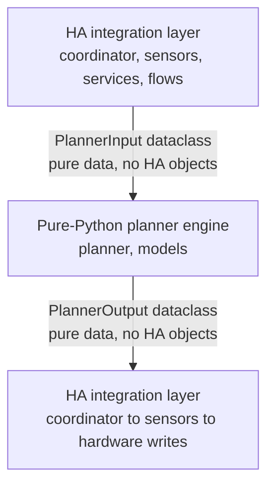

# ADR-001: Pure-Python Planner Extraction

**Status:** Accepted (retrospective)

**Date:** 2026-05-08

## Context

The HSEM integration originally had the planning logic tightly coupled with
Home Assistant runtime concepts — sensor states, coordinator callbacks, and
entity models were all mixed together in the same modules. This caused several
problems:

1. **Testing friction:** Every test required a Home Assistant test harness
   (`pytest-homeassistant-custom-component`), making tests slow, fragile, and
   difficult to write.
2. **Non-determinism:** Runtime state leaks (e.g. HA event loops, sensor
   availability races) could produce different planner outputs for the same
   input data.
3. **Slow iteration:** Running a single unit test required loading HA core,
   sensors, and the coordinator — a multi-second overhead per test.
4. **Poor separation of concerns:** Business logic (charge/discharge scheduling,
   cost calculation, SoC simulation) was interleaved with infrastructure
   (config entry parsing, entity state reading, service calls).

The project needed a clear boundary between "what the planner computes" and
"how HA delivers inputs and consumes outputs."

## Decision

Extract all planning logic into a **pure-Python layer** with zero Home Assistant
imports. This layer lives in `custom_components/hsem/planner/` and depends only
on the Python standard library (plus `scipy` for the optional MILP solver).

### Architecture boundary

- **`models/planner_inputs.py`** and **`models/planner_outputs.py`** define the
  boundary dataclasses. These are pure Python — they contain only fields,
  no HA entity references, no `hass` objects.
- **`planner/engine_core.py`** orchestrates the full planning pipeline:
  slot population → scheduling → candidate generation → SoC simulation
  → cost scoring → selection.
- **`coordinator.py`** (HA-dependent) is responsible for:
  - Reading HA entity states via `state_collector.py`
  - Building `PlannerInput` from `SensorConfig` + `LiveState`
  - Calling the planner engine
  - Writing results back to HA sensors

### Planner modules

| Module | Responsibility | HA imports |
|---|---|---|
| `planner/engine_core.py` | Pipeline orchestration | None |
| `planner/slot_population.py` | Build time horizon | None |
| `planner/charge_scheduler.py` | Charge schedule logic | None |
| `planner/discharge_scheduler.py` | Discharge schedule logic | None |
| `planner/candidate_generator.py` | Candidate plan generation | None |
| `planner/candidate_selector.py` | Candidate scoring + selection | None |
| `planner/cost_function.py` | Cost/score calculation | None |
| `planner/soc_simulation.py` | Battery SoC forward sim | None |
| `planner/milp_optimizer.py` | LP solver (scipy HiGHS) | None |
| `planner/ev_planner.py` | EV charging plan builder | None |
| `planner/engine_explanation.py` | Human-readable explanations | None |

### Data boundary enforcement

- `PlannerInput` contains only primitives, dataclasses, and enums — no HA
  `Entity`, `ConfigEntry`, or `hass` references.
- `PlannerOutput` contains `PlannedSlot`, candidate metadata, and cost
  breakdowns — all plain dataclasses.
- The `coordinator_builder.py` module bridges the gap: it converts HA types
  to `PlannerInput` via pure mapping functions.

## Consequences

### Positive

- **Deterministic planner:** Same `PlannerInput` always produces the same
  `PlannerOutput`, enabling reproducible debugging and regression testing.
- **Fast unit tests:** Planner tests run in < 10 ms with plain `pytest` —
  no HA harness needed. A full planning cycle completes in < 100 ms on
  commodity hardware.
- **Clear testing strategy:** Planner logic tests are pure `pytest`.
  Integration tests (coordinator → planner → output) use the HA test
  harness but only need to verify the boundary, not the internal logic.
- **Separate evolution:** Planner math can be improved without touching HA
  integration code, and vice versa.
- **Open-source reuse:** The pure-Python planner could potentially be reused
  by other Home Assistant integrations or standalone tools.

### Negative

- **Two sets of tests:** Planner tests (pure pytest) + integration tests
  (HA test harness). Developers must understand both testing approaches.
- **Mapping overhead:** `coordinator_builder.py` must faithfully map HA types
  to `PlannerInput` — any mismatch produces silent planner errors.
- **Slight indirection:** Adding a new planner input requires updating both
  the HA side (state collector) and the model layer (`PlannerInput`).

### Mitigations

- The `coordinator_builder.py` mapping functions are kept as thin, purely
  structural transformations — no business logic.
- Integration tests in `tests/test_coordinator.py` verify that a full HA
  cycle produces a valid `PlannerOutput`.
- `PlannerInput` and `PlannerOutput` have strict type annotations caught
  by `pyright` during CI.

## Alternatives Considered

### Option A: Keep tight coupling (status quo ante)

*Rejected because:* Testing friction and non-determinism made the planner
difficult to maintain. Every change required full HA test harness setup.

### Option B: Abstract base class with HA and planner implementations

*Rejected because:* Would have created leaky abstractions — planner methods
would need to accept or return HA types at some boundary. Pure data boundary
is simpler and more testable.

### Option C: Separate standalone library (pip package)

*Rejected because:* HSEM is a Home Assistant integration; extracting the
planner as a separate pip package would require managing versioning,
releases, and dependency sync. The current in-repo separation achieves the
same decoupling without the overhead of a library release process.

## Related

- `custom_components/hsem/planner/`
- `custom_components/hsem/models/planner_inputs.py`
- `custom_components/hsem/models/planner_outputs.py`
- `docs/planner-spec.md`
- `docs/architecture-overview.md`
