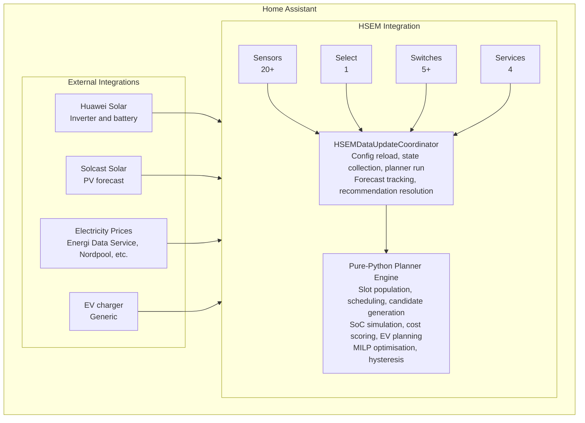

# HSEM Architecture Overview

> **Home Assistant Solar Energy Management (HSEM)** — a complete battery-optimisation
> integration for Home Assistant that minimises grid electricity costs by intelligently
> scheduling battery charge and discharge cycles using PV forecasts, electricity prices,
> and consumption predictions.

---

## Table of Contents

1. [System context](#system-context)
2. [Layered architecture](#layered-architecture)
3. [Module responsibility map](#module-responsibility-map)
4. [Planning pipeline](#planning-pipeline)
5. [Key design decisions](#key-design-decisions)
6. [Dependency graph](#dependency-graph)

---

## System context

### External dependencies

| Integration | Purpose | Data provided |
|---|---|---|
| **Huawei Solar** (`wlcrs/huawei_solar`) | Inverter/battery hardware interface | SoC, power limits, working mode, TOU periods, rated capacity |
| **Solcast Solar** (`solcast_solar`) | PV production forecast | Per-hour PV estimates for today and tomorrow |
| **Energi Data Service** (`energidataservice`) | Electricity spot prices | Hourly import and export prices |
| **EV charger** (generic) | EV state monitoring | Connected status, SoC, charging power |

---

## Layered architecture

HSEM follows a strict three-layer architecture:

### Layer 1: Home Assistant integration layer

Files that depend on Home Assistant runtime (`hass`, `ConfigEntry`, entity models).

| Module | Responsibility |
|---|---|
| `__init__.py` | Entry point, platform setup, version check, service registration |
| `config_flow.py` | Initial configuration wizard |
| `options_flow.py` | Configuration editing wizard |
| `coordinator.py` | `DataUpdateCoordinator` — orchestrates the update cycle |
| `coordinator_builder.py` | Pure data-mapping functions (bridge between HA and planner) |
| `sensor.py` | Platform setup for all sensor entities |
| `select.py` | Working-mode selector entity |
| `switch.py` | Toggle entities (read-only, schedules, EV force discharge) |
| `entity.py` | Base entity classes (`HSEMEntity`, `HSEMCoordinatorEntity`) |
| `diagnostics.py` | HA diagnostics hook |
| `services.py` | Service call handlers |
| `time.py` | Time platform entities |

### Layer 2: Custom sensor layer

HA-dependent sensor entities that consume coordinator data.

| Module | Responsibility |
|---|---|
| `custom_sensors/working_mode_sensor.py` | Main recommendation sensor + hardware writes |
| `custom_sensors/config_reader.py` | Reads config entry → `SensorConfig` |
| `custom_sensors/state_collector.py` | Reads HA entities → `LiveState` |
| `custom_sensors/hourly_data_populator.py` | Populates prices & PV into slots |
| `custom_sensors/recommendation_resolver.py` | Real-time post-planner adjustments |
| `custom_sensors/applier.py` | Executes hardware writes |
| `custom_sensors/forecast_accuracy_sensor.py` | Forecast vs actual diagnostic sensor |
| `custom_sensors/ev_optimal_charging_plan_sensor.py` | Primary EV plan sensor |
| `custom_sensors/ev_second_optimal_charging_plan_sensor.py` | Second EV plan sensor |
| `custom_sensors/*.py` | Various diagnostic sensors (20+ total) |

### Layer 3: Pure-Python planner layer

**No Home Assistant imports.** Fully testable with plain `pytest`.

| Module | Responsibility |
|---|---|
| `planner/engine_core.py` | Orchestrates the full planning pipeline |
| `planner/slot_population.py` | Builds time horizon, populates prices/PV/consumption |
| `planner/charge_scheduler.py` | Assigns charge recommendations |
| `planner/discharge_scheduler.py` | Assigns discharge recommendations |
| `planner/candidate_generator.py` | Generates 8+ candidate strategies |
| `planner/candidate_selector.py` | Scores, validates, picks best candidate |
| `planner/cost_function.py` | 8-term cost function (money + selector) |
| `planner/soc_simulation.py` | Forward battery SoC simulation |
| `planner/milp_optimizer.py` | LP solver for global optimum (scipy) |
| `planner/ev_planner.py` | EV charging plan builder |
| `planner/engine_explanation.py` | Human-readable plan explanations |

### Utils layer (shared, minimal HA imports)

| Module | Responsibility |
|---|---|
| `utils/recommendations.py` | `Recommendations` enum + canonical frozensets |
| `utils/misc.py` | Shared math helpers, config reading, entity lookups |
| `utils/sensornames.py` | All HA entity name constants |
| `utils/prices.py` | Price lookup, grid fee calculation |
| `utils/huawei.py` | Huawei Solar inverter API helpers |
| `utils/logger.py` | `HSEM_LOGGER` — rotating file handler |
| `utils/datetime_utils.py` | Canonical datetime/slot-key normalisation |
| `utils/degraded_mode.py` | Health-state classification |
| `utils/diagnostics.py` | Safe redacted dumps |
| `utils/forecast_tracker.py` | Forecast vs actual accuracy metrics |
| `utils/inverter_verify.py` | Write-and-verify wrapper |
| `utils/config_validator.py` | Config validation |
| `utils/units.py` | Unit conversions |

### Models layer (pure-Python dataclasses)

| Module | Responsibility |
|---|---|
| `models/planner_inputs.py` | `PlannerInput`, `PricePoint`, `SolcastSlot`, etc. |
| `models/planner_outputs.py` | `PlannerOutput`, `PlannedSlot`, `DataQuality`, etc. |
| `models/live_state.py` | `LiveState`, `EVLiveState` — HA entity snapshots |
| `models/sensor_config.py` | `SensorConfig`, `EVChargerConfig`, `BatteryScheduleConfig` |
| `models/state_snapshot.py` | `StateSnapshot` — frozen immutable HA state collection |
| `models/time_series.py` | `TimeSeriesIndex`, `SlotKey` — shared slot alignment |
| `models/hourly_recommendation.py` | `HourlyRecommendation` — per-slot planner output |
| `models/battery_schedule.py` | `BatterySchedule` dataclass |

---

## Planning pipeline

The coordinator runs this pipeline every update cycle (default: every 5 minutes):

```mermaid
flowchart TD
    A[Reload config from ConfigEntry]
    B[Collect live HA entity states\nstate_collector]
    C[Build SensorConfig from config entry]
    D[Generate recommendation time-slots]
    E[Build battery-schedule objects]
    F[Populate weighted house-consumption averages]
    G[Populate electricity prices and Solcast PV estimates]

    subgraph Planner[Run pure-Python planner engine]
        H1[Build time-series index]
        H2[Build empty slots]
        H3[Populate prices, PV, consumption]
        H4[Mark time-passed slots]
        H5[Populate battery capacity]
        H6[Populate net consumption\npass 1 without EV]
        H7[Apply discharge schedules]
        H8[Apply charge schedules and arbitrage]
        H9[Apply excess export]
        H10[Apply seasonal optimisation]
        H11[Build EV charging plan\nfrom net surplus]
        H12[Populate net consumption\npass 2 with EV]
        H13[Generate 8+ candidate plans]
        H14[Simulate SoC for each candidate]
        H15[Score all candidates]
        H16[Apply plan-level hysteresis]
        H17[Select best candidate]
        H18[Apply EV load labelling\nlayer 2]
        H19[Build explanation]

        H1 --> H2 --> H3 --> H4 --> H5 --> H6 --> H7 --> H8 --> H9 --> H10
        H10 --> H11 --> H12 --> H13 --> H14 --> H15 --> H16 --> H17 --> H18 --> H19
    end

    I[Resolve current slot recommendation\nruntime resolver]
    J[Accumulate forecast vs actual data]
    K[Package CoordinatorData and notify subscribers]

    A --> B --> C --> D --> E --> F --> G --> H1
    H19 --> I --> J --> K
```

---

## Key design decisions

### 1. Pure-Python planner (no HA imports)

The entire planner engine (`planner/`) and all models (`models/`) are pure Python
with zero Home Assistant imports. This makes them:

- **Fully testable** with plain `pytest` — no HA instance needed
- **Deterministic** — same input always produces same output
- **Fast** — a full planning cycle completes in < 100 ms on commodity hardware

### 2. Two-currency cost function (money vs selector score)

The cost function returns two distinct aggregates:

- **`total_cost`** — the real-money outcome (sum of grid import cost, export revenue, cycle cost, conversion loss). Auditable and comparable to an electricity bill.
- **`score`** — the selector objective. Equals `total_cost` plus synthetic penalties (SoC guard, grid limit, override) and terminal-SoC opportunity cost. The selector picks the plan with the lowest **score**, not the lowest money cost.

This split prevents the selector from preferring plans that look cheap only because they drain the battery to zero or violate soft safety constraints.

### 3. MILP global optimisation

Battery scheduling is globally an NP-hard combinatorial problem. HSEM solves it with:

- A rule-based heuristic (8+ candidate strategies) for fast, reliable daily use
- An LP solver (scipy's HiGHS) that finds the globally optimal solution when available
- The MILP winner can reinforce or replace the heuristic winner

### 4. Three-layer recommendation system

Recommendations are assigned in three consecutive layers, each with strict priority rules:

- **Layer 1** — Planner engine: discharge schedules → charge schedules → excess export → seasonal fill
- **Layer 2** — EV labelling: post-simulation re-label of EV-charging slots
- **Layer 3** — Runtime resolver: current-slot overrides based on live sensor data

### 5. Layered safety system (degraded mode)

HSEM classifies each update cycle into one of three health states:

| Mode | Writes allowed | Trigger |
|---|---|---|
| `OK` | Yes | All inputs present |
| `Degraded` | Yes (with warnings) | Non-critical data missing |
| `Error` | **No** | Critical data missing (SoC, load, working mode) |

Plus explicit read-only and dry-run modes that also block hardware writes.

---

## Dependency graph

```mermaid
flowchart TD
    Init[__init__.py]
    Config[config_flow.py]
    Options[options_flow.py]
    Coordinator[coordinator.py]
    Builder[coordinator_builder.py]
    ConfigReader[custom_sensors/config_reader.py]
    StateCollector[custom_sensors/state_collector.py]
    HourlyPopulator[custom_sensors/hourly_data_populator.py]
    Resolver[custom_sensors/recommendation_resolver.py]
    Sensor[sensor.py]
    Select[select.py]
    Switch[switch.py]
    Services[services.py]
    Diagnostics[utils/diagnostics.py]

    subgraph Planner[planner]
        Engine[engine_core.py]
        SlotPopulation[slot_population.py]
        Charge[charge_scheduler.py]
        Discharge[discharge_scheduler.py]
        Candidates[candidate_generator.py]
        Selector[candidate_selector.py]
        Cost[cost_function.py]
        SoC[soc_simulation.py]
        MILP[milp_optimizer.py]
        EVPlanner[ev_planner.py]
        Explanation[engine_explanation.py]
    end

    subgraph Shared[shared pure/helper modules]
        Utils[utils]
        Models[models]
    end

    Init --> Config
    Init --> Options
    Init --> Coordinator
    Init --> Sensor
    Init --> Select
    Init --> Switch
    Init --> Services

    Coordinator --> Builder
    Coordinator --> ConfigReader
    Coordinator --> StateCollector
    Coordinator --> HourlyPopulator
    Coordinator --> Resolver
    Coordinator --> Engine
    Coordinator --> Utils
    Coordinator --> Models

    Sensor --> ConfigReader
    Sensor --> StateCollector
    Services --> Coordinator
    Services --> Diagnostics

    Engine --> SlotPopulation
    Engine --> Charge
    Engine --> Discharge
    Engine --> Candidates
    Engine --> Selector
    Engine --> Cost
    Engine --> SoC
    Engine --> MILP
    Engine --> EVPlanner
    Engine --> Explanation
    Engine --> Models
    Engine --> Utils
```

All planner modules (`planner/`, `models/`, `utils/recommendations.py`,
`utils/datetime_utils.py`, `utils/prices.py`) are **pure Python** with
zero HA imports. They depend only on the Python standard library.
