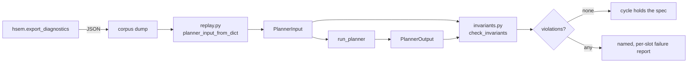

# Planner Backtest Harness

> Issue [#1037](https://github.com/woopstar/hsem/issues/1037) — measure whether
> plans are economically good, not merely self-consistent.

HSEM's test suite proves the planner is **self-consistent**: it obeys
`planner-spec.md`, holds its invariants, and does not contradict itself.
Nothing in it proves the planner is **economically good** — that the plans it
produces are close to the best achievable from the same inputs. Those are
different questions, and only the second one says whether the MILP, the cost
function and the forecasts are worth their complexity.

The harness is built in two stages.

| Stage                                 | Answers                                               | Status                           |
| ------------------------------------- | ----------------------------------------------------- | -------------------------------- |
| **1 — replay**                        | Does the planner hold the spec on _real_ inputs?      | **implemented**                  |
| **2a — collection + actuals loading** | Can realized outcomes be lined up with the plan?      | **implemented**                  |
| **2b — scoring** (savings + regret)   | Was the plan any good, and whose fault when it isn't? | not implemented — needs a corpus |

Stage 2b is deliberately not built yet. Scoring code written before there is
data to run it on would answer the alignment and attribution questions below
by guessing. Stage 2a exists so the collection clock can start now.

---

## Why Stage 1 is worth having on its own

Every other planner test runs on synthetic fixtures, and a fixture can only
contain input combinations someone thought to write down. Issue #1032 shipped a
label/energy contradiction to v6.3.2 while the whole fixture suite passed,
because no fixture reproduced the production input that caused it. Replaying
recorded cycles puts the spec invariants in front of inputs nobody designed.

---

## How Stage 1 works

`run_planner(inp: PlannerInput) -> PlannerOutput`
(`planner/engine_core.py`) is a pure function over one dataclass, and
`hsem.export_diagnostics` already serialises that dataclass — `asdict()`, with
only `solar_corrector` nulled, which its own docstring records as "not needed
to reproduce planner logic offline". So a dump is a replayable input.



| Module                            | Responsibility                                                      |
| --------------------------------- | ------------------------------------------------------------------- |
| `tests/backtest/replay.py`        | Rebuild a `PlannerInput` from a dump; report anything it cannot map |
| `tests/backtest/invariants.py`    | Check one `(input, output)` pair against `planner-spec.md`          |
| `tests/backtest/actuals.py`       | Load realized outcomes and align them to planner slots              |
| `tests/backtest/conftest.py`      | Corpus discovery, including a private out-of-repo corpus            |
| `tests/backtest/corpus/`          | Committed, redacted dumps — so CI needs no live Home Assistant      |
| `scripts/replay_planner_input.py` | Command-line front end for replay                                   |
| `scripts/build_actuals.py`        | Turn an HA history export into an actuals file                      |

### What the shim has to rebuild

`asdict()` plus JSON flattens three things that do not survive on their own:

1. the nested `HourlyConsumptionAverage` / `PricePoint` / `SolcastSlot` lists,
   which come back as plain dicts;
2. the `datetime` fields (EV deadlines and charger-power holds), which come
   back as ISO-8601 strings — the field set is derived from `PlannerInput`'s
   own annotations, so a datetime field added later is handled without
   touching the shim;
3. `solar_corrector`, pinned back to `None`.

Anything else is reported on `ReplayReport` rather than dropped quietly:

| Field                 | Meaning                                                    |
| --------------------- | ---------------------------------------------------------- |
| `dropped`             | The dump has it; `PlannerInput` no longer defines it       |
| `missing`             | `PlannerInput` defines it; the dump predates it            |
| `dropped_nested`      | Same, per element of a nested list                         |
| `malformed_datetimes` | Not `None` and not a parseable ISO-8601 string             |
| `is_faithful`         | All four empty — the only state in which a replay is exact |

A replay that silently loses an input produces numbers that look real and are
not, which is why `is_faithful` is asserted rather than reported.

---

## Running it

The harness is part of the normal suite:

```bash
./scripts/quality.sh test
python -m pytest tests/backtest/ -q        # just the harness
```

To replay a dump that is **not** in the corpus — for example a diagnostics
download attached to a bug report:

```bash
python3 scripts/replay_planner_input.py path/to/diagnostics.json
```

```text
hsem_version=6.3.2 dumped=2026-09-14T17:24:38.517328+02:00
faithful=False
  dropped (dump has, PlannerInput lacks): ['battery_schedules', 'extra']
  missing (defaulted): ['live_solar_production_available']
replayed 192 slots  winner='milp'  terminal_soc=100.0%
invariants: 0 violation(s)
no invariant violations
```

Exit status is `1` when any invariant failed, so it composes in a shell. Both
dump shapes load: the `hsem.export_diagnostics` service response, and the HA
diagnostics download that nests the same payload under `data`.

### Capturing a dump

- **One cycle, interactively** — call the `hsem.export_diagnostics` service, or
  download diagnostics from the HSEM device page.
- **Many cycles** — see [Collecting a corpus](#collecting-a-corpus) below.

`hsem.log` is **not** a corpus. It carries derived per-slot traces
(`[soc_sim]`, `[avg]`, `[pop]`) but no `planner_input`, so nothing in it can be
replayed.

### Adding to the corpus

See `tests/backtest/corpus/README.md`. In short: read the dump before you
commit it, and regenerate it through the current code so it round-trips.

The committed corpus is a _sample_. A real collection run is roughly 2.6 MB/day
and is nobody's business but yours, so keep it out of the repo and point the
harness at it:

```bash
HSEM_BACKTEST_CORPUS=~/hsem-corpus pytest tests/backtest/ -q
```

Both `*.json` (one cycle) and `*.jsonl` (an append log, one cycle per line) are
discovered. At most `HSEM_BACKTEST_MAX_CYCLES` cycles (default 25) are read from
any one file — a three-week log holds thousands at ~0.15 s each, which would
blow the per-test timeout with no explanation. Raise it when that is what you
want.

---

## What Stage 1 checks

Each check restates one bullet from `planner-spec.md`. Violations are returned,
not raised, so one replay reports all of its problems at once.

| Invariant                         | Rule                                                                |
| --------------------------------- | ------------------------------------------------------------------- |
| `slot_count`                      | `(interval_length_hours × 60) ÷ interval_minutes` slots             |
| `slots_contiguous`                | Each slot ends exactly where the next begins                        |
| `energy_balance`                  | `net = house + ev_planned − pv`, every slot                         |
| `soc_bounds`                      | Simulated SoC stays within the effective floor and ceiling          |
| `non_negative_flows`              | No negative charge, discharge, import or export                     |
| `grid_direction_exclusive`        | No slot both imports and exports materially                         |
| `battery_direction_exclusive`     | No slot both charges and discharges materially                      |
| `export_attribution`              | Battery-origin export + direct-PV export = total export             |
| `known_recommendation`            | Every slot carries a real `Recommendations` value                   |
| `plan_self_consistency`           | Label and energy agree (delegates to the shipped #1035 gate)        |
| `winner_cost_identity`            | Published `total_cost`/`score` equal the winning candidate's        |
| `winner_slots_identity`           | Published slots are the winner's slots — no post-selection mutation |
| `winner_present`                  | The winner is among the candidates that were scored                 |
| `winner_not_worse_than_no_action` | The winner's **score** beats the no-action baseline's               |
| `terminal_soc_reported`           | `battery_soc_at_end` matches the simulated trajectory               |
| `missing_price_reported`          | A zero-price day is reported by `DataQuality`, not planned as free  |

Two deliberate exclusions:

- **State sentinels are skipped** where it matters. `time_passed` and
  `missing_input_entities` slots are never simulated, so their SoC and energy
  fields stay at their defaults; asserting bounds on them would report ~69
  false violations on a mid-afternoon 48 h dump.
- **`winner_not_worse_than_no_action` compares `score`, not `total_cost`.** The
  selector minimises `score`. A plan may spend more money inside the horizon
  and still be correct because it leaves the battery fuller — on the corpus
  cycle the winner's `total_cost` is _worse_ than no-action's by 4.28 DKK while
  its `score` is better by 5.84. Asserting on `total_cost` would fail a correct
  plan.

`tests/backtest/test_invariant_detection.py` breaks each invariant on purpose
and asserts the matching check reports it, because a check that cannot fail is
not a check.

---

## Collecting a corpus

Both halves are file dumps. No live connection is needed for either.

### Inputs — one dump per planner cycle

Declare a file notifier in `configuration.yaml`:

```yaml
notify:
  - platform: file
    name: hsem_corpus
    filename: hsem-corpus.jsonl
    timestamp: false
```

Then append a dump whenever the planner republishes:

```yaml
automation:
  - alias: HSEM backtest corpus
    triggers:
      - trigger: time_pattern
        minutes: "/5"
    actions:
      - action: hsem.export_diagnostics
        response_variable: dump
      - action: notify.send_message
        target:
          entity_id: notify.hsem_corpus
        data:
          message: "{{ dump | to_json }}"
```

Trigger on a time pattern rather than on a state change: the working-mode sensor
only changes when the _recommendation_ changes, so state-triggered collection
silently skips every cycle that reached the same conclusion — which is most of
them, and exactly the stable stretches a baseline needs. Match the interval to
your configured HSEM update interval. On Home Assistant older than 2024.8 use
`service: notify.hsem_corpus` in place of the `notify.send_message` block.

That produces JSON Lines — one cycle per line, ~9 KB of `planner_input` each,
roughly 2.6 MB/day at 5-minute cycles. `iter_dumps()` reads it directly, so the
file needs no post-processing.

### Actuals — one history export

Realized outcomes come from the recorder. The history REST API is the
documented path:

```bash
curl -H "Authorization: Bearer $HA_TOKEN" \
  "$HA_URL/api/history/period/2026-09-01T00:00:00+02:00?end_time=2026-09-22T00:00:00+02:00&filter_entity_id=sensor.pv_energy,sensor.house_energy,sensor.grid_import_energy,sensor.grid_export_energy,sensor.battery_soc" \
  > history.json
```

Convert it to the actuals format, mapping each entity onto a series:

```bash
python3 scripts/build_actuals.py history.json \
    --map sensor.pv_energy=pv_produced \
    --map sensor.house_energy=house_load \
    --map sensor.grid_import_energy=grid_import \
    --map sensor.grid_export_energy=grid_export \
    --map sensor.battery_soc=battery_soc_pct \
    --slot-minutes 15 --out actuals.json
```

Energy series must be cumulative kWh accumulators — Riemann `integration`
sensors are ideal. Instantaneous power sensors will not work.

Home Assistant records a state only when it _changes_, so a meter that sat flat
through a six-hour export afternoon has no history rows in those six hours.
Energy is therefore taken from the value **in force** at each slot boundary:

$$
E_{slot} = V(t_{end}) - V(t_{start}), \qquad V(t) = \text{last reading at or before } t
$$

A slot in which nothing flowed comes out `0.0`, and the first slot after a
quiet stretch keeps its full energy. Neither needs a reading _inside_ the slot.

This is deliberately **not** `HistoryReader._compute_slot_deltas`, which the ML
layer uses. That routine answers a different question — how much did the house
consume? — and correctly discards zero slots and any slot whose predecessor had
no reading. For actuals both are real observations: measured against a meter
that imports 06:00–09:00 and again from 15:07, it drops the 15:00 slot's
0.09 kWh outright. The plausibility cap (`MAX_SLOT_KWH`) is shared.

A slot is **missing** — never zero — when a boundary falls before the first
reading or inside an `unavailable` stretch, when the meter went down (a reset),
or when the delta exceeds the cap. `unknown`/`unavailable` states are kept as
gaps, not dropped: dropping the row would let the previous value carry straight
across the outage.

**Include a chatty entity in every export.** A flat meter and a stopped recorder
look identical on one sensor. Across all of them they do not — a running system
keeps reporting something, an outage silences everything at once. Any slot
overlapping a silence longer than `--max-silence-minutes` (default 10) across
every exported entity is treated as unobserved. House load is the natural
heartbeat; exported alone, a sparse meter's flat stretches stay missing because
nothing can prove they were real.

Value series (battery SoC) take the value in force at the slot start, so a SoC
that sits at 100 % for an hour is present in every slot of that hour.

### The actuals file format

```json
{
  "schema": "hsem-actuals-1",
  "slot_minutes": 15,
  "slot_energy_kwh": {
    "pv_produced": [["2026-09-14T10:00:00+00:00", 1.02]],
    "house_load": [["2026-09-14T10:00:00+00:00", 0.31]],
    "grid_import": [["2026-09-14T10:00:00+00:00", 0.0]],
    "grid_export": [["2026-09-14T10:00:00+00:00", 0.71]],
    "battery_charged": [["2026-09-14T10:00:00+00:00", 0.0]],
    "battery_discharged": [["2026-09-14T10:00:00+00:00", 0.0]]
  },
  "slot_values": {
    "battery_soc_pct": [["2026-09-14T10:00:00+00:00", 96.2]]
  }
}
```

`slot_energy_kwh` holds integrated per-slot energy; `slot_values` holds one
scalar per slot. An unrecognised series name is reported and ignored rather
than silently accepted. The `schema` tag is mandatory so a format change is
loud.

`battery_charged` / `battery_discharged` are optional but worth having: they
measure what the battery actually did, instead of inferring it from SoC deltas
under assumed efficiencies.

**Prices are normally absent, and that is correct.** Day-ahead prices are
published in advance and never revised, so the price the planner optimised
against _is_ the realized price — and it already lives on the dump's
`price_points`, including HSEM's grid fees. A raw spot-price sensor carries no
fees, so exporting one would introduce a systematic offset that scores as
regret. `import_price`/`export_price` exist for a market where that assumption
fails; `is_scorable` does not require them.

---

## Loading and aligning actuals

```python
from tests.backtest.actuals import align_to_slots, load_actuals

actuals = load_actuals("actuals.json")
rows, report = align_to_slots(actuals, planner_output.slots)
print(report.describe())
```

```text
aligned 192 slot(s); 40 scorable (partial)
  pv_produced: 40/192
  house_load: 40/192
  grid_import: 40/192
  grid_export: 40/192
  battery_soc_pct: 40/192
  import_price: 40/192
  export_price: 40/192
  covered 2026-09-14T00:00:00+02:00 → 2026-09-14T09:45:00+02:00
```

Coverage is reported first because "how many slots can I actually score?" is the
question any scoring pass has to answer before it reports a number.

### Three rules the loader enforces

**Missing is not zero.** Every field on `SlotActuals` is `float | None`, and an
unobserved slot stays `None`. This is the same rule the planner follows for
telemetry (issues #988, #1056), and it matters more here: regret is a
_difference_ of two costs, so a fabricated zero does not cancel out — it
manufactures savings.

Because zero slots are observations, a file built by `build_actuals.py` needs
no zero-filling: overnight PV is already `0.0`, and absence means the value
genuinely could not be established. For a hand-built file or a source that omits
zeros, `actuals.fill_absent_with_zero("pv_produced")` exists, and the alignment
report names every series it was applied to. The danger was never zero-filling;
it was zero-filling _silently_.

**Alignment is by canonical slot key.** Both sides go through
`datetime_utils.slot_key()`, so a UTC export lines up with a `+02:00` plan, and
the two folds of an autumn repeated hour stay distinct instead of collapsing
onto each other. Wall-clock matching would pass every test except the one night
a year it matters.

**A slot-width mismatch raises.** Actuals exported at 60 minutes will not align
to a 15-minute plan. Resampling changes what a scoring pass measures, so it is
refused rather than performed quietly.

---

## Stage 2b — savings and regret (not implemented)

### Two comparisons

| Comparison                                                                              | Measures    |
| --------------------------------------------------------------------------------------- | ----------- |
| plan vs **no-action baseline**                                                          | **savings** |
| plan vs **perfect-foresight oracle** — the same MILP, actuals substituted for forecasts | **regret**  |

Savings say what the integration delivered. **Regret is the metric worth
building this for**, because it separates two failure modes that are
indistinguishable today:

- the oracle beats us mainly on PV-variable days → the **forecasts** are the
  problem (Solcast handling, solar correction);
- the oracle beats us even where forecasts were near-perfect → the **optimizer**
  is the problem (MILP formulation or cost function).

Those are completely different fixes.

### Open design questions

These need real paired data to answer, which is why Stage 2b waits.

1. **Alignment.** Dump cadence (~5 min) does not match slot width (15 min), and
   several dumps fall inside one slot. Which cycle's plan is the one being
   scored — the first in the slot, or the one the applier last wrote?
2. **Attribution.** Realized grid flows reflect what the _hardware_ did,
   including manual overrides, degraded mode and write failures. The apply
   result is already in every dump (`apply_result`), so scored days can exclude
   cycles where it reports a failed or blocked write — but "exclude" versus
   "annotate" is a judgement call that changes the headline number.
3. **Oracle scope.** A perfect-foresight oracle over a 48 h horizon needs 48 h of
   actuals _after_ the cycle, so the last two days of any corpus can never be
   scored.

Home Assistant's `mcp_server` integration was evaluated for collection and
rejected: it exposes Assist-oriented tools returning a plain-text snapshot
rather than raw entity attributes, only for entities exposed to Assist, and
backtesting needs historical series rather than live polling anyway.

---

## Related

- [Planner Specification](planner-spec.md) — the invariants this checks
- [Architecture Overview](architecture-overview.md) — where the planner sits
- [Services Reference](services-reference.md) — `hsem.export_diagnostics`
- [Quality Checks](quality-checks.md) — how the suite is run in CI
