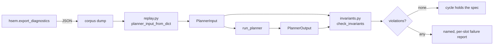

# Planner Backtest Harness

> Issue [#1037](https://github.com/woopstar/hsem/issues/1037) — measure whether
> plans are economically good, not merely self-consistent.

HSEM's test suite proves the planner is **self-consistent**: it obeys
`planner-spec.md`, holds its invariants, and does not contradict itself.
Nothing in it proves the planner is **economically good** — that the plans it
produces are close to the best achievable from the same inputs. Those are
different questions, and only the second one says whether the MILP, the cost
function and the forecasts are worth their complexity.

The harness is built in two stages.

| Stage                              | Answers                                               | Needs                        | Status                     |
| ---------------------------------- | ----------------------------------------------------- | ---------------------------- | -------------------------- |
| **1 — replay** (`tests/backtest/`) | Does the planner hold the spec on _real_ inputs?      | recorded `planner_input`s    | **implemented**            |
| **2 — scoring** (savings + regret) | Was the plan any good, and whose fault when it isn't? | recorded **actuals** as well | design only, no corpus yet |

---

## Why Stage 1 is worth having on its own

Every other planner test runs on synthetic fixtures, and a fixture can only
contain input combinations someone thought to write down. Issue #1032 shipped a
label/energy contradiction to v6.3.2 while the whole fixture suite passed,
because no fixture reproduced the production input that caused it. Replaying
recorded cycles puts the spec invariants in front of inputs nobody designed.

---

## How Stage 1 works

`run_planner(inp: PlannerInput) -> PlannerOutput`
(`planner/engine_core.py`) is a pure function over one dataclass, and
`hsem.export_diagnostics` already serialises that dataclass — `asdict()`, with
only `solar_corrector` nulled, which its own docstring records as "not needed
to reproduce planner logic offline". So a dump is a replayable input.



| Module                            | Responsibility                                                      |
| --------------------------------- | ------------------------------------------------------------------- |
| `tests/backtest/replay.py`        | Rebuild a `PlannerInput` from a dump; report anything it cannot map |
| `tests/backtest/invariants.py`    | Check one `(input, output)` pair against `planner-spec.md`          |
| `tests/backtest/corpus/`          | Committed, redacted dumps — so CI needs no live Home Assistant      |
| `scripts/replay_planner_input.py` | Command-line front end over both                                    |

### What the shim has to rebuild

`asdict()` plus JSON flattens three things that do not survive on their own:

1. the nested `HourlyConsumptionAverage` / `PricePoint` / `SolcastSlot` lists,
   which come back as plain dicts;
2. the `datetime` fields (EV deadlines and charger-power holds), which come
   back as ISO-8601 strings — the field set is derived from `PlannerInput`'s
   own annotations, so a datetime field added later is handled without
   touching the shim;
3. `solar_corrector`, pinned back to `None`.

Anything else is reported on `ReplayReport` rather than dropped quietly:

| Field                 | Meaning                                                    |
| --------------------- | ---------------------------------------------------------- |
| `dropped`             | The dump has it; `PlannerInput` no longer defines it       |
| `missing`             | `PlannerInput` defines it; the dump predates it            |
| `dropped_nested`      | Same, per element of a nested list                         |
| `malformed_datetimes` | Not `None` and not a parseable ISO-8601 string             |
| `is_faithful`         | All four empty — the only state in which a replay is exact |

A replay that silently loses an input produces numbers that look real and are
not, which is why `is_faithful` is asserted rather than reported.

---

## Running it

The harness is part of the normal suite:

```bash
./scripts/quality.sh test
python -m pytest tests/backtest/ -q        # just the harness
```

To replay a dump that is **not** in the corpus — for example a diagnostics
download attached to a bug report:

```bash
python3 scripts/replay_planner_input.py path/to/diagnostics.json
```

```text
hsem_version=6.3.2 dumped=2026-09-14T17:24:38.517328+02:00
faithful=False
  dropped (dump has, PlannerInput lacks): ['battery_schedules', 'extra']
  missing (defaulted): ['live_solar_production_available']
replayed 192 slots  winner='milp'  terminal_soc=100.0%
invariants: 0 violation(s)
no invariant violations
```

Exit status is `1` when any invariant failed, so it composes in a shell. Both
dump shapes load: the `hsem.export_diagnostics` service response, and the HA
diagnostics download that nests the same payload under `data`.

### Capturing a dump

- **One cycle, interactively** — call the `hsem.export_diagnostics` service, or
  download diagnostics from the HSEM device page.
- **Many cycles** — an HA automation calling `hsem.export_diagnostics` each
  cycle and appending to a file, roughly 2.5 MB/day at 5-minute cycles.

`hsem.log` is **not** a corpus. It carries derived per-slot traces
(`[soc_sim]`, `[avg]`, `[pop]`) but no `planner_input`, so nothing in it can be
replayed.

### Adding to the corpus

See `tests/backtest/corpus/README.md`. In short: read the dump before you
commit it, and regenerate it through the current code so it round-trips.

---

## What Stage 1 checks

Each check restates one bullet from `planner-spec.md`. Violations are returned,
not raised, so one replay reports all of its problems at once.

| Invariant                         | Rule                                                                |
| --------------------------------- | ------------------------------------------------------------------- |
| `slot_count`                      | `(interval_length_hours × 60) ÷ interval_minutes` slots             |
| `slots_contiguous`                | Each slot ends exactly where the next begins                        |
| `energy_balance`                  | `net = house + ev_planned − pv`, every slot                         |
| `soc_bounds`                      | Simulated SoC stays within the effective floor and ceiling          |
| `non_negative_flows`              | No negative charge, discharge, import or export                     |
| `grid_direction_exclusive`        | No slot both imports and exports materially                         |
| `battery_direction_exclusive`     | No slot both charges and discharges materially                      |
| `export_attribution`              | Battery-origin export + direct-PV export = total export             |
| `known_recommendation`            | Every slot carries a real `Recommendations` value                   |
| `plan_self_consistency`           | Label and energy agree (delegates to the shipped #1035 gate)        |
| `winner_cost_identity`            | Published `total_cost`/`score` equal the winning candidate's        |
| `winner_slots_identity`           | Published slots are the winner's slots — no post-selection mutation |
| `winner_present`                  | The winner is among the candidates that were scored                 |
| `winner_not_worse_than_no_action` | The winner's **score** beats the no-action baseline's               |
| `terminal_soc_reported`           | `battery_soc_at_end` matches the simulated trajectory               |
| `missing_price_reported`          | A zero-price day is reported by `DataQuality`, not planned as free  |

Two deliberate exclusions:

- **State sentinels are skipped** where it matters. `time_passed` and
  `missing_input_entities` slots are never simulated, so their SoC and energy
  fields stay at their defaults; asserting bounds on them would report ~69
  false violations on a mid-afternoon 48 h dump.
- **`winner_not_worse_than_no_action` compares `score`, not `total_cost`.** The
  selector minimises `score`. A plan may spend more money inside the horizon
  and still be correct because it leaves the battery fuller — on the corpus
  cycle the winner's `total_cost` is _worse_ than no-action's by 4.28 DKK while
  its `score` is better by 5.84. Asserting on `total_cost` would fail a correct
  plan.

`tests/backtest/test_invariant_detection.py` breaks each invariant on purpose
and asserts the matching check reports it, because a check that cannot fail is
not a check.

---

## Stage 2 — savings and regret (not implemented)

Stage 1 replays _forecasts_: `planner_input` carries `solcast_slots` and
`consumption_averages`, never what actually happened. Scoring a plan needs
realized PV, house load, prices and battery SoC, which no dump contains. Until
a corpus of actuals exists, Stage 2 stays a design.

### Two comparisons

| Comparison                                                                              | Measures    |
| --------------------------------------------------------------------------------------- | ----------- |
| plan vs **no-action baseline**                                                          | **savings** |
| plan vs **perfect-foresight oracle** — the same MILP, actuals substituted for forecasts | **regret**  |

Savings say what the integration delivered. **Regret is the metric worth
building this for**, because it separates two failure modes that are
indistinguishable today:

- the oracle beats us mainly on PV-variable days → the **forecasts** are the
  problem (Solcast handling, solar correction);
- the oracle beats us even where forecasts were near-perfect → the **optimizer**
  is the problem (MILP formulation or cost function).

Those are completely different fixes.

### Collecting actuals

`ml/history_reader.py` already reads HA recorder history at slot resolution and
is the natural source:

- `read_energy_history(entity_id, days=…, slot_minutes=15)` →
  `(datetime, slot_index, energy_kwh)` per-slot deltas from a
  `TOTAL_INCREASING` accumulator — grid import/export and PV production;
- `read_today_actuals(entity_id, slot_minutes=15)` → completed slots only, keyed
  by canonical UTC slot start;
- `read_instantaneous_history(...)` → battery SoC, which is a level rather than
  an accumulator.

A one-off recorder or long-term-statistics export covers months in one go, so
no live connection is needed for either half of the corpus.

### Open design questions

1. **Alignment.** Dump cadence (~5 min) does not match slot width (15 min), and
   several dumps fall inside one slot. Which cycle's plan is the one being
   scored — the first in the slot, or the one the applier last wrote?
2. **Attribution.** Realized grid flows reflect what the _hardware_ did,
   including manual overrides, degraded mode and write failures. The apply
   result is already in the dump (`apply_result`); scored days probably have to
   exclude cycles where it reports a failed or blocked write.
3. **Oracle scope.** A perfect-foresight oracle over a 48 h horizon needs
   48 h of actuals _after_ the cycle, so the last two days of any corpus can
   never be scored.

Home Assistant's `mcp_server` integration was evaluated for collection and
rejected: it exposes Assist-oriented tools returning a plain-text snapshot
rather than raw entity attributes, only for entities exposed to Assist, and
backtesting needs historical series rather than live polling anyway.

---

## Related

- [Planner Specification](planner-spec.md) — the invariants this checks
- [Architecture Overview](architecture-overview.md) — where the planner sits
- [Services Reference](services-reference.md) — `hsem.export_diagnostics`
- [Quality Checks](quality-checks.md) — how the suite is run in CI
