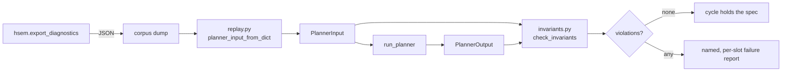

# Planner Backtest Harness

> Issue [#1037](https://github.com/woopstar/hsem/issues/1037) — measure whether
> plans are economically good, not merely self-consistent.

HSEM's test suite proves the planner is **self-consistent**: it obeys
`planner-spec.md`, holds its invariants, and does not contradict itself.
Nothing in it proves the planner is **economically good** — that the plans it
produces are close to the best achievable from the same inputs. Those are
different questions, and only the second one says whether the MILP, the cost
function and the forecasts are worth their complexity.

The harness is built in stages.

| Stage                                 | Answers                                               | Status                        |
| ------------------------------------- | ----------------------------------------------------- | ----------------------------- |
| **1 — replay**                        | Does the planner hold the spec on _real_ inputs?      | **implemented**               |
| **2a — collection + actuals loading** | Can realized outcomes be lined up with the plan?      | **implemented**               |
| **2b — scoring** (savings + regret)   | Was the day run well, against the best it could be?   | **implemented** (issue #1208) |
| **2c — attribution**                  | Whose fault when it is not: forecasts or the planner? | **implemented** (issue #1208) |

---

## Why Stage 1 is worth having on its own

Every other planner test runs on synthetic fixtures, and a fixture can only
contain input combinations someone thought to write down. Issue #1032 shipped a
label/energy contradiction to v6.3.2 while the whole fixture suite passed,
because no fixture reproduced the production input that caused it. Replaying
recorded cycles puts the spec invariants in front of inputs nobody designed.

---

## How Stage 1 works

`run_planner(inp: PlannerInput) -> PlannerOutput`
(`planner/engine_core.py`) is a pure function over one dataclass, and
`hsem.export_diagnostics` already serialises that dataclass — `asdict()`, with
only `solar_corrector` nulled, which its own docstring records as "not needed
to reproduce planner logic offline". So a dump is a replayable input.


```mermaid
flowchart LR
    A[hsem.export_diagnostics] -->|JSON| B[corpus dump]
    B --> C[replay.py<br/>planner_input_from_dict]
    C --> D[PlannerInput]
    D --> E[run_planner]
    E --> F[PlannerOutput]
    D --> G[invariants.py<br/>check_invariants]
    F --> G
    G --> H{violations?}
    H -->|none| I[cycle holds the spec]
    H -->|any| J[named, per-slot failure report]
```

| Module                            | Responsibility                                                         |
| --------------------------------- | ---------------------------------------------------------------------- |
| `tests/backtest/replay.py`        | Rebuild a `PlannerInput` from a dump; report anything it cannot map    |
| `tests/backtest/invariants.py`    | Check one `(input, output)` pair against `planner-spec.md`             |
| `tests/backtest/actuals.py`       | Load realized outcomes and align them to planner slots                 |
| `tests/backtest/scoring.py`       | Score realized days: cost, regret, savings and capture                 |
| `tests/backtest/attribution.py`   | Split a day's regret into execution, forecast and planner error        |
| `planner/hindsight_oracle.py`     | Self-consumption baseline and perfect-foresight oracle (no HA imports) |
| `tests/backtest/conftest.py`      | Corpus discovery, including a private out-of-repo corpus               |
| `tests/backtest/harvest.py`       | Grow the committed corpus from a live one, one new situation at a time |
| `tests/backtest/actuals/`         | Committed per-day actuals for the days committed cycles cover          |
| `tests/backtest/corpus/`          | Committed, redacted dumps — so CI needs no live Home Assistant         |
| `scripts/replay_planner_input.py` | Command-line front end for replay                                      |
| `scripts/backtest_update.sh`      | One command: copy corpus, collect actuals, backtest, harvest, test     |
| `scripts/backtest_harvest.py`     | Backtest new cycles and harvest new situations                         |
| `scripts/backtest_corpus.py`      | Replay every cycle of a corpus and report                              |
| `scripts/backtest_score.py`       | Score every complete day of an actuals file                            |
| `scripts/backtest_attribute.py`   | Replay a day on forecasts and on realized values; attribute its regret |
| `scripts/collect_actuals.sh`      | One command: fetch a week of history, convert, verify                  |
| `scripts/build_actuals.py`        | Turn an HA history export into an actuals file                         |

### What the shim has to rebuild

`asdict()` plus JSON flattens three things that do not survive on their own:

1. the nested `HourlyConsumptionAverage` / `PricePoint` / `SolcastSlot` lists,
   which come back as plain dicts;
2. the `datetime` fields (EV deadlines and charger-power holds), which come
   back as ISO-8601 strings — the field set is derived from `PlannerInput`'s
   own annotations, so a datetime field added later is handled without
   touching the shim;
3. `solar_corrector`, pinned back to `None`.

Anything else is reported on `ReplayReport` rather than dropped quietly:

| Field                 | Meaning                                                    |
| --------------------- | ---------------------------------------------------------- |
| `dropped`             | The dump has it; `PlannerInput` no longer defines it       |
| `missing`             | `PlannerInput` defines it; the dump predates it            |
| `dropped_nested`      | Same, per element of a nested list                         |
| `malformed_datetimes` | Not `None` and not a parseable ISO-8601 string             |
| `is_faithful`         | All four empty — the only state in which a replay is exact |

A replay that silently loses an input produces numbers that look real and are
not, which is why `is_faithful` is asserted rather than reported.

---

## Running it

> Step-by-step instructions for collecting a corpus and replaying it live in
> the [Backtest Runbook](backtest-runbook.md). This section explains the pieces.

The harness is part of the normal suite:

```bash
./scripts/quality.sh test
python -m pytest tests/backtest/ -q        # just the harness
```

To replay a dump that is **not** in the corpus — for example a diagnostics
download attached to a bug report:

```bash
python3 scripts/replay_planner_input.py path/to/diagnostics.json
```

```text
hsem_version=6.3.2 dumped=2026-09-14T17:24:38.517328+02:00
faithful=False
  dropped (dump has, PlannerInput lacks): ['battery_schedules', 'extra']
  missing (defaulted): ['live_solar_production_available']
replayed 192 slots  winner='milp'  terminal_soc=100.0%
invariants: 0 violation(s)
no invariant violations
```

Exit status is `1` when any invariant failed, so it composes in a shell. Both
dump shapes load: the `hsem.export_diagnostics` service response, and the HA
diagnostics download that nests the same payload under `data`.

### Capturing a dump

- **One cycle, interactively** — call the `hsem.export_diagnostics` service, or
  download diagnostics from the HSEM device page.
- **Many cycles** — see [Collecting a corpus](#collecting-a-corpus) below.

`hsem.log` is **not** a corpus. It carries derived per-slot traces
(`[soc_sim]`, `[avg]`, `[pop]`) but no `planner_input`, so nothing in it can be
replayed.

### Adding to the corpus

See `tests/backtest/corpus/README.md`. In short: read the dump before you
commit it, and regenerate it through the current code so it round-trips.

Every committed cycle carries a `site` tag that says which installation it was
recorded on; see [Which installation a file is from](#which-installation-a-file-is-from).

The committed corpus is a _sample_. A real collection run is roughly 2.6 MB/day
and is nobody's business but yours, so keep it out of the repo and point the
harness at it:

```bash
HSEM_BACKTEST_CORPUS=~/hsem-corpus pytest tests/backtest/ -q
```

Both `*.json` (one cycle) and `*.jsonl` (an append log, one cycle per line) are
discovered. At most `HSEM_BACKTEST_MAX_CYCLES` cycles (default 25) are read from
any one file — a three-week log holds thousands at ~0.15 s each, which would
blow the per-test timeout with no explanation. Raise it when that is what you
want.

---

## What Stage 1 checks

Each check restates one bullet from `planner-spec.md`. Violations are returned,
not raised, so one replay reports all of its problems at once.

| Invariant                         | Rule                                                                |
| --------------------------------- | ------------------------------------------------------------------- |
| `slot_count`                      | `(interval_length_hours × 60) ÷ interval_minutes` slots             |
| `slots_contiguous`                | Each slot ends exactly where the next begins                        |
| `energy_balance`                  | `net = house + ev_planned − pv`, every slot                         |
| `soc_bounds`                      | Simulated SoC stays within the effective floor and ceiling          |
| `non_negative_flows`              | No negative charge, discharge, import or export                     |
| `grid_direction_exclusive`        | No slot both imports and exports materially                         |
| `battery_direction_exclusive`     | No slot both charges and discharges materially                      |
| `export_attribution`              | Battery-origin export + direct-PV export = total export             |
| `known_recommendation`            | Every slot carries a real `Recommendations` value                   |
| `plan_self_consistency`           | Label and energy agree (delegates to the shipped #1035 gate)        |
| `winner_cost_identity`            | Published `total_cost`/`score` equal the winning candidate's        |
| `winner_slots_identity`           | Published slots are the winner's slots — no post-selection mutation |
| `winner_present`                  | The winner is among the candidates that were scored                 |
| `winner_not_worse_than_no_action` | The winner's **score** beats the no-action baseline's               |
| `terminal_soc_reported`           | `battery_soc_at_end` matches the simulated trajectory               |
| `missing_price_reported`          | A zero-price day is reported by `DataQuality`, not planned as free  |

**Replays lift the solver time limit.** Production caps HiGHS at 2 s and
accepts the best feasible solution found by then. A real cycle can take 1.5 s on
an idle machine, so on a busy one the same input returns a worse plan: one live
cycle scored 143.61 under a 0.6 s cap against 110.12 solved properly, and failed
`winner_not_worse_than_no_action`. `generous_solver_limit()` raises the cap for
every backtest replay, so results depend on the planner's logic, not on machine
load. (The underlying policy — a time-limited MILP incumbent is executed even
when it scores worse than `passive`, because the selector treats a valid MILP as
the sole authority — is a real gap on slow hosts, but a separate issue.)

Two deliberate exclusions:

- **State sentinels are skipped** where it matters. `time_passed` and
  `missing_input_entities` slots are never simulated, so their SoC and energy
  fields stay at their defaults; asserting bounds on them would report ~69
  false violations on a mid-afternoon 48 h dump.
- **`winner_not_worse_than_no_action` compares `score`, not `total_cost`.** The
  selector minimises `score`. A plan may spend more money inside the horizon
  and still be correct because it leaves the battery fuller — on the corpus
  cycle the winner's `total_cost` is _worse_ than no-action's by 4.28 DKK while
  its `score` is better by 5.84. Asserting on `total_cost` would fail a correct
  plan.

`tests/backtest/test_invariant_detection.py` breaks each invariant on purpose
and asserts the matching check reports it, because a check that cannot fail is
not a check.

---

## Collecting a corpus

Both halves are file dumps. No live connection is needed for either.

### Inputs — one dump per planner cycle

Declare a file notifier in `configuration.yaml`:

```yaml
notify:
  - platform: file
    name: hsem_corpus
    filename: hsem-corpus.jsonl
    timestamp: false
```

Then append a dump whenever the planner republishes:

```yaml
automation:
  - alias: HSEM backtest corpus
    triggers:
      - trigger: time_pattern
        minutes: "/5"
    actions:
      - action: hsem.export_diagnostics
        response_variable: dump
      - action: notify.hsem_corpus
        data:
          message: "{{ dump | to_json }}"
```

Two things that are easy to get wrong here.

**Call `notify.hsem_corpus` as a service, not an entity.** The legacy YAML
`notify:` platform above registers a _service_; it creates no entity, so
`notify.send_message` with `target.entity_id` fails and the file is never
written. Use the entity form only if you add the File integration through the
UI instead of the YAML block.

**Trigger on a time pattern, not a state change.** The working-mode sensor only
changes when the _recommendation_ changes, so state-triggered collection
silently skips every cycle that reached the same conclusion — most of them, and
exactly the stable stretches a baseline needs. Match the interval to your
configured HSEM update interval.

That produces JSON Lines — one cycle per line. `iter_dumps()` reads it
directly, so the file needs no post-processing: the header the `file` platform
writes when it creates the log (`Home Assistant notifications (Log started: …)`
and a rule of dashes) is skipped, as is a truncated last line from copying the
file mid-write. A corrupt line anywhere else raises, because that is lost data.

Budget more than the `planner_input` alone suggests: each line is the whole
dump, planner output included — about 120 KB, or roughly 35 MB/day at
5-minute cycles.

To replay a whole corpus rather than the default first 25 cycles per file,
raise both the cap and pytest's per-test timeout — a real cycle takes a few
hundred milliseconds, and the determinism and round-trip tests run each one
twice:

```bash
HSEM_BACKTEST_CORPUS=~/hsem-actuals/corpus HSEM_BACKTEST_MAX_CYCLES=1000 \
    python -m pytest tests/backtest/ -q --timeout=1800
```

### Actuals — one history export

`scripts/collect_actuals.sh` does the whole loop — fetch, convert, verify:

```bash
export HA_URL=http://homeassistant.local:8123
export HA_TOKEN=<long-lived access token>
export TZ=Europe/Copenhagen          # must match Home Assistant's timezone

./scripts/collect_actuals.sh --days 7 --verify
```

It downloads one file per complete day into `~/hsem-actuals/raw/`, skipping days
it already has, then converts **every** raw file in one pass so day boundaries
are stitched. Re-run it weekly; it is idempotent.

Set `HSEM_ARCHIVE_ENTITIES` to a comma-separated list of extras — EV charger
power, EV SoC, phase meters, the working-mode sensor. They are downloaded but
not converted: the recorder purges, so they cannot be fetched later, and they
give the outage check more evidence to work with.

The nine mapped entities — four energy meters, realized battery charge and
discharge, battery SoC and the two price sensors — default to the names used by
the common HSEM template package. Override any of them with `HSEM_GRID_IMPORT_ENTITY`,
`HSEM_PV_ENTITY`, `HSEM_HOUSE_LOAD_ENTITY` and friends — see `MAPPING` at the
top of the script. Map `house_load` to the **EV-excluded** meter: the planner's
baseline is EV-normalized, so an EV-inclusive meter double-counts against
`ev_planned_load_kwh`.

Under the hood it calls `scripts/build_actuals.py`, which you can drive
directly for one-off exports:

```bash
python3 scripts/build_actuals.py history-*.json \
    --map sensor.energy_import_ps=grid_import \
    --map sensor.batteries_state_of_capacity=battery_soc_pct \
    --slot-minutes 15 --out actuals.json
```

### The actuals file format

```json
{
  "schema": "hsem-actuals-1",
  "slot_minutes": 15,
  "site": "site-a",
  "slot_energy_kwh": {
    "pv_produced": [["2026-09-14T10:00:00+00:00", 1.02]],
    "house_load": [["2026-09-14T10:00:00+00:00", 0.31]],
    "grid_import": [["2026-09-14T10:00:00+00:00", 0.0]],
    "grid_export": [["2026-09-14T10:00:00+00:00", 0.71]],
    "battery_charged": [["2026-09-14T10:00:00+00:00", 0.0]],
    "battery_discharged": [["2026-09-14T10:00:00+00:00", 0.0]]
  },
  "slot_values": {
    "battery_soc_pct": [["2026-09-14T10:00:00+00:00", 96.2]]
  }
}
```

`slot_energy_kwh` holds integrated per-slot energy; `slot_values` holds one
scalar per slot. An unrecognised series name is reported and ignored rather
than silently accepted. The `schema` tag is mandatory so a format change is
loud. `site` is optional and says which installation the file is from.

### Which installation a file is from

A planner input and a history export carry nothing that says where they were
recorded. Until issue #1225 the harness paired cycles and actuals by date
alone, and the committed sample paired a bug report's 10 kWh installation with
the meters of a 15 kWh one.

Both kinds of file therefore carry a **site tag**, the top-level `site` key:

- `scripts/build_actuals.py` (and so `collect_actuals.sh`) writes
  `HSEM_BACKTEST_SITE` from `.env` into the actuals file.
- The harvest writes the same tag into every cycle it commits, and commits an
  actuals day only when a committed cycle **with the same tag** covers it.
  Without a tag it still replays and checks every cycle, but commits nothing.
- `tests/backtest/site.py` holds the rule every comparison uses: two files
  pair when their tags are equal. Two untagged files pair, so a private
  collection from before the tag keeps working; an untagged file never pairs
  with a tagged one.
- `merge_actuals` refuses files with different tags, the attribution ignores
  cycles of another installation exactly like cycles of another day, and
  `test_committed_actuals.py` aligns only cycles and days of one installation.

A live corpus on disk is untagged. `backtest_attribute.py` and the `--site`
dump of `backtest_score.py` take an untagged dump to be from
`HSEM_BACKTEST_SITE` (`--site-tag`), the tag the actuals were built with.

The tag is committed to a public repository. It is a label that tells the
installations of one collection apart, not an identity: lower-case letters,
digits and hyphens, at most 32 characters. Which committed file is which is
listed in `tests/backtest/corpus/README.md`.

`battery_charged` / `battery_discharged` are optional but worth having: they
measure what the battery actually did, instead of inferring it from SoC deltas
under assumed efficiencies.

**Export prices when your price sensor is the one the planner reads.** HSEM
takes its prices straight from the configured import/export price sensors — it
adds no grid fee of its own — so their recorded state is the price a slot was
settled at. Recording them makes realized cost computable across the whole
recorder window without a matching dump, which is what lets savings be measured
over months while regret waits for paired data.

Confirm rather than assume, per installation:

- the sensor must already carry tariffs (Energi Data Service does; a bare spot
  feed does not);
- `hsem_export_fee_per_kwh`, when set, is subtracted from the export price by
  the planner and must be subtracted here too.

`collect_actuals.sh --verify` checks both, comparing every overlapping slot
against a dump's own `price_points` and naming _why_ they differ:

| Verdict                        | Meaning                                                                                                           |
| ------------------------------ | ----------------------------------------------------------------------------------------------------------------- |
| same prices, slot for slot     | Nothing to do.                                                                                                    |
| systematic offset              | A fee or tariff one side has and the other does not. **Do not score.**                                            |
| _n_ slot(s) outside the spread | Individual prices are wrong — a stale value, a source gap, or a sensor that writes just after the boundary.       |
| plan hourly, export sub-hourly | Expected against a cycle from before the market moved to 15-minute periods. Re-check against a contemporary dump. |

The distinction that matters is between a _mean_ difference and a _spread_. A
fee is identical on every slot, so its mean stands clear of its own spread; a
granularity difference averages to nothing but is wide. Judging the mean against
a fixed tolerance alone calls a short sample a fee, so the check tests whether
the mean is significant against its standard error, and separately counts slots
more than three spreads out — because a day-long mean otherwise absorbs a
handful of badly wrong slots.

`is_scorable` does not require prices: an energy-only export still supports
every comparison that does not need money.

---

## Loading and aligning actuals

```python
from tests.backtest.actuals import align_to_slots, load_actuals

actuals = load_actuals("actuals.json")
rows, report = align_to_slots(actuals, planner_output.slots)
print(report.describe())
```

```text
aligned 192 slot(s); 40 scorable (partial)
  pv_produced: 40/192
  house_load: 40/192
  grid_import: 40/192
  grid_export: 40/192
  battery_soc_pct: 40/192
  import_price: 40/192
  export_price: 40/192
  covered 2026-09-14T00:00:00+02:00 → 2026-09-14T09:45:00+02:00
```

Coverage is reported first because "how many slots can I actually score?" is the
question any scoring pass has to answer before it reports a number.

### Three rules the loader enforces

**Missing is not zero.** Every field on `SlotActuals` is `float | None`, and an
unobserved slot stays `None`. This is the same rule the planner follows for
telemetry (issues #988, #1056), and it matters more here: regret is a
_difference_ of two costs, so a fabricated zero does not cancel out — it
manufactures savings.

Because zero slots are observations, a file built by `build_actuals.py` needs
no zero-filling: overnight PV is already `0.0`, and absence means the value
genuinely could not be established. For a hand-built file or a source that omits
zeros, `actuals.fill_absent_with_zero("pv_produced")` exists, and the alignment
report names every series it was applied to. The danger was never zero-filling;
it was zero-filling _silently_.

**Alignment is by canonical slot key.** Both sides go through
`datetime_utils.slot_key()`, so a UTC export lines up with a `+02:00` plan, and
the two folds of an autumn repeated hour stay distinct instead of collapsing
onto each other. Wall-clock matching would pass every test except the one night
a year it matters.

**A slot-width mismatch raises.** Actuals exported at 60 minutes will not align
to a 15-minute plan. Resampling changes what a scoring pass measures, so it is
refused rather than performed quietly.

---

## Stage 2b — scoring a day

```bash
python3 scripts/backtest_score.py                              # the committed days
python3 scripts/backtest_score.py ~/hsem-actuals/actuals.json  # your own collection
```

```text
site limits from cycle-2026-09-25-0816.json: 15 kWh, 5-100 % SoC, 5/5 kW, efficiency 0.98/0.98
day         realized   oracle   regret potential  savings  capture
2026-09-15     13.45    10.19     3.26      9.32     6.05    65.0%
2026-09-26     84.19    64.68    19.51     15.40    -4.12   -26.7%
   2 day(s)    97.64    74.87    22.78     24.71     1.94     7.8%
```

Costs are in the currency of the price sensors. That table is produced from the
committed actuals alone, with no live system, and
`tests/backtest/test_scoring.py` pins it.

### Three ways the same day could have gone

Every run uses the same slots, the same realized prices and the same load.

| Run          | What it is                                                                |
| ------------ | ------------------------------------------------------------------------- |
| **realized** | What was paid: grid import × import price − grid export × export price    |
| **baseline** | Plain inverter self-consumption — the hardware with nobody controlling it |
| **oracle**   | The cheapest the day could have been, with perfect foresight              |

The oracle is a small mixed-integer program
(`planner/hindsight_oracle.py::solve_hindsight_oracle`) over the realized
slots. Per slot it chooses the battery's charge and discharge and how much PV
to curtail; the grid takes the rest. It gets **hard limits only** — capacity,
power, conversion losses, the main fuse and the export limit. No dynamic floor,
reserve, hysteresis, export price threshold or terminal value: those are
policy, and policy is what is being measured. A slot cannot both charge and
discharge, or both import and export, so the oracle's day is one the hardware
could execute.

The **load** is everything that is not the battery — house, EV and losses —
read off the meters as `grid_import − grid_export − battery_charged +
battery_discharged`. That is the grid flow each slot would have had with the
battery idle, and it needs no house meter. The EV is therefore a fixed load:
what moving its charging saved is not measured here.

### Stored energy at the end of the day is part of the result

A run that ends the day with a fuller battery has paid for energy it has not
used yet. Compare it with a run that ends empty and it looks expensive; give
the oracle a free hand and it wins by draining the battery, and HSEM is
punished for planning tomorrow. So two costs are only compared when both runs
start and end at the same stored energy:

| Number        | Definition                                                                                                 |
| ------------- | ---------------------------------------------------------------------------------------------------------- |
| **regret**    | realized − oracle. The oracle starts where the day started and must end at least as full as the day ended. |
| **potential** | baseline − oracle. Both start where the day started; the oracle must end where self-consumption ends.      |
| **savings**   | potential − regret: what the control was worth against self-consumption, with the end difference priced.   |
| **capture**   | savings ÷ potential: the share of the day's potential that was realized.                                   |

Regret is never negative. Capture is at most 100 % and **can be negative**:
the 26th above is a day on which the battery did worse than the inverter would
have alone, and the number says so. Capture is `unknown`, never clamped, when
the potential is below 0.05: on a day no control could have improved, there is
no share to report.

`savings` here is not "baseline bill minus real bill". That plain difference
mixes in whatever the two runs happen to leave in the battery (14 kWh on the
26th). Over a period it is still worth having, so the summary line also runs
self-consumption as **one battery carried across consecutive days** and prints
its total next to the stored energy it ends with:

```text
self-consumption as one battery across consecutive days: 68.09, -29.55 against realized; it ends with -14.35 kWh against what the battery held
```

With two unconnected days that line is dominated by the end difference; over
weeks of consecutive days it is the honest "what would the bill have been".

### Why the oracle is a lower bound

Regret is only meaningful if no real day can beat the oracle. That holds by
construction, not just on the days tested: the realized day itself is always a
feasible answer to the oracle's problem.

- The load is derived from the realized flows, so the realized flows satisfy
  the oracle's energy balance exactly.
- The required end energy is the one the **measured battery flows** imply
  under the configured efficiencies, so the realized day meets it.
- Every limit is widened wherever the realized day went beyond it: a slot
  that charged a little more than the configured power, or a stored-energy
  trajectory that drifts outside the capacity because the real efficiency is
  not the configured one. A widening of more than 10 % of the limit is printed
  as a `note:` under the day, because it means the limits do not describe
  this battery.

`tests/planner/test_hindsight_oracle.py` checks the same property from the
other side: on random days, no random feasible run that ends at least as full
is cheaper than the oracle. On the committed days regret is 3.26 and 19.51.

### Days that cannot be scored

A day needs grid import and export, battery charge and discharge, and both
prices in **every** slot, plus the battery SoC at its first slot. Anything
missing makes the whole day `not scored`, with the reason — missing is never
read as zero, because a fabricated zero does not cancel out of a difference of
costs. PV is optional: without it the oracle cannot curtail.

### Which installation's limits

The actuals carry no battery data, so the limits come from a recorded planner
input: by default the newest committed cycle with the
[site tag](#which-installation-a-file-is-from) of the actuals, or
`--site <dump>`. They must be from the installation the actuals were recorded
on: a `--site` dump with another tag is refused, and when no committed cycle
carries the actuals' tag the script stops and asks for one. Between two
untagged files nothing can be checked; there a mismatch only shows up as a
"leave the configured capacity" note.

### What it does not measure

- **EV scheduling.** The EV's energy is in the load as it happened.
- **Battery wear.** All costs are grid cash. The planner also prices each kWh
  cycled, so it declines trades the oracle makes; that shows up as regret.
- **More curtailment than happened.** The oracle may curtail the PV that was
  produced, not PV that had already been curtailed.
- **Why the regret is there.** That is the next stage.

## Stage 2c — where the regret came from

Regret says how much was left on the table, not what to fix. It has two very
different sources:

- the **forecasts** were wrong (Solcast handling, solar correction, the load
  profile, prices not yet published);
- the **planner** does not make the best of what it knows (floors, reserves,
  wear pricing, hysteresis, the terminal value, the MILP itself).

```bash
python3 scripts/backtest_attribute.py                      # the committed day
python3 scripts/backtest_attribute.py ~/hsem-actuals/actuals.json \
    --corpus ~/hsem-actuals/corpus --day 2026-09-30
```

```text
day         realized forecast hindsight   regret = execution + forecast +  planner
2026-09-29     15.29    11.67     10.42     2.29        0.79       1.25      0.26
```

The attribution needs a planner cycle for (almost) every slot of the day,
which the committed corpus does not have: it holds a handful of cycles on
different days. The line above is the **recorded day** committed for that
purpose (issue #1229), so it is reproducible from the repository with no live
system: a 15 kWh installation on 2026-09-29, 96 cycles at 15-minute slots.
`tests/backtest/test_recorded_day.py` pins these numbers. A day at 15-minute
slots takes about half a minute, because every slot is planned twice.

### Recorded days

A recorded day lives apart from the corpus, in `tests/backtest/days/<date>/`:

| File                    | Content                                                              |
| ----------------------- | -------------------------------------------------------------------- |
| `cycles.jsonl`          | One slim cycle per slot: the first whose `now_iso` falls in the slot |
| `actuals-<date>.json`   | The day's realized values                                            |
| `actuals-<date+1>.json` | The following day's: every plan of the day reaches into it           |

It is not part of the corpus because it is neither a new situation nor
something to replay on every test run: the corpus is capped at 50 cycles that
are each replayed several times per run, and a day is 96 consecutive cycles
that only the attribution test reads, once.

`scripts/backtest_harvest.py --day <date>` writes one from the live corpus and
`~/hsem-actuals/actuals.json` (`tests/backtest/recorded_day.py`). It applies
the checks a corpus cycle gets and refuses the day otherwise:

- a cycle in at least half of the day's slots (the attribution's own minimum);
- every cycle slim, round-tripping and free of entity ids, with the site tag;
- actuals complete for the day **and** the following day, from the same site.

A cycle recorded before a `PlannerInput` field existed gets the field's
default, and the fields filled are listed for review, exactly as
`--refresh-corpus` does. `--refresh-corpus` also keeps committed days in step
when a field is added later.

The script prints the files and commits nothing. **Read them before you
commit them**: a recorded day is one home's load, PV, prices, battery and EV
settings for two days, in a public repository.

When the planner's decisions on the day change, the pinned numbers in
`test_recorded_day.py` change with them. Re-run the script, check the change is
the intended one, and update them in the same PR.

### Two replays of the same day

The day is replayed slot by slot through the real planner
(`tests/backtest/attribution.py::rolling_run`). At each slot the planner input
HSEM recorded for it is replanned from the slot's start, with the battery the
replay has left, and the decision for that one slot is executed against the
slot's **real** load. Then the next slot.

| Replay            | Inputs at each slot                                           | Its cost is                                   |
| ----------------- | ------------------------------------------------------------- | --------------------------------------------- |
| **forecast run**  | what HSEM recorded: its price, PV and load forecasts          | what HSEM's decisions cost                    |
| **hindsight run** | the same input with realized prices, PV and house load put in | what the same planner does knowing the future |
| **oracle**        | (Stage 2b)                                                    | the best achievable                           |

Each run's regret is its cost above the oracle that ends the day with the
**same stored energy** as that run. That matters here as much as in Stage 2b:
the run that buys the night ends the day fuller and has the higher bill and
the lower regret. The split is then:

| Error               | Definition                                   | What it means                                             |
| ------------------- | -------------------------------------------- | --------------------------------------------------------- |
| **forecast error**  | regret(forecast run) − regret(hindsight run) | What better forecasts would have saved the same planner.  |
| **planner error**   | regret(hindsight run)                        | What the planner leaves on the table with perfect inputs. |
| **execution error** | regret(realized) − regret(forecast run)      | What separates the replay from the meters.                |

The three add up to the realized regret. Forecast and execution error can be
negative: a wrong forecast can turn out lucky, and the real system replans
inside a slot where the replay decides once.

### The answers to the design questions

1. **Alignment.** A slot is planned from the first cycle whose input was built
   in that slot (`cycles_by_slot`, by the input's own `now_iso`: the planner
   does not replan on every dump, so several dumps carry one input). A slot
   with no cycle of its own uses the latest earlier one of the same day, which
   is the input HSEM was still acting on, and the result says how many slots
   that was. A day with a cycle in fewer than half of its slots is not
   attributed.
2. **Execution.** The replay does not try to detect failed writes or manual
   overrides. It executes every decision through one model of the applier
   (`execute_decision`): forced modes move the planned energy, the
   self-consumption modes follow the real load, held modes only take a
   surplus, and the battery serves the house's own deficit, never the EV.
   Whatever the real system did differently — and whatever the model gets
   wrong — is the execution error. It is reported, not excluded.
3. **Horizon.** The hindsight run puts realized values into every horizon slot
   the actuals cover and keeps the forecast for the rest. A day whose plans
   reach past the recorded days is therefore only partly "hindsight", and the
   result says what share was realized (50 % for the last recorded day of a
   48 h planner).
4. **Which price is the realized price.** The recorded price sensors, as in
   Stage 2b. The hindsight run gets them for every covered slot, including the
   hours HSEM had to estimate because the day-ahead prices were not out yet,
   so price-forecast error is part of the forecast error. What a scoring pass
   must not do is read a realized price off the cycle being scored.

### What the hindsight run replaces

`with_realized_forecasts()` rewrites three inputs for the slots and hours the
actuals cover: the price points, the PV forecast (as the average power of each
slot) and the hourly house load. The live readings the planner blends into the
current slot are switched off, since the realized slot is already in the
forecast's place. Everything else is as recorded: the EV's state and deadline,
the configuration, and the dynamic floor the cycle was solved with.

So the planner still applies its own policy to the realized numbers — the PV
confidence decay for tomorrow, for example. That is deliberate: the hindsight
run is _this planner_ with perfect inputs, and what it still loses is planner
error.

### Limits

- **The execution model is a model.** It decides once per slot and knows
  nothing of the applier's own guards (the reserve below which it stops
  discharging, for example). On one recorded day the real battery was held
  through the evening while the replay discharged it; that difference is in
  the execution error.
- **The EV is replayed as it really charged**, in both runs. A different plan
  would have moved it; that is not modelled.
- **The dynamic floor is the recorded one.** The replay does not re-run the
  floor's reference solve for its own battery.
- **Dumps and actuals must be from the same installation** (#1225).

Home Assistant's `mcp_server` integration was evaluated for collection and
rejected: it exposes Assist-oriented tools returning a plain-text snapshot
rather than raw entity attributes, only for entities exposed to Assist, and
backtesting needs historical series rather than live polling anyway.

---

## Related

- [Planner Specification](planner-spec.md) — the invariants this checks
- [Architecture Overview](architecture-overview.md) — where the planner sits
- [Services Reference](services-reference.md) — `hsem.export_diagnostics`
- [Quality Checks](quality-checks.md) — how the suite is run in CI
