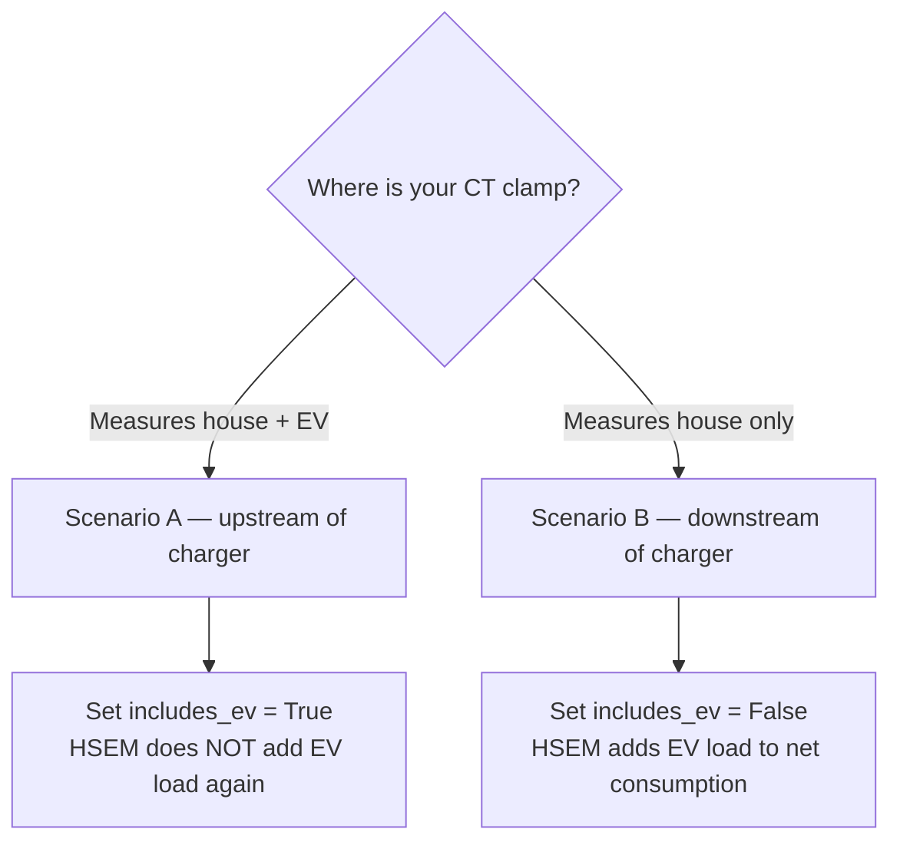
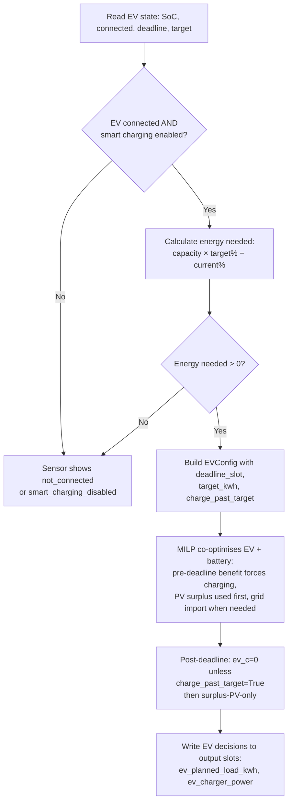

# EV Charge Plan Setup Guide

This guide explains how to configure the **EV Planned Load** feature in HSEM so that
the home battery planner correctly accounts for upcoming EV charging demand before
deciding how to use solar surplus and battery capacity.

> **See also:** `docs/planner-guide.md` — the technical reference explaining how
> the EV planner integrates with the home battery planner, the net-load formula, and the
> solar surplus bug fix.

---

## Table of contents

1. [What this feature does](#what-this-feature-does)
2. [Before you start](#before-you-start)
3. [Configuration steps](#configuration-steps)
4. [Field reference](#field-reference)
5. [Double-counting — when to enable base_load_includes_ev](#double-counting)
6. [Second EV](#second-ev)
7. [How the EV planner works](#how-the-ev-planner-works)
8. [Sensor entities](#sensor-entities)
9. [Troubleshooting](#troubleshooting)

---

## What this feature does

Without this feature, HSEM does not know that the EV is about to charge. When the EV
starts drawing power from the charger, the house consumption sensor suddenly reads much
higher than normal. If solar panels are producing, HSEM may have already allocated that
solar energy to the home battery — so the EV ends up importing from the grid while the
battery charges for free. This is the wrong priority.

With EV Planned Load enabled, HSEM:

1. Reads the current EV battery SoC and calculates how much energy is needed to reach
   the target SoC before the configured deadline.
2. Allocates that energy into planner slots — **solar-surplus slots first**, then
   cheapest grid-import slots.
3. Injects the per-slot EV load into the home battery planner **before** it calculates
   solar surplus and battery recommendations.
4. The home battery planner then sees zero (or reduced) net solar surplus in those slots
   and correctly avoids charging the home battery from solar that the EV will consume.

---

## Before you start

You need the following entities available in Home Assistant:

| What you need | Example entity |
|---|---|
| Binary sensor: EV plugged in | `binary_sensor.ev_charger_connected` |
| Sensor: EV battery SoC (%) | `sensor.ev_battery_soc` |
| (Optional) Input for target SoC | `input_number.ev_target_soc` |
| (Optional) Input for charge deadline | `input_datetime.ev_charge_deadline` |
| (Optional) Switch: smart charging on/off | `input_boolean.ev_smart_charging` |
| (Optional) Sensor: actual EV charge power | `sensor.ev_charger_power` |

If your EV integration does not expose all of these, you can use `input_number`,
`input_boolean`, and `input_datetime` helpers as manual overrides.

---

## Configuration steps

Go to **Settings → Devices & Services → HSEM → Configure** to open the options flow.

The EV charge plan step appears after the EV charger setup steps:

```
init → prices → months → solcast
     → huawei_solar → power
     → ev (force-discharge charger) → [ev_second]
     → ev_planned_load               ← you are here
     → [ev_second_planned_load]
     → batteries_schedule_1/2/3 → batteries_excess_export
     → weighted_values
```

### Step: EV Optimal Charging Plan (primary EV)

Fill in the fields described in the [Field reference](#field-reference) section below.

At minimum you must:
- Set **Enable EV Planned Load Integration** to `on`
- Set **EV Battery Capacity** to your car's usable battery size (e.g. `86` kWh)
- Set **EV Charger Power** to your charger's AC output (e.g. `11` kW)
- Select your **EV Connected Binary Sensor**
- Select your **EV Battery SoC Sensor**

All other fields have sensible defaults (target SoC 80 %, deadline 07:00, efficiency
100 %, min charger power 1380 W).

---

## Field reference

| Field | Required | Default | Description |
|---|---|---|---|
| **Enable EV Planned Load Integration** | Yes | `off` | Master switch. Must be `on` for any planning to occur. |
| **EV Connected Binary Sensor** | Optional* | — | Binary sensor that is `on` when the EV is physically plugged into the charger. |
| **EV Battery SoC Sensor** | Optional* | — | Sensor reporting the current EV battery state of charge (0–100 %). |
| **EV Target SoC Entity** | Optional | — | Entity whose state is the target SoC. Overrides the fixed target when set. Accepts `sensor`, `input_number`, `number`. |
| **EV Target SoC (fixed fallback)** | Yes | `80` | Target SoC to use when no entity is configured. Range 0–100 %. |
| **EV Charge Deadline Entity** | Optional | — | Entity whose state is a time string (`HH:MM`) representing when the EV must be charged. Accepts `input_datetime`, `sensor`, `input_text`. |
| **EV Charge Deadline (fixed HH:MM fallback)** | Yes | `07:00` | Deadline to use when no entity is configured. The planner will not schedule EV load after this time. |
| **EV Smart Charging Enabled Entity** | Optional | — | Boolean entity (`binary_sensor`, `input_boolean`, `switch`) that enables/disables smart charging at runtime. When this entity is `off`, the sensor shows `smart_charging_disabled` and no EV load is allocated. |
| **EV Battery Capacity (kWh)** | Yes | `0` | EV battery nameplate capacity. Range 1–200 kWh, step 0.5 kWh. |
| **EV Charger Power (kW)** | Yes | `0` | AC output power of the charger. Range 0.1–50 kW, step 0.1 kW. |
| **EV Charger Efficiency** | Yes | `100` % | Fraction of AC energy delivered to the EV battery. Most AC chargers are 95–100 %. Range 50–100 %, step 1 %. |
| **Charger Min Power (W)** | Yes | `1380` | Minimum AC power required for the charger to physically operate (230 V × 6 A). Below this, the slot is zeroed out by engine post-processing. Range 0–22000 W, step 10 W. |
| **Base House Load Already Includes EV** | Yes | `off` | See [Double-counting](#double-counting). |
| **EV Actual Charging Power Sensor (optional)** | Optional | — | Sensor for real-time EV charge power. Used for diagnostics only — not fed into the planner. |

> \* Strongly recommended. Without a connected sensor the EV is always assumed connected.
> Without a SoC sensor the current SoC defaults to `0 %`, which will over-plan charging.

---

## Double-counting

The planner's `base_load_includes_ev` flag is automatically derived from the
`hsem_house_power_includes_ev_charger_power` setting in the EV charger config step.
You do **not** need to set it separately.

**How your CT clamp position determines the setting in the EV step:**



### Net load formula

The planner's net load with EV is:

$$
\mathrm{net\_load}[t] = \mathrm{house\_load}[t] - \mathrm{pv}[t] + \left\{
\begin{array}{ll}
0 & \text{if } \mathrm{base\_load\_includes\_ev} \\
\mathrm{ev\_load}[t] & \text{otherwise}
\end{array}
\right.
$$

### Quick test

If you are unsure, plug the EV in and watch the house consumption sensor. If it rises
by the charger power when charging starts, set `hsem_house_power_includes_ev_charger_power`
to `True` in the EV charger step. If it stays flat, set it to `False`.

---

## Second EV

If you have a second EV and have enabled it in the EV charger step, a second identical
step — **EV 2 Optimal Charging Plan** — will appear immediately after the first.
All fields are the same; just use the second car's sensors and config values.

The two EV plans are independent. Their per-slot loads are **summed** into
`ev_planned_load_kwh` on each planner slot before net consumption is calculated.

---

## How the EV planner works



### Inputs

| Input | Source | Description |
|---|---|---|
| Current EV SoC | `hsem_ev_soc` sensor | Percentage (0–100 %) |
| Target SoC | `hsem_ev_soc_target` entity or 80 % default | Target percentage |
| Deadline | `time.hsem_ev_deadline` entity or `"07:00"` | Time-of-day by which EV must be charged |
| Battery capacity | `hsem_ev_planned_load_battery_capacity_kwh` | Nameplate kWh |
| Charger AC power | `hsem_ev_planned_load_charger_power_kw` | AC kW output |
| Charger efficiency | `hsem_ev_planned_load_charger_efficiency` | Percent (50–100) |
| Charger min power | `hsem_ev_planned_load_charger_min_power_w` | Watts (default 1380) |
| Connected sensor | `hsem_ev_connected` binary sensor | Plug status |
| Smart charging switch | `switch.hsem_ev_smart_charging` | Enable/disable |
| Force charge now | `switch.hsem_ev_force_charge_now` | Immediate charge |
| Allow past target | `hsem_ev_allow_charge_past_target_soc` | Solar-only surplus charging past target |
| Base load includes EV | `hsem_house_power_includes_ev_charger_power` | CT clamp position |
| Auto-Full on negative price | `hsem_ev_auto_full_negative_price` | Max-charge EV when price ≤ 0 |

### Auto-Full EV on negative electricity prices

When `hsem_ev_auto_full_negative_price` is enabled (off by default), HSEM
automatically promotes the EV to **Full** charging mode whenever the import
electricity price drops to ≤ 0 (including negative prices). The previous
charging mode is restored automatically when the price rises above 0.

This feature is especially useful in markets with frequent negative-price
periods (e.g. Nordpool, Amber Electric) where charging the EV at full power
can be profitable or free.

**Configuration:**
- Toggle ``hsem_ev_auto_full_negative_price`` in the EV charger config step
  of the config/options flow, or at runtime via
  ``switch.hsem_ev_auto_full_negative_price``.
- No additional entities are required — it uses the import price sensor
  already configured for the planner.

### Session-aware EV demand

When the EV is actively plugged in and drawing power, the MILP planner treats
the next 2 hours of EV load as **near-certain** demand rather than
probabilistic. This prevents the battery planner from grid-charging the home
battery against EV demand that is definitely happening right now.

**How it works:**
1. The coordinator reads `live.ev.is_charging` and `live.ev.power_w`.
2. If the EV is actively charging, the first 8 future slots (2 hours at
   15-minute granularity) get fixed EV load bounds.
3. A grid-charge prevention constraint blocks battery grid-charging during
   those session slots.
4. A post-solve guard overrides any `BatteriesChargeGrid` recommendations
   in session slots to `BatteriesChargeSolar` or skip.

**Conditions:**
- Activates only when `live.ev.is_charging == True` AND `live.ev.power_w > 0`.
- Applies independently to the second EV if configured.

---

## Sensor entities

After setup, two diagnostic sensor entities are created:

| Entity | States | Meaning |
|---|---|---|
| `sensor.hsem_ev_optimal_charging_plan` | see below | Primary EV plan state |
| `sensor.hsem_ev_second_optimal_charging_plan` | see below | Second EV plan state |

### Sensor states

| State | Meaning |
|---|---|
| `not_connected` | EV is not plugged in (connected sensor is `off`) |
| `smart_charging_disabled` | Feature is disabled, or the smart charging entity is `off` |
| `fully_charged` | EV is already at or above target SoC — nothing to plan |
| `charging` | EV is scheduled to charge in the current slot |
| `waiting` | EV is connected, energy is needed, but current slot has no planned load (e.g. slot is after the deadline or all load is in future slots) |
| `unavailable` | Feature is not configured or `battery_capacity_kwh`/`charger_power_kw` is zero |

### Sensor attributes

Both sensors expose full plan details as attributes:

```yaml
battery_capacity_kwh: 86.0
charge_power_kw: 11.0
current_soc: 32.0
target_soc: 80.0
ev_connected: true
total_kwh_needed: 41.3
deadline: "2026-05-15T07:00:00+02:00"
current_slot_planned_load_kwh: 9.2
planned_load_by_slot:
  "2026-05-15T10:00:00+02:00": 9.2
  "2026-05-15T11:00:00+02:00": 11.0
  "2026-05-15T01:00:00+02:00": 11.0
  "2026-05-15T02:00:00+02:00": 10.1
charging_slots:
  - start: "2026-05-15T10:00:00+02:00"
    end:   "2026-05-15T11:00:00+02:00"
    estimated_charged_kwh: 9.2
    solar_surplus_kwh: 10.5
    import_needed_kwh: 0.0
    import_price: 1.25
    estimated_cost: 0.0
data_quality: {}
```

---

## Troubleshooting

### Sensor shows `unavailable`

The most common cause is that the feature has not been configured yet, or the
`battery_capacity_kwh`/`charger_power_kw` fields are still at their default of `0`.

**Fix:** Go to **Settings → Devices & Services → HSEM → Configure** and complete the
EV Optimal Charging Plan step. Make sure battery capacity and charger power are both
set to non-zero values.

### Sensor shows `not_connected` but the car is plugged in

The connected binary sensor is reporting `off`. Check:
- The entity ID is correct in HSEM config.
- The binary sensor is actually `on` in HA Developer Tools → States.
- If you have no connected sensor configured, HSEM assumes the EV is always connected.

### Sensor shows `smart_charging_disabled`

Either:
- `hsem_ev_planned_load_enabled` is `False` — toggle it to `on` in the config.
- The smart charging entity (if configured) is currently `off`. This is intentional
  — it lets you temporarily disable smart EV scheduling without changing HSEM config.

### EV is charging but home battery also charges from solar

Check `base_load_includes_ev`. If your house consumption sensor already includes EV
power (CT clamp upstream of the EVSE), this should be `True`. If it is `False` and
the sensor already includes EV power, HSEM double-counts the load and the battery
planner sees a larger surplus than actually exists.

### EV always charges from grid, never from solar

This was a bug fixed in PR #397. The EV planner was computing solar surplus from
`estimated_net_consumption` which is `0.0` at planning time. It is now computed from
raw `pv - house_load` fields.

If you are on a version before this fix, update HSEM.

### EV charging slots show zero power

The engine post-processing applies a **minimum power floor** (default 1380 W, configurable
via `hsem_ev_planned_load_charger_min_power_w`). If the computed AC power for a slot is
below this threshold, the slot's EV fields are zeroed out because the charger physically
cannot operate below 6 A (230 V × 6 A = 1380 W).

### Deadline is in the past

If the deadline (fixed or from entity) is earlier than the current time, there are no
valid candidate slots and the sensor will show `waiting` with a `data_quality` warning:
`"No candidate slots before deadline"`.

The deadline is interpreted as a **time-of-day** and automatically advanced to the
next occurrence if needed:
- If it is currently 15:00 and the deadline is `07:00`, it is treated as 07:00
  **tomorrow**.
- If it is currently 06:00 and the deadline is `07:00`, it is treated as today.
