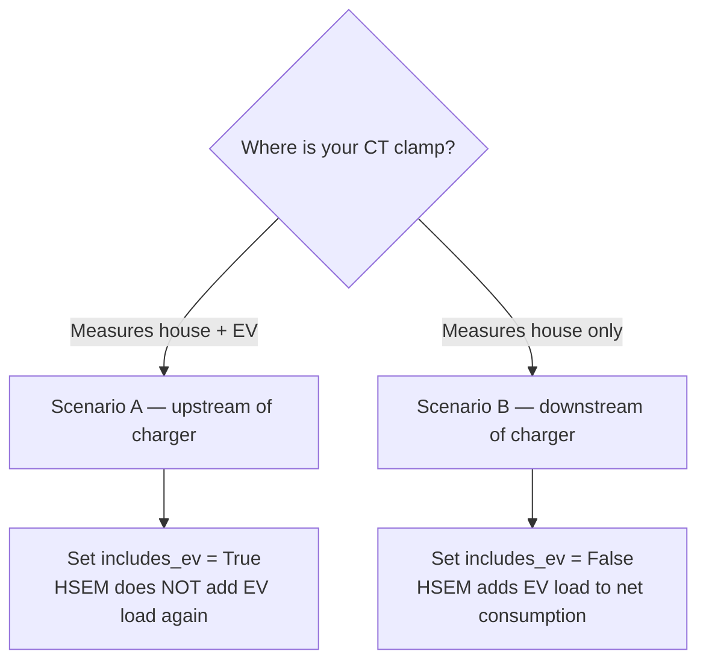
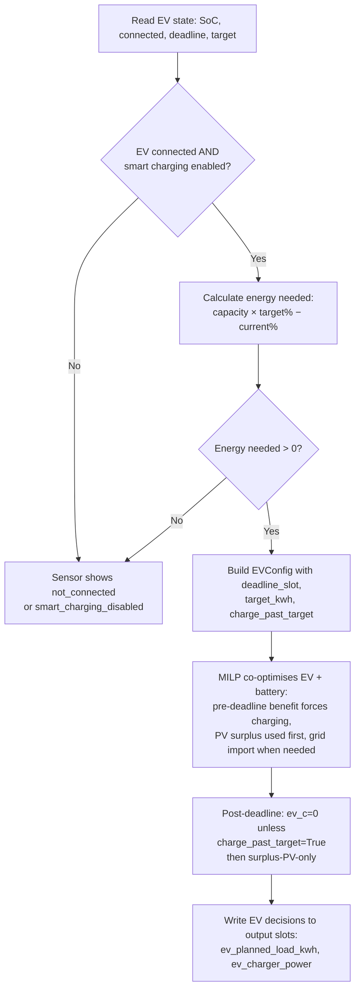

# EV Charge Plan Setup Guide

This guide explains how to configure the **EV Planned Load** feature in HSEM so that
the home battery planner correctly accounts for upcoming EV charging demand before
deciding how to use solar surplus and battery capacity.

> **See also:** `docs/planner-guide.md` — the technical reference explaining how
> the EV planner integrates with the home battery planner, the net-load formula, and the
> solar surplus bug fix.

---

## Table of contents

1. [What this feature does](#what-this-feature-does)
2. [Before you start](#before-you-start)
3. [Configuration steps](#configuration-steps)
4. [Field reference](#field-reference)
5. [Double-counting — when to enable base_load_includes_ev](#double-counting)
6. [Second EV](#second-ev)
7. [How the EV planner works](#how-the-ev-planner-works)
8. [Sensor entities](#sensor-entities)
9. [Troubleshooting](#troubleshooting)

---

## What this feature does

Without this feature, HSEM does not know that the EV is about to charge. When the EV
starts drawing power from the charger, the house consumption sensor suddenly reads much
higher than normal. If solar panels are producing, HSEM may have already allocated that
solar energy to the home battery — so the EV ends up importing from the grid while the
battery charges for free. This is the wrong priority.

With EV Planned Load enabled, HSEM:

1. Reads the current EV battery SoC and calculates how much energy is needed to reach
   the target SoC before the configured deadline.
2. Allocates that energy into planner slots — **solar-surplus slots first**, then
   cheapest grid-import slots.
3. Injects the per-slot EV load into the home battery planner **before** it calculates
   solar surplus and battery recommendations.
4. The home battery planner then sees zero (or reduced) net solar surplus in those slots
   and correctly avoids charging the home battery from solar that the EV will consume.

---

## Before you start

You need the following entities available in Home Assistant:

| What you need                             | Example entity                       |
| ----------------------------------------- | ------------------------------------ |
| Binary sensor: EV plugged in              | `binary_sensor.ev_charger_connected` |
| Sensor: EV battery SoC (%)                | `sensor.ev_battery_soc`              |
| (Optional) Input for target SoC           | `input_number.ev_target_soc`         |
| (Optional) Input for charge deadline      | `input_datetime.ev_charge_deadline`  |
| (Optional) Switch: smart charging on/off  | `input_boolean.ev_smart_charging`    |
| (Optional) Sensor: actual EV charge power | `sensor.ev_charger_power`            |

> **Unit note (Watts expected):** HSEM expects EV charge power in **Watts**.
> If your sensor reports kW (e.g. a template sensor showing `3.6` for a
> 3.6 kW session), either change the template to Watts or set
> `unit_of_measurement: kW` on the sensor — HSEM then converts it
> automatically. A kW value without the unit attribute is treated as Watts
> and triggers a "suspiciously low EV power" warning in the log (issue #592).

If your EV integration does not expose all of these, you can use `input_number`,
`input_boolean`, and `input_datetime` helpers as manual overrides.

---

## Configuration steps

Go to **Settings → Devices & Services → HSEM → Configure** to open the options flow.

The EV charge plan step appears after the EV charger setup steps:

```
init → prices → months → solcast
     → huawei_solar → power
     → ev (force-discharge charger) → [ev_second]
     → ev_planned_load               ← you are here
     → [ev_second_planned_load]
     → batteries_schedule_1/2/3 → batteries_excess_export
     → weighted_values
```

### Step: EV Optimal Charging Plan (primary EV)

Fill in the fields described in the [Field reference](#field-reference) section below.

At minimum you must:

- Set **Enable EV Planned Load Integration** to `on`
- Set **EV Battery Capacity** to your car's usable battery size (e.g. `86` kWh)
- Set **EV Charger Power** to your charger's AC output (e.g. `11` kW)
- Select your **EV Connected Binary Sensor**
- Select your **EV Battery SoC Sensor**

All other fields have sensible defaults (target SoC 80 %, deadline 07:00, efficiency
100 %, min charger power 1380 W).

---

## Field reference

| Field                                          | Required   | Default        | Description                                                                                                                                                                                                                                                                 |
| ---------------------------------------------- | ---------- | -------------- | --------------------------------------------------------------------------------------------------------------------------------------------------------------------------------------------------------------------------------------------------------------------------- |
| **Enable EV Planned Load Integration**         | Yes        | `off`          | Master switch. Must be `on` for any planning to occur.                                                                                                                                                                                                                      |
| **EV Connected Binary Sensor**                 | Optional\* | —              | Binary sensor that is `on` when the EV is physically plugged into the charger.                                                                                                                                                                                              |
| **EV Battery SoC Sensor**                      | Optional\* | —              | Sensor reporting the current EV battery state of charge (0–100 %).                                                                                                                                                                                                          |
| **EV Target SoC Entity**                       | Optional   | —              | Entity whose state is the target SoC. Overrides the fixed target when set. Accepts `sensor`, `input_number`, `number`.                                                                                                                                                      |
| **EV Target SoC (fixed fallback)**             | Yes        | `80`           | Target SoC to use when no entity is configured. Range 0–100 %.                                                                                                                                                                                                              |
| **EV Charge Deadline Entity**                  | Optional   | —              | Entity whose state is a time string (`HH:MM`) representing when the EV must be charged. Accepts `input_datetime`, `sensor`, `input_text`.                                                                                                                                   |
| **EV Charge Deadline (fixed HH:MM fallback)**  | Yes        | `07:00`        | Deadline to use when no entity is configured. The planner will not schedule EV load after this time.                                                                                                                                                                        |
| **EV Smart Charging Enabled Entity**           | Optional   | —              | Boolean entity (`binary_sensor`, `input_boolean`, `switch`) that enables/disables smart charging at runtime. When this entity is `off`, the sensor shows `smart_charging_disabled` and no EV load is allocated.                                                             |
| **EV Battery Capacity (kWh)**                  | Yes        | `0`            | EV battery nameplate capacity. Range 1–200 kWh, step 0.5 kWh.                                                                                                                                                                                                               |
| **EV Charger Power (kW)**                      | Yes        | `0`            | Approximate AC nameplate. Snapped to the nearest executable whole amp by the configured phase topology when publishing a command — `11.0 kW` single-phase becomes `13 A / 2.99 kW`; `11.0 kW` balanced three-phase becomes `16 A / 11.04 kW`. Range 0.1–50 kW, step 0.1 kW. |
| **EV Charger Phase Topology**                  | Yes        | `single_phase` | Safe default for single-phase or unknown wiring — every hard per-phase check assumes the whole command lands on one phase. Select `three_phase_balanced` only after confirming the charger draws balanced current across all three phases.                                  |
| **EV Charger Efficiency**                      | Yes        | `100` %        | Fraction of AC energy delivered to the EV battery. Most AC chargers are 95–100 %. Range 50–100 %, step 1 %.                                                                                                                                                                 |
| **Charger Min Power (W)**                      | Yes        | `1380`         | Physical start threshold, rounded up to the first executable whole amp for the configured topology (`1380 W` single-phase → `6 A`). Below this, the slot is zeroed out (or re-portioned into another slot) by engine post-processing. Range 0–22000 W, step 10 W.           |
| **Base House Load Already Includes EV**        | Yes        | `off`          | See [Double-counting](#double-counting).                                                                                                                                                                                                                                    |
| **EV Actual Charging Power Sensor (optional)** | Optional   | —              | Sensor for real-time EV charge power. Used for diagnostics only — not fed into the planner.                                                                                                                                                                                 |

> \* Strongly recommended. Without a connected sensor the EV is always assumed connected.
> Without a SoC sensor the current SoC defaults to `0 %`, which will over-plan charging.

---

## Double-counting

The planner's `base_load_includes_ev` flag is automatically derived from the
`hsem_house_power_includes_ev_charger_power` setting in the EV charger config step.
You do **not** need to set it separately.

**How your CT clamp position determines the setting in the EV step:**


```mermaid
flowchart TD
    A{Where is your CT clamp?}
    B[Scenario A — upstream of charger]
    C[Scenario B — downstream of charger]
    D[Set includes_ev = True\nHSEM does NOT add EV load again]
    E[Set includes_ev = False\nHSEM adds EV load to net consumption]

    A -->|Measures house + EV| B --> D
    A -->|Measures house only| C --> E
```

### Net load formula

The planner's net load with EV is:

$$
\mathrm{net\_load}[t] = \mathrm{house\_load}[t] - \mathrm{pv}[t] + \left\{
\begin{array}{ll}
0 & \text{if } \mathrm{base\_load\_includes\_ev} \\
\mathrm{ev\_load}[t] & \text{otherwise}
\end{array}
\right.
$$

### Quick test

If you are unsure, plug the EV in and watch the house consumption sensor. If it rises
by the charger power when charging starts, set `hsem_house_power_includes_ev_charger_power`
to `True` in the EV charger step. If it stays flat, set it to `False`.

---

## Second EV

If you have a second EV and have enabled it in the EV charger step, a second identical
step — **EV 2 Optimal Charging Plan** — will appear immediately after the first.
All fields are the same; just use the second car's sensors and config values.

The two EV plans are independent. Their per-slot loads are **summed** into
`ev_planned_load_kwh` on each planner slot before net consumption is calculated.

---

## How the EV planner works


```mermaid
flowchart TD
    A[Read EV state: SoC, connected, deadline, target]
    B{EV connected AND\nsmart charging enabled?}
    C[Calculate energy needed:\ncapacity × target% − current%]
    D[Sensor shows not_connected\nor smart_charging_disabled]
    E{Energy needed > 0?}
    F[Build EVConfig with deadline_slot,\ntarget_kwh, charge_past_target]
    G[MILP co-optimises EV + battery:\npre-deadline benefit forces charging,\nPV surplus used first, grid import when needed]
    H[Post-deadline: ev_c=0 unless\ncharge_past_target=True\nthen surplus-PV-only]
    I[Write EV decisions to output slots:\nev_planned_load_kwh, ev_charger_power]

    A --> B
    B -->|No| D
    B -->|Yes| C --> E
    E -->|No| D
    E -->|Yes| F --> G --> H --> I
```

### Inputs

| Input                         | Source                                       | Description                                                                                                                                                                                               |
| ----------------------------- | -------------------------------------------- | --------------------------------------------------------------------------------------------------------------------------------------------------------------------------------------------------------- |
| Current EV SoC                | `hsem_ev_soc` sensor                         | Percentage (0–100 %)                                                                                                                                                                                      |
| Target SoC                    | `hsem_ev_soc_target` entity or 80 % default  | Target percentage                                                                                                                                                                                         |
| Deadline                      | `time.hsem_ev_deadline` entity or `"07:00"`  | Time-of-day by which EV must be charged                                                                                                                                                                   |
| Battery capacity              | `hsem_ev_planned_load_battery_capacity_kwh`  | Nameplate kWh                                                                                                                                                                                             |
| Charger AC power              | `hsem_ev_planned_load_charger_power_kw`      | AC kW output                                                                                                                                                                                              |
| Charger efficiency            | `hsem_ev_planned_load_charger_efficiency`    | Percent (50–100)                                                                                                                                                                                          |
| Charger min power             | `hsem_ev_planned_load_charger_min_power_w`   | Watts (default 1380)                                                                                                                                                                                      |
| Ceiling deadband              | `hsem_ev_planned_load_command_deadband_a`    | Amps (0–5, default 3). Smallest reduction in the published ceiling that is applied; increases always pass through                                                                                         |
| Slot-tail stop suppression    | `hsem_ev_planned_load_stub_floor_minutes`    | Minutes (0–10, default 2). Suppresses a 0 W command in the slot tail while need remains                                                                                                                   |
| Connected sensor              | `hsem_ev_connected` binary sensor            | Plug status                                                                                                                                                                                               |
| Smart charging switch         | `switch.hsem_ev_smart_charging`              | Enable/disable                                                                                                                                                                                            |
| Force charge now              | `switch.hsem_ev_force_charge_now`            | Immediate charge                                                                                                                                                                                          |
| Allow past target             | `hsem_ev_allow_charge_past_target_soc`       | Surplus charging past target, valued against export by avoided future import cost. The house battery always takes its share of surplus PV first; the EV only absorbs what the battery cannot (issue #775) |
| Past-target confidence factor | `hsem_ev_past_target_confidence_factor`      | Discount (0.0–1.0, default 0.9) applied to the avoided-future-import valuation                                                                                                                            |
| Base load includes EV         | `hsem_house_power_includes_ev_charger_power` | CT clamp position                                                                                                                                                                                         |
| Auto-Full on negative price   | `hsem_ev_auto_full_negative_price`           | Max-charge EV when price ≤ 0                                                                                                                                                                              |

### Auto-Full EV on negative electricity prices

When `hsem_ev_auto_full_negative_price` is enabled (off by default), HSEM
automatically promotes the EV to **Full** charging mode whenever the import
electricity price drops to ≤ 0 (including negative prices). The previous
charging mode is restored automatically when the price rises above 0.

This feature is especially useful in markets with frequent negative-price
periods (e.g. Nordpool, Amber Electric) where charging the EV at full power
can be profitable or free.

**Configuration:**

- Toggle `hsem_ev_auto_full_negative_price` in the EV charger config step
  of the config/options flow, or at runtime via
  `switch.hsem_ev_auto_full_negative_price`.
- No additional entities are required — it uses the import price sensor
  already configured for the planner.

### Force Charge Now

Toggling `switch.hsem_ev_force_charge_now` (or
`switch.hsem_ev_second_force_charge_now` for the second EV) immediately
overrides the current slot to charge the EV at its maximum configured AC
power (`hsem_ev_planned_load_charger_power_kw`).

**Force charge works even when smart charging is disabled.** When
`switch.hsem_ev_smart_charging` is off the EV planner normally returns
`smart_charging_disabled` with no slot allocation — but the force-charge
switch bypasses this and issues the charge command anyway. The plan sensor
(`sensor.hsem_ev_optimal_charging_plan`) flips to `charging` so dashboards
reflect the forced session.

Use this for ad-hoc "charge now" scenarios (e.g. unexpected trip) without
enabling the full smart-charging schedule.

### Session-aware EV demand

When an EV is actively drawing power, HSEM distinguishes demand it can
command from demand it can only observe (issue #789). This prevents a
running charger from reserving hours it does not need, or from authorising
itself after Smart Charging has been turned off.

**How it works:**

1. The coordinator reads `live.ev.is_charging` and `live.ev.power_w`.
2. For a **managed** session (smart charging enabled and connected), only the
   remaining minutes of the current slot are fixed to the observed power,
   capped by the EV's own remaining target. Later slots stay controllable
   and are selected by price/PV like any other flexible allocation.
3. For an **unmanaged** session (smart charging disabled, disconnected, or
   incompletely configured — HSEM never emits a command for it), up to two
   hours of future slots are fixed as physical demand (slot count is
   resolution-dependent: 8 slots at 15-minute, 4 at 30-minute, 2 at
   60-minute), but no `ev_smart_charging` label or charger command is
   published for it.
4. Primary and second EV certainty windows are tracked independently — an
   unmanaged second EV's window can never make a different, managed first
   EV's flexible slots look session-fixed.
5. A grid-charge prevention constraint blocks battery grid-charging during
   the union of every EV's fixed slots.

**Conditions:**

- Activates only when `live.ev.is_charging == True` AND `live.ev.power_w > 0`.
- Applies independently to the second EV if configured.
- With a configured EV Actual Charging Power Sensor, measured session energy
  is also credited against a stale vehicle SoC reading until its own
  telemetry catches up; disconnecting or restarting the integration clears
  that in-memory credit (`utils/ev_delivered_energy.py`).

See [planner-spec.md](planner-spec.md) _Session EV invariant_ for the exact
per-slot energy bounds.

---

## Sensor entities

After setup, plan and executable-current sensor entities are created:

| Entity                                        | States     | Meaning                                                                                                            |
| --------------------------------------------- | ---------- | ------------------------------------------------------------------------------------------------------------------ |
| `sensor.hsem_ev_optimal_charging_plan`        | see below  | Primary EV plan state                                                                                              |
| `sensor.hsem_ev_second_optimal_charging_plan` | see below  | Second EV plan state                                                                                               |
| `sensor.hsem_ev_charger_current_limit`        | whole amps | Primary current ceiling for the active slot; unavailable and `0` until a successful live plan owns it (issue #789) |
| `sensor.hsem_ev_second_charger_current_limit` | whole amps | Second-EV current ceiling with the same fail-closed semantics                                                      |

### Sensor states

| State                     | Meaning                                                                                                                                  |
| ------------------------- | ---------------------------------------------------------------------------------------------------------------------------------------- |
| `not_connected`           | EV is not plugged in (connected sensor is `off`)                                                                                         |
| `smart_charging_disabled` | Feature is disabled, or the smart charging entity is `off`                                                                               |
| `fully_charged`           | EV is already at or above target SoC — nothing to plan                                                                                   |
| `charging`                | EV is scheduled to charge in the current slot                                                                                            |
| `waiting`                 | EV is connected, energy is needed, but current slot has no planned load (e.g. slot is after the deadline or all load is in future slots) |
| `unavailable`             | Feature is not configured or `battery_capacity_kwh`/`charger_power_kw` is zero                                                           |

### Sensor attributes

Both sensors expose full plan details as attributes:

```yaml
battery_capacity_kwh: 86.0
charge_power_kw: 11.0
current_soc: 32.0
target_soc: 80.0
ev_connected: true
total_kwh_needed: 41.3
deadline: "2026-05-15T07:00:00+02:00"
current_slot_planned_load_kwh: 9.2
planned_load_by_slot:
  "2026-05-15T10:00:00+02:00": 9.2
  "2026-05-15T11:00:00+02:00": 11.04
  "2026-05-15T01:00:00+02:00": 11.04
  "2026-05-15T02:00:00+02:00": 10.1
charging_slots:
  - start: "2026-05-15T10:00:00+02:00"
    end: "2026-05-15T11:00:00+02:00"
    estimated_charged_kwh: 9.2
    solar_surplus_kwh: 10.5
    import_needed_kwh: 0.0
    import_price: 1.25
    estimated_cost: 0.0
data_quality: {}
```

---

## Troubleshooting

### Sensor shows `unavailable`

The most common cause is that the feature has not been configured yet, or the
`battery_capacity_kwh`/`charger_power_kw` fields are still at their default of `0`.

**Fix:** Go to **Settings → Devices & Services → HSEM → Configure** and complete the
EV Optimal Charging Plan step. Make sure battery capacity and charger power are both
set to non-zero values.

### Sensor shows `not_connected` but the car is plugged in

The connected binary sensor is reporting `off`. Check:

- The entity ID is correct in HSEM config.
- The binary sensor is actually `on` in HA Developer Tools → States.
- If you have no connected sensor configured, HSEM assumes the EV is always connected.

### Sensor shows `smart_charging_disabled`

Either:

- `hsem_ev_planned_load_enabled` is `False` — toggle it to `on` in the config.
- The smart charging entity (if configured) is currently `off`. This is intentional
  — it lets you temporarily disable smart EV scheduling without changing HSEM config.

### EV is charging but home battery also charges from solar

Check `base_load_includes_ev`. If your house consumption sensor already includes EV
power (CT clamp upstream of the EVSE), this should be `True`. If it is `False` and
the sensor already includes EV power, HSEM double-counts the load and the battery
planner sees a larger surplus than actually exists.

### EV always charges from grid, never from solar

This was a bug fixed in PR #397. The EV planner was computing solar surplus from
`estimated_net_consumption` which is `0.0` at planning time. It is now computed from
raw `pv - house_load` fields.

If you are on a version before this fix, update HSEM.

### How real chargers follow HSEM's ceiling

HSEM publishes a **ceiling**, not a setpoint. `sensor.hsem_ev_charger_calculated_power`
and `sensor.hsem_ev_charger_current_limit` are diagnostic entities: HSEM owns the
_economics_ (how many amps are worth drawing this slot) while the charger or an
external controller keeps _final authority_ and may only ramp within that ceiling.
The one exception is the built-in OCPP server — when `hsem_ocpp_enabled` is on,
HSEM dispatches `SetChargingProfile` and the value is a real setpoint (with its own
anti-flap start/stop windows and a 50 W material-change filter). The requested
amperage is derived from the same command and phase topology backing
`sensor.hsem_ev_charger_current_limit` — never a flat default — via
`coordinator_helpers.ocpp_charge_target()` (issue #886), and is exposed for
diagnostics as `requested_current_a` on `sensor.hsem_ocpp_charger_status`.

This distinction drives the asymmetric ceiling deadband: a _reduction_ can force a
charger to throttle, an _increase_ only offers headroom it may or may not take.

**go-e Charger.** The V2 API exposes `ama` (max ampere) for dynamic load balancing.
go-e have confirmed setting it frequently is safe, but the community convention is
still to apply hysteresis of roughly 0.5–1 A before moving the limit — for example
only stepping up at 7.1 A and down at 6.9 A — with load-balancing automations
typically recalculating every ~5 s. HSEM's default 3 A ceiling deadband is the
coarser equivalent for a planner that re-solves every ~2 minutes on an integer
lattice, rather than a continuous controller reacting every few seconds.

**Huawei SmartCharger (SCharger-7KS-S0 / 22KT-S0).** Adjusts charging power
dynamically against solar irradiance and other household load, and supports
three-phase to single-phase switchover to reach as low as 1.4 kW. Huawei recommend
wiring the charger's L1 to the least-loaded phase so that switching does not
overload a single phase — relevant if you set `..._charger_phase_topology`, since a
charger that drops to single-phase no longer spreads its command across three
phases.

**Phase switching is not modelled.** HSEM plans a single topology per charger for
the whole horizon; it does not schedule 1↔3-phase transitions. A charger that
switches phases on its own will draw a different per-phase profile than the hard
per-phase fuse rows assume, so leave `single_phase` (the conservative default)
configured if your charger switches autonomously.

> Sources: [go-eCharger API v2 discussion #137](https://github.com/goecharger/go-eCharger-API-v2/discussions/137),
> [Huawei SCharger product page](https://solar.huawei.com/en/products/scharger-7ks-s0-22kt-s0/),
> [Huawei PV+ESS+Charger three-phase system manual](https://support.huawei.com/enterprise/en/doc/EDOC1100280349/c8c88135/three-phase-system).
> No manufacturer-published _minimum interval_ between ampere changes was found for
> either charger; the deadband default is derived from HSEM's own measured churn,
> not from a vendor limit.

### EV charging slots show zero power

HSEM converts each EV's configured minimum power into the first executable
whole amp at or above that physical start threshold (default 1380 W per EV,
configurable via `hsem_ev_planned_load_charger_min_power_w` and
`hsem_ev_second_planned_load_charger_min_power_w`). For a single-phase
charger, 1380 W becomes 6 A. For a balanced three-phase charger, configure the
minimum near the intended per-phase current — a 6 A minimum should be
configured around 3.6 kW and becomes 6 A / 4.14 kW; leaving the 1380 W default
would only mean 2 A per phase.

Sub-minimum fragments are first concentrated or re-portioned into another
actionable slot before the deadline. If no safe whole-amp command fits
anywhere, HSEM publishes `0` for that slot and reports the residue as unmet
instead of asking the charger to run below its minimum. Each EV is checked
independently against its own minimum — a higher minimum on one EV does not
affect the other.

### Deadline is in the past

If the deadline (fixed or from entity) is earlier than the current time, there are no
valid candidate slots and the sensor will show `waiting` with a `data_quality` warning:
`"No candidate slots before deadline"`.

The deadline is interpreted as a **time-of-day** and automatically advanced to the
next occurrence if needed:

- If it is currently 15:00 and the deadline is `07:00`, it is treated as 07:00
  **tomorrow**.
- If it is currently 06:00 and the deadline is `07:00`, it is treated as today.
