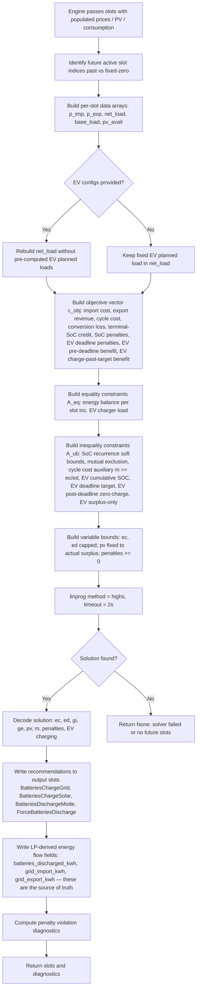
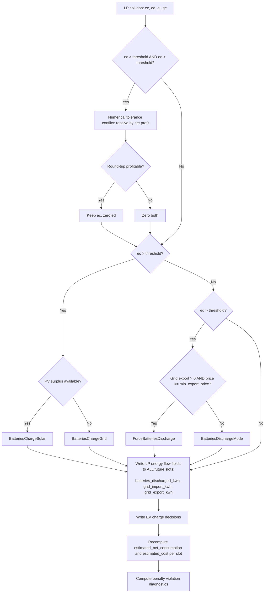

# HSEM MILP Optimization

The MILP solver (`planner/milp_optimizer.py`) finds the globally optimal battery charge/discharge schedule using scipy's HiGHS linear programming solver. It is the **primary planner** — heuristic candidates are generated alongside it for benchmarking and fallback, but when scipy is available the MILP solution is preferred.

---

## Pipeline



---

## Variable layout

### Base battery variables (8 × n slots)

For each slot `t ∈ 0…n-1` the LP variable vector `x` contains eight decision variables:

| Offset | Variable | Name | Description | Bounds |
|---|---|---|---|---|
| `0` | `ec[t]` | `ec_off` | Energy charged and stored in battery this slot (kWh) | `[0, max_charge_per_slot]` |
| `n` | `ed[t]` | `ed_off` | Energy discharged from battery this slot (kWh) | `[0, max_discharge_per_slot]` |
| `2n` | `gi[t]` | `gi_off` | Grid import this slot (kWh) | `[0, ∞)` |
| `3n` | `ge[t]` | `ge_off` | Grid export this slot (kWh) | `[0, ∞)` |
| `4n` | `pv[t]` | `pv_off` | PV surplus available in slot t (kWh) | `[pv_avail[t], pv_avail[t]]` (fixed) |
| `5n` | `m[t]` | `m_off` | Auxiliary variable ≥ max(ec[t], ed[t]) for cycle cost (kWh) | `[0, ∞)` |
| `6n` | `s_max_pen[t]` | `s_max_off` | SoC upper penalty — kWh by which state of charge exceeds `usable_kwh` | `[0, ∞)` |
| `7n` | `s_min_pen[t]` | `s_min_off` | SoC lower penalty — kWh by which state of charge drops below 0 | `[0, ∞)` |

The state of charge `soc[t]` is **not an explicit variable** — it is derived from the forward recurrence:

$$
soc[t] = soc[0] + \sum_{k=0}^{t} \bigl( ec[k] - ed[k] \bigr)
$$

Penalty variables `s_max_pen` and `s_min_pen` prevent infeasibility when the initial SoC lies outside `[0, usable_kwh]`. Their objective coefficient is extremely high (`max(p_imp) × 100`), so they are only used when the initial state is physically out of bounds.

### EV co-optimization extension

When one or more active EVs are provided, the variable vector expands to:

$$
\text{total variables} = 8n + n \cdot E + E
$$

where `E` is the number of active EVs.

| Offset | Variable | Name | Description | Bounds |
|---|---|---|---|---|
| `8n + i·n` | `evN_c[t]` | EV N DC-side charge per slot (kWh) | `[0, evN.max_charge_per_slot]` |
| `8n + E·n + i` | `evN_pen` | EV N deadline target slack (kWh shortfall) | `[0, ∞)` |

The EV charger AC load entering the energy balance equation is `evN_c[t] / charger_efficiency`.

When an EV's `charge_past_target` flag is `True` (EV already at user-configured target SoC, `allow_charge_past_target_soc` enabled, SoC < 100 %):
- The deadline constraint is **suppressed** (`deadline_slot = None`) — no grid import pressure
- The **surplus-only constraint** is added (see Constraints below)
- An **avoided-future-import-cost benefit** (`future_value_per_kwh`, issue #630) is added to the objective, falling back to a tiny fixed tiebreaker when no future price data is available (see Objective function below)

When an EV has a deadline and `charge_past_target=False` (normal mode):
- **Pre-deadline slots** (`t \u2264 D`): direct benefit `-ev_penalty_cost` on `ev_c[t]` forces charging.  This benefit is **mutually exclusive** with `charge_past_target` — the LP guards the pre-deadline benefit block with `and not ev.charge_past_target`, mirroring the post-deadline zero-charge and target-cap constraint guards.
- **Post-deadline slots** (`t > D`): hard constraint `ev_c[t] = 0` — charging is forbidden

### Fuse constraint extension (issue #567)

When `main_fuse_amps > 0`, the variable vector expands further:

$$
\text{total variables} = 8n + n \cdot E + E + n
$$

| Offset | Variable | Name | Description | Bounds |
|---|---|---|---|---|
| after EV vars | `gi_pen[t]` | `gi_pen_off` | Grid import fuse penalty — kWh exceeding the main fuse rating | `[0, ∞)` |

The max grid import per slot is converted from amps to kWh/slot:

$$
\mathrm{max\_grid\_import} = \frac{\mathrm{amps} \times 230 \times \mathrm{phases}}{1000} \times \frac{\mathrm{interval\_minutes}}{60}
$$

where ``phases`` is the electrical phase count (1 or 3, default 3).
This assumes balanced load at 230 V phase-to-neutral per phase.

The penalty uses the same high coefficient as SoC penalties (`max(p_imp) × 100`), ensuring the solver only exceeds the fuse limit when physically unavoidable (e.g. house base load alone exceeds the rating). When `main_fuse_amps` is `None` or 0, no variables or constraints are added — behaviour is unchanged.

---

## Objective function

$$
\begin{aligned}
\mathrm{minimise} \quad
\sum_{t} \delta_t \cdot \bigg[
    & p_{\mathrm{imp}}[t] \cdot gi[t]
    && \text{grid import cost} \\
    - & p_{\mathrm{exp}}[t] \cdot ge[t]
    && \text{export revenue} \\
    + & \alpha \cdot m[t]
    && \text{battery cycle cost (depreciation)} \\
    + & \epsilon_{\mathrm{chg}} \cdot p_{\mathrm{imp}}[t] \cdot ec[t]
    && \text{charge-side conversion loss cost} \\
    + & \epsilon_{\mathrm{dis}} \cdot \max\bigl(p_{\mathrm{imp}}[t],\, p_{\mathrm{exp}}^{\mathrm{loss}}[t]\bigr) \cdot ed[t]
    && \text{discharge-side conversion loss cost} \\
    + & p_{\mathrm{soc}} \cdot \bigl( \mathrm{s\_max\_pen}[t] + \mathrm{s\_min\_pen}[t] \bigr)
    && \text{SoC soft-constraint penalties} \\
    + & p_{\mathrm{fuse}} \cdot \mathrm{gi\_pen}[t]
    && \text{Main fuse grid-import penalty}
\bigg] \\
+ \sum_{t} \gamma \cdot \bigl( ed[t] - ec[t] \bigr)
    && \text{terminal-SoC valuation (undiscounted)} \\
\end{aligned}
$$

Plus EV deadline penalties (undiscounted — deadline is a hard commitment):

$$
\sum_{v=1}^{E} p_{\mathrm{ev\_pen}}^{(v)} \cdot \mathrm{ev\_pen}_v
$$

Where:

| Symbol | Description |
|---|---|
| $\delta_t$ | Time discount per slot: $\delta_t = r^{\Delta t}$ where $\Delta t$ is hours from now |
| $p_{\mathrm{imp}}[t]$ | Sanitised grid import price (currency/kWh): $\max(p_{\mathrm{imp\_raw}}[t], 0)$.  Negative import prices are clamped to zero to prevent unbounded LP behaviour — the LP never earns synthetic profit from a negative price slot (issue #655). |
| $p_{\mathrm{exp}}[t]$ | Grid export price (currency/kWh). Before solving, `p_exp` is sanitised: (1) clamped to 0 when below `min_export_price` (physically blocked export), and (2) clamped to `min(p_exp, p_imp)` to prevent an unbounded LP when `p_exp > p_imp` in any slot (issue #635). |
| $\alpha$ | Battery cycle cost per kWh: $\alpha = \frac{P \cdot L_{pct}/100}{2 \cdot N \cdot C_u}$ |
| $\epsilon_{\mathrm{chg}}$ | Charge-side loss fraction: $\epsilon_{\mathrm{chg}} = 1 - \eta_{\mathrm{chg}}$ |
| $\epsilon_{\mathrm{dis}}$ | Discharge-side loss fraction: $\epsilon_{\mathrm{dis}} = 1 - \eta_{\mathrm{dis}}$ |
| $\gamma$ | Terminal-SoC replacement price (currency/kWh), from the engine |
| $p_{\mathrm{soc}}$ | SoC penalty cost: $\max(p_{\mathrm{imp}}) \times 100$ |
| $p_{\mathrm{fuse}}$ | Fuse penalty cost: $\max(p_{\mathrm{imp}}) \times 100$ (same magnitude as SoC) |
| $p_{\mathrm{ev\_pen}}^{(v)}$ | EV deadline penalty for EV v: $\max(p_{\mathrm{imp}}) \cdot \max(\mathrm{energy\_needed}, 1.0) \cdot 10$ |
| $\beta_{\mathrm{ev}}^{(v)}$ | EV charge-past-target benefit for EV v: `future_value_per_kwh` — avoided-future-import valuation (issue #630), or a $0.0001$ per kWh AC fallback tiebreaker when no future price data is available |

Plus EV pre-deadline benefit (undiscounted, per EV $v$ with deadline, slots $t \leq D_v$):

$$
-\sum_{v=1}^{E} \sum_{t=0}^{D_v} p_{\mathrm{ev\_pen}}^{(v)} \cdot \mathrm{ev\_c}_v[t]
$$

This direct benefit on pre-deadline slots ensures the LP always prefers charging over paying the deadline penalty. Post-deadline slots ($t > D_v$) have zero coefficient unless `charge_past_target=True`.

The pre-deadline benefit block and the charge-past-target benefit block are **mutually exclusive** by design. The LP construction guards the pre-deadline block with `and not ev.charge_past_target`, mirroring the post-deadline zero-charge constraint's guard. An EV in charge-past-target mode never receives the large penalty-driven benefit — only the `future_value_per_kwh` benefit (or its tiebreaker fallback) applies. This exclusion is enforced directly in the LP construction rather than relying on caller discipline in `engine_core.py`.

Plus EV charge-past-target benefit (discounted, per charge-past-target EV $v$):

$$
-\sum_{v \in \mathrm{past\_target}} \sum_{t} \delta_t \cdot \frac{\beta_{\mathrm{ev}}^{(v)}}{\eta_{\mathrm{charger}}^{(v)}} \cdot \mathrm{ev\_c}_v[t]
$$

$\beta_{\mathrm{ev}}^{(v)}$ is `EVConfig.future_value_per_kwh`: the avoided cost of importing the same energy later, computed as `confidence_factor × mean(import_price)` over the next 24 hours (`ev_future_charge_value_per_kwh` in `candidate_selector.py`, mirroring `replacement_price_from_next_discharge` for the house battery's terminal SoC). `confidence_factor` defaults to `0.9` and is configurable per EV (`hsem_ev_past_target_confidence_factor` / `hsem_ev_second_past_target_confidence_factor`) to discount for uncertainty in whether the EV will actually need the extra energy before its next charge.

Because $\beta_{\mathrm{ev}}^{(v)}$ is priced in the same currency units as $p_{\mathrm{imp}}$ and $p_{\mathrm{exp}}$, charge-past-target EV charging competes fairly against both house battery charging and grid export — whichever has the higher genuine avoided-cost value wins the surplus for that slot. When no future price data is available (`future_value_per_kwh` is `None`), the MILP falls back to a tiny fixed tiebreaker ($0.0001$ per kWh AC) so surplus PV still prefers the EV over being wastefully curtailed/exported at near-zero or negative prices.

---

## Constraints

### Equality constraint — energy balance per slot

For each slot $t$:

$$
gi[t] + pv[t] + ed[t] \cdot \eta_{\mathrm{dis}} =
\operatorname{base\_load}[t] + \frac{ec[t]}{\eta_{\mathrm{chg}}} + ge[t] + \sum_{v=1}^{E} \frac{\operatorname{ev\_c}_v[t]}{\eta_{\mathrm{charger}}^{(v)}}
$$

- `base_load[t]` = $\max(\operatorname{net\_load}[t], 0)$ — demand the grid/battery must satisfy (kWh)
- `net_load[t]` = `avg_house_consumption[t] - solcast_pv_estimate[t]` (when EV co-optimisation active)
- `pv_avail[t]` = $\max(-\operatorname{net\_load}[t], 0)$ — PV surplus fixed to the `pv[t]` variable bounds
- EV charger efficiency re-scales DC-side charge to AC grid/PV load

### Inequality constraints

**SoC upper bound (soft):**

$$
\sum_{k=0}^{t} \bigl( ec[k] - ed[k] \bigr) - \mathrm{s\_max\_pen}[t] \leq C_u - soc_0
$$

**SoC lower bound (soft):**

$$
-\sum_{k=0}^{t} \bigl( ec[k] - ed[k] \bigr) - \mathrm{s\_min\_pen}[t] \leq soc_0
$$

**Mutual exclusion — no simultaneous charge + discharge:**

$$
\frac{ec[t]}{\mathrm{max\_charge}} + \frac{ed[t]}{\mathrm{max\_discharge}} \leq 1
$$

**Cycle cost auxiliary — forcing $m[t] \geq ec[t]$ and $m[t] \geq ed[t]$:**

$$
-m[t] + ec[t] \leq 0
$$
$$
-m[t] + ed[t] \leq 0
$$

**EV cumulative SoC upper bound (per EV v):**

$$
\sum_{k=0}^{t} \mathrm{ev\_c}_v[k] \leq \mathrm{capacity}_v - \mathrm{initial\_soc}_v
$$

**EV deadline target (soft, per EV v):**

$$
\mathrm{initial\_soc}_v + \sum_{k=0}^{D_v} \mathrm{ev\_c}_v[k] + \mathrm{ev\_pen}_v \geq \mathrm{target}_v
$$

**EV post-deadline zero-charge (hard, per EV v with deadline and `charge_past_target=False`):**

$$
\mathrm{ev\_c}_v[t] = 0 \quad \forall\, t > D_v
$$

This hard constraint prevents any EV charging after the deadline unless
`charge_past_target=True` (surplus-PV-only mode).

**EV surplus-only constraint (per charge-past-target EV v, per slot t):**

$$
\frac{\mathrm{ev\_c}_v[t]}{\eta_{\mathrm{charger}}^{(v)}} \leq \max\bigl(0,\; \mathrm{pv\_avail}[t] - \mathrm{base\_load}[t]\bigr)
$$

This constraint ensures charge-past-target EVs only consume **genuine PV surplus** — never battery discharge or grid import. It is added for EVs where `charge_past_target=True` (EV already at user-configured target SoC but `allow_charge_past_target_soc` is enabled and SoC < 100 %). The house battery charges first (benefit ~$p_{\mathrm{imp}}$), then export at good prices (benefit $p_{\mathrm{exp}}$), and only when both are saturated does the EV get the remaining surplus.

**Main fuse grid import limit (soft):**

For each slot $t$, when `main_fuse_amps > 0`:

$$
gi[t] - \mathrm{gi\_pen}[t] \leq \frac{\mathrm{amps} \times 230 \times \mathrm{phases}}{1000} \times \frac{\mathrm{interval\_minutes}}{60}
$$

The penalty variable `gi_pen[t]` absorbs any excess at high cost (`p_fuse`), preventing infeasibility when house base load alone exceeds the fuse rating. When `main_fuse_amps` is `None` or 0, this constraint is not added.

Where $D_v$ is the deadline slot index for EV v.

---

## Price sanitisation

Before the LP is built, two sanitisation steps are applied to `p_exp` to prevent solver instability and maintain consistency with physical constraints:

### 1. Min-export-price clamp

Slots where `p_exp < min_export_price` are clamped to 0. The applier physically blocks export for these slots by setting the inverter to `GRID_EXPORT_LIMIT_WATT`, so the LP must not optimise around a price signal that will never be realised. Negative export prices are **not** clamped — the `curt[t]` variable (zero objective cost) naturally handles them.

### 2. Export-≤-import clamp (issue #635)

`p_exp` is clamped to never exceed `p_imp` for the same slot:

$$
p_{\mathrm{exp}}[t] = \min\bigl(p_{\mathrm{exp}}[t],\; p_{\mathrm{imp}}[t]\bigr)
$$

Without this, slots where `p_exp > p_imp` create an **unbounded LP** (HiGHS status=3). `gi[t]` and `ge[t]` are both `[0, ∞)` and linked only through the per-slot energy-balance equality, so the LP can drive both to infinity (import cheap, export expensive) while the terms cancel. A single such slot causes `solve_milp()` to return `None` for the **entire horizon**, silently falling back to weaker heuristic candidates.

This condition occurs in practice whenever negative import spot prices coincide with positive export tariffs (common in DK/DE/NL markets during high wind/solar hours), or when asymmetric import/export grid fees create an apparent export-price premium.

The clamp is economically correct and capping the achievable arbitrage spread removes the unbounded direction without changing any other optimisation behaviour.

### 3. Discharge-side loss pricing: max-price convention (issue #641)

The energy lost to discharge-side conversion inefficiency is priced using
the higher of the sanitised import price and the (pre-clamp) export price:

```text
p_loss_discharge[t] = max(p_imp_obj[t], max(p_exp_for_loss[t], 0))
```

where `p_exp_for_loss[t]` is the slot's export price after the
min-export-price clamp but **before** the export-to-import clamp.

**Rationale:** The true marginal value of lost discharge energy depends on
where the discharged energy was destined:

- **House-load coverage:** The alternative is importing, so lost kWh are
  valued at the import price (avoided import cost).
- **Export:** The alternative is exporting that kWh, so lost kWh are valued
  at the export price (foregone export revenue).

Since the LP cannot know the destination split before solving, using
`max(p_imp_obj, p_exp_for_loss)` is a conservative approximation that never
under-prices loss.  In the common case (both prices positive), the max
reduces to `p_imp_obj`, identical to the pre-#641 behaviour.  The max
matters only when `p_exp_for_loss > p_imp_obj`, which occurs when negative
import prices overlap positive export tariffs.

Using the export price **before** the export-to-import clamp (but after
the min-export-price clamp) is deliberate.  The export-to-import clamp is a
solver-stability mechanism for the `gi[t]` / `ge[t]` arbitrage direction.
The discharge variable `ed[t]` is physically bounded, so using the pre-clamp
export price for its loss coefficient cannot re-introduce unboundedness.
This also matches what `cost_function.py` sees (the scorer does not apply
the export-to-import clamp), keeping the two files consistent.

---

## Post-processing

After solving, the solution is decoded into slot recommendations and energy flow fields:



### Energy flow fields written to slots (issue #637)

The MILP now writes **all** per-slot energy flow fields directly from the LP solution,
making them the source of truth:

| Field | LP variable | Description |
|---|---|---|
| `batteries_discharged_kwh` | `ed[t]` | Energy discharged from battery (kWh) |
| `grid_import_kwh` | `gi[t]` | Grid import (kWh) |
| `grid_export_kwh` | `ge[t]` | Grid export (kWh) |

These are populated for **every** future slot (zero for idle slots).  The
SoC simulation (:func:`~soc_simulation.simulate_soc`) must be called with
``milp_prepopulated=True`` for MILP-sourced candidates so it preserves
these values verbatim instead of re-deriving a different (greedy)
allocation from the recommendation label and net demand.

### EV charging fields written to slots

| Field | Source |
|---|---|
| `ev_planned_load_kwh` | AC load added when `base_load_includes_ev` is `False` |
| `ev_accounted_load_kwh` | AC load when already captured in house consumption |
| `ev_total_planned_load_kwh` | Total AC load (sum of planned + accounted) |
| `ev_charger_calculated_power` | Target AC power (W) for primary EV |
| `ev_second_charger_calculated_power` | Target AC power (W) for second EV |

### Engine-level post-processing (after winner selection)

After the MILP (or baseline) winner is selected, the engine runs a final pass over all slots to ensure consistency:

1. **Power recomputation**: `ev_charger_calculated_power` is recomputed from the actual per-slot EV AC load (`ev_planned_load_kwh + ev_accounted_load_kwh`).  For the current (partially elapsed) slot the remaining time is used as the divisor.  This ensures the power field always matches the load, even when the baseline candidate wins (bypassing the MILP's own power calculation).

2. **Minimum power floor**: If the computed AC power is below `charger_min_power_w` (default 1380 W = 230 V × 6 A), the charger physically cannot start.  The slot's EV fields are zeroed out:
   - `ev_charger_calculated_power = 0`
   - `ev_planned_load_kwh = 0`, `ev_accounted_load_kwh = 0`, `ev_total_planned_load_kwh = 0`
   - `recommendation` cleared if it was `ev_smart_charging`
   - `estimated_net_consumption_kwh` and `estimated_cost_currency` recomputed without EV load

3. **EV plan rebuild**: When the MILP wins, the `EVChargingPlan` objects (used by the `ev_optimal_charging_plan` sensor) are rebuilt from the winning slots via `rebuild_ev_plan_from_slots()`.  This ensures the sensor displays the MILP's actual decisions, not the EV planner's pre-MILP estimate.

---

## Assumptions

- **Linear relaxation**: Binary charge/discharge flags are relaxed to continuous because the mutual-exclusion constraint and per-slot power caps already prevent simultaneous charge + discharge in the optimal solution.
- **Deterministic inputs**: All forecasts (prices, PV, load) are treated as known with certainty — no stochastic programming.
- **Cycle cost proxy**: The `m[t] = max(ec[t], ed[t])` formulation counts the larger of charge or discharge per slot, matching the 2× denominator in the cycle cost formula.
- **Time discount**: The objective uses exponential discounting with `time_discount_rate^hours_ahead` to match the selector's discounted score.
- **Export price clamping**: Negative export prices and prices below `min_export_price` are clamped to 0 before solving, reflecting physical inverter behaviour.
- **Terminal-SoC credit**: Undiscounted in the objective, matching the cost function's `terminal_soc_value`.

---

## Solver configuration

| Parameter | Value | Rationale |
|---|---|---|
| Method | `highs` | scipy's HiGHS is the only supported LP method |
| Timeout | 2.0 s | Covers 192-slot (768+ variable) problems where preprocessing reaches 200-400 ms |
| `pv[t]` bounds | `(pv_avail[t], pv_avail[t])` | Fixed — PV surplus is not chosen by the LP |

---

## Fallback

If `scipy` is unavailable, `usable_kwh ≤ 0`, or the solver fails (crash, timeout, or non-success status), `solve_milp()` returns `None`. The engine silently drops the MILP candidate and the heuristic candidates compete as normal. Pickup is be measured via the `hsem_plan_origin` metric: `milp` when the LP succeeds, `rule_based` otherwise.

---

## Related

- [HSEM Planner Specification](planner-spec.md)
- [Cost Function Math](cost-function-math.md)
- [Energy Accounting](energy-accounting.md)
- [Candidate Generation](candidate-generation.md)