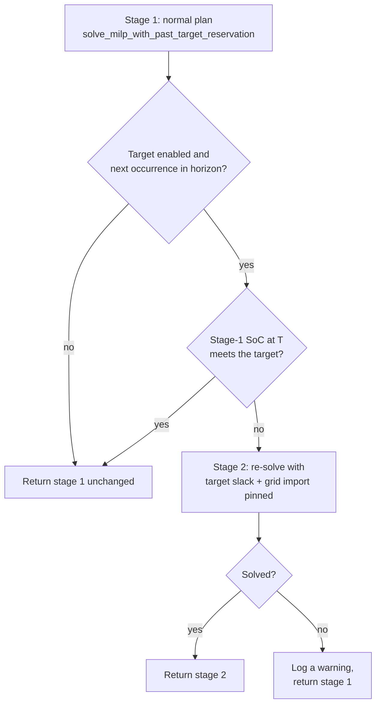

# HSEM Planner Specification

This document defines how the HSEM planner should work.

Use it as the reference for reviewing planner code, cost planning, and optimization changes.

## Goals

The planner must:

- minimize expected total cost within the configured horizon
- respect battery and inverter constraints
- keep energy accounting physically consistent
- avoid hardware writes when inputs are unsafe
- explain why a plan was selected
- produce deterministic output for the same input

## Core concepts

### Slot

A slot is one time interval in the planning horizon.

Each slot must have:

- start time
- end time
- duration in hours
- expected house load in kWh
- expected PV production in kWh
- import price per kWh
- export price per kWh
- optional tariff per kWh
- recommendation
- planned battery charge in kWh
- planned battery discharge in kWh
- expected SoC before and after the slot

Power values in kW must be converted to energy using:

```text
energy_kwh = power_kw * duration_hours
```

### Slot grid and DST

The slot grid starts at local midnight of `now`'s date and ends
`interval_length_hours` of local wall-clock time later. Both the
recommendation grid (`coordinator_builder.generate_recommendation_intervals`)
and the planner's `TimeSeriesIndex` build it with
`utils.datetime_utils.physical_slot_grid`, which steps in physical (UTC)
time (issue #1160):

- The local zone comes from `now.tzinfo`. `now_iso` only carries a fixed
  UTC offset, which has no DST rules, so `run_planner` re-expresses `now`
  in `PlannerInput.time_zone` (the HA zone's IANA name, set by
  `build_planner_input`) before building the grid (issue #1169). Without
  it, a DST day is planned as 24 fixed-offset hours and no longer lines up
  with the recommendation grid or the `(day_offset, slot_in_day)` price
  keys. `time_zone=None` (old dumps, hand-built inputs) keeps that
  fixed-offset behaviour.

- Every slot spans exactly `interval_minutes` of real time, so
  `slot_fraction = interval_minutes / 60` is always the real duration.
- A DST day has its real length: 23 h (92 × 15 min) on the spring-forward
  day, with no slots at the non-existent 02:xx times, and 25 h
  (100 × 15 min) on the fall-back day, with both occurrences of the repeated
  hour.
- Boundaries carry a fixed UTC offset (`02:00+02:00`, then `02:00+01:00`),
  so comparing, sorting and subtracting slot times is by physical instant.
  Two datetimes sharing one `ZoneInfo` compare by wall clock and cannot
  tell the repeated hour's two occurrences apart; match slots by
  `utc_key` / UTC instants, never by local wall-clock time.
- Past / live / future checks compare UTC instants (issue #1167): the live
  slot is `slot_contains(start, end, now)`, a future slot is
  `slot_is_future(end, now)`, and anything aligned with the MILP's LP rows
  uses `future_slot_indices`. `as_tz(x, now.tzinfo)` is only for reading
  wall-clock fields (`.date()`, `.hour`); ordering it against a `ZoneInfo`
  `now` compares by wall clock. `tests/test_dst_slot_compare.py` guards
  against the pattern returning.
- Slots are half-open `[start, end)`, so a slot with `end == now` has
  passed: `mark_time_passed` labels it `time_passed`, the MILP leaves it
  out, `simulate_soc` zeroes its SoC display and the consistency gate skips
  its balance check. Every pass uses the same rule (`slot_is_future`); a
  strict `end < now` in `mark_time_passed` once left the boundary slot
  labelled but unsolved whenever `now` fell exactly on a boundary
  (issue #1174).
- `SlotKey.slot_in_day` (and `PricePoint.slot_in_day`, via
  `utils.datetime_utils.slot_position`) counts real steps since the local
  midnight of the slot's date. It equals `(hour × 60 + minute) // interval`
  on ordinary days and stays unique on DST days, so each of the fall-back
  day's two hour-2 prices lands on its own slot.
- Hour-granular series (consumption averages, an hourly Solcast PV source,
  and the hourly price fallback) are keyed by `(day_offset, hour)`, so both
  occurrences of the repeated hour use the same hourly value. A sub-hourly
  PV source is keyed by `(day_offset, slot_in_day)` like prices, so each
  occurrence keeps its own values (issue #1191).

## Recommendation priority rules

### Three-layer model

Recommendations are assigned and potentially overridden in three layers.
Every layer must respect the rules below.

#### Layer 1 — Planner engine (pre-simulation)

Slots are assigned recommendations by the scheduling functions in strict
priority order. Once a slot has a non-`None` recommendation, later rules
in the same layer must not change it.

> **Fixed schedules removed (issue #860):** user-configured charge/discharge
> schedule windows were confirmed inert whenever MILP is active (the default
> planner path) and removed entirely — the schedule-consuming heuristic
> candidates had already been retired, so schedule-derived recommendations
> never reached the final plan. No code reads a configured window, and the
> `hsem_batteries_enable_batteries_schedule_*` keys are dropped during the v4
> config migration. Layer 1 therefore begins with the opportunistic grid
> charge below; `batteries_discharge_window_mode` is produced only by the
> seasonal fill (step 5).

**Opportunistic grid charge** (outside any schedule):

1. Import price < 0 → `batteries_charge_grid`
2. Import price ≤ depreciation threshold − cycle cost → `batteries_charge_grid`

**Excess export** (only when enabled):

1. Export price > threshold AND battery above required capacity → `force_batteries_discharge`

**Seasonal fill** (remaining `None` slots):

1. Export price > import price AND export price ≥ `export_min_price` → `force_export`
2. Actual PV surplus (`estimated_net_consumption_kwh < 0`) and battery not full → `batteries_charge_solar`
   — allocated from a per-calendar-day budget over the day's unassigned slots sorted by
   **ascending export price**, so the cheapest-export slots are served first. A slot reached
   after the budget is exhausted receives a residual allocation that may round to `0.000`
   while still carrying the label; the SoC simulation clears such a label (see
   "Zero-charge labels" below, issue #989).
3. Future `force_batteries_discharge` AND battery > required → `batteries_wait_mode`
4. Slot's month is a winter month → `batteries_wait_mode`
5. Slot's month is a summer month, actual PV surplus → `batteries_charge_solar`; else → `batteries_discharge_window_mode` (the SoC simulation relabels between this and `batteries_discharge_mode` in both directions, based on whether the battery actually discharges — see "Zero-discharge labels" below)

> **Note:** `BatteriesChargeSolar` is only assigned when there is a genuine PV
> surplus (negative net consumption). A small positive house load with zero PV
> must not be mislabeled as solar charging — that would cause the applier to
> write `MaximizeSelfConsumption` instead of `TimeOfUse` + charge TOU
> (issue #720).

> **Per-slot season:** the seasonal check (steps 4–5) uses each slot's own
> calendar month (derived from the slot's `start` timestamp in the local
> timezone), **not** the month of `now`. This means a planning horizon that
> crosses a season boundary (e.g. Aug 31 → Sep 1) applies the correct seasonal
> strategy to every slot independently — summer slots get discharge/solar and
> winter slots get wait-mode, even within the same 48-hour plan.

### Layer 2 — EV planned load labelling (post-simulation)

After the final SoC simulation, slots are relabelled where HSEM has actual
actuator intent: `ev_charger_calculated_power > 1e-9` OR
`ev_second_charger_calculated_power > 1e-9` (see
`_label_commanded_ev_slots` in `engine_core.py`).

`ev_total_planned_load_kwh` is **deliberately excluded** from this trigger.
It represents fixed/accounted session energy — physical demand, not a
command to run a charger — so a slot with planned EV load but a zero
per-charger command must not be labelled `ev_smart_charging`. Only a
positive per-charger command is treated as permission to display the EV
label; this keeps the label off-authoritative even while stale live power
is still being measured.

`hsem_house_power_includes_ev_charger_power` describes only the raw live CT
position. `base_load_includes_ev` separately describes whether a specific EV
remains embedded in the normalized planner baseline after HSEM preprocessing.
There is no separate user input for the planner field.

- `batteries_charge_solar` → `ev_smart_charging`
- `batteries_wait_mode` → `ev_smart_charging`
- All other recommendations: **kept unchanged** (must not be overridden by EV label)

The following must never be overridden by the EV label:
`batteries_charge_grid`, `force_batteries_discharge`, `force_export`,
`time_passed`, `missing_input_entities`.

`batteries_discharge_mode` and `batteries_discharge_window_mode` are **not** in this
protected set — they are intentionally overrideable. When an EV is scheduled to
charge in a slot that is also inside a discharge window, the `ev_smart_charging`
label wins so dashboards correctly reflect EV activity rather than showing a
discharge recommendation during an active charge session.

#### Layer 3 — Runtime resolver (current slot only, at hardware-write time)

Applied to the current slot immediately before hardware writes, using live sensor data:

1. `import_price < 0` AND `batteries_enable_excess_export` is enabled AND the
   live export price is authoritative, non-negative, and at/above
   `max(export_electricity_min_price, batteries_export_min_price)` →
   `force_export` (overrides everything else). Otherwise this rule does not
   fire and evaluation continues at rule 2 (issue #732 — a negative import
   price does not by itself make exporting profitable, and must not silently
   override a disabled excess-export setting).
2. `batteries_charge_grid` → kept (must never be overridden by EV or discharge rule)
3. Any EV actively charging (live) AND the planner allocated EV load for this
   slot (`ev_charger_calculated_power > 1e-9`, `ev_second_charger_calculated_power > 1e-9`,
   or `ev_total_planned_load_kwh > 1e-9`) → `ev_smart_charging`.

   A live charging session with the planner's per-charger command at `0` (e.g.
   target SoC reached, no surplus PV, expensive grid power) does **not**
   override — the planner's original recommendation stands. See
   `custom_sensors/recommendation_resolver.py`, `planner_allocated_ev`.

No fixed-schedule capacity override exists. The former
`batteries_schedules_remaining_capacity_needed` rule was removed with the inert
battery-schedule feature (#860/#873); the planner's current recommendation is
kept when none of the three runtime rules above fires.

### Invariants for tests

- A slot assigned `batteries_charge_grid` by the planner must never be relabelled by
  the EV load labelling pass (layer 2).
- A slot assigned `batteries_discharge_mode` or `batteries_discharge_window_mode`
  **may** be relabelled `ev_smart_charging` by the EV load labelling pass when
  `ev_charger_calculated_power > 1e-9` or `ev_second_charger_calculated_power > 1e-9`.
- A slot with `ev_charger_calculated_power > 1e-9` (or
  `ev_second_charger_calculated_power > 1e-9`) and recommendation
  `batteries_charge_solar` must be relabelled `ev_smart_charging` after layer 2.
- A slot with `ev_charger_calculated_power > 1e-9` (or
  `ev_second_charger_calculated_power > 1e-9`) and recommendation
  `batteries_wait_mode` must be relabelled `ev_smart_charging` after layer 2.
- A slot with `ev_total_planned_load_kwh > 0` but `ev_charger_calculated_power == 0`
  and `ev_second_charger_calculated_power == 0` must **not** be relabelled
  `ev_smart_charging` by layer 2 — planned session energy without an actuator
  command is physical demand, not permission to display the EV label.
- The runtime resolver must set `force_export` when `import_price < 0` AND
  excess battery export is enabled AND the live export price is available,
  non-negative, and at/above the configured export floor — regardless of the
  planner recommendation.
- The runtime resolver must NOT set `force_export` when `import_price < 0` but
  `batteries_enable_excess_export` is disabled.
- The runtime resolver must NOT set `force_export` when `import_price < 0` but
  the live export price is negative, below the configured floor, or
  unavailable.
- The runtime resolver must NOT override `batteries_charge_grid` even when an EV
  is actively charging.
- The runtime resolver must NOT override `batteries_charge_grid` even when
  `import_price < 0` is False and EV is charging.
- Priority 1 (negative price + profitable export → `force_export`) always
  beats priority 3 (EV charging) when it fires.
- The runtime resolver must NOT relabel to `ev_smart_charging` when the EV is
  actively charging (live) but the planner allocated zero EV load for the slot
  (`ev_charger_calculated_power == 0` and `ev_second_charger_calculated_power == 0`
  and `ev_total_planned_load_kwh == 0`) — the planner's original recommendation
  must stand. Covered by
  `tests/sensors/test_recommendation_resolver.py::test_ev1_charging_but_planner_zero_power_no_override`.

## Energy balance per slot

For every slot:

```text
net_load_kwh = house_load_kwh + ev_planned_load_kwh - pv_kwh
```

`ev_planned_load_kwh` is the **extra** EV AC load to add to net consumption — the
portion not already captured in `house_load_kwh`. See the EV load semantics section
for the three-field breakdown.

When EV integration is disabled, `ev_planned_load_kwh` is `0.0` for every slot
and the formula is identical to the non-EV case.

Positive `net_load_kwh` means the house (plus any extra EV load) needs energy.

Negative `net_load_kwh` means there is net surplus (solar minus house and EV load).

### EV charger energy source

The EV charger is an **AC appliance** that draws directly from the grid or from
PV surplus. **It never draws from the house battery.** This means:

- The battery's net demand is computed from `house_load - pv` only.
- `ev_planned_load_kwh` is added to `grid_import_kwh` — not to the battery
  discharge calculation.
- When PV surplus is available the EV consumes from it first (reducing
  `grid_export_kwh`); any residual EV demand that cannot be met by PV is
  imported from the grid.
- `batteries_discharged` is therefore independent of `ev_planned_load_kwh`.

At execution time, the #816 live-minus-planned phase-headroom reservation applies
only to a charger HSEM manages through its built-in OCPP server. A managed charger
may still be drawing above a newly reduced command during the anti-flap ramp-down
window, so temporarily reducing the Huawei discharge cap prevents a phase-fuse
transient. For an externally controlled charger, planned `0 W` means HSEM has no
actuator command; its live grid draw must not reduce the planned battery discharge
to house load (issue #1086).

Battery and grid flows must satisfy:

```text
house_load_kwh
= pv_used_for_house_kwh
+ battery_discharge_to_house_kwh
+ grid_import_for_house_kwh

grid_import_kwh
= grid_import_for_house_kwh
+ grid_import_for_battery_kwh
+ ev_grid_import_kwh
```

PV production must satisfy:

```text
pv_kwh
= pv_used_for_house_kwh
+ pv_used_for_ev_kwh
+ pv_used_for_battery_kwh
+ pv_exported_kwh
+ pv_curtailed_kwh
```

Battery charge must satisfy:

```text
battery_charge_stored_kwh
= pv_used_for_battery_kwh * charge_efficiency
+ grid_import_for_battery_kwh * charge_efficiency
```

Grid import for charging:

```text
grid_import_for_battery_kwh = battery_charge_stored_kwh / charge_efficiency
```

Battery discharge must satisfy:

```text
usable_battery_discharge_kwh
= battery_energy_removed_kwh * discharge_efficiency
```

Battery energy to remove in order to deliver a target house load:

```text
battery_energy_removed_kwh = house_load_kwh / discharge_efficiency
```

## Battery efficiency

HSEM tracks charge-side and discharge-side efficiency independently.

### Parameters

| Parameter            | Field                              | Default | Description                                   |
| -------------------- | ---------------------------------- | ------- | --------------------------------------------- |
| Charge efficiency    | `battery_charge_efficiency_pct`    | 97 %    | Fraction of input energy stored.              |
| Discharge efficiency | `battery_discharge_efficiency_pct` | 97 %    | Fraction of stored energy delivered to house. |

### Semantics

```text
battery_stored = grid_or_pv_input × (charge_efficiency_pct / 100)
house_delivered = battery_removed × (discharge_efficiency_pct / 100)
grid_import_for_battery = battery_stored / (charge_efficiency_pct / 100)
battery_to_remove = house_load / (discharge_efficiency_pct / 100)
```

Round-trip yield:

```text
roundtrip_yield = (charge_efficiency_pct / 100) × (discharge_efficiency_pct / 100)
roundtrip_loss  = 1 − roundtrip_yield
```

Example (90 % / 90 %): yield = 0.81, loss = 19 %.

### Physical conversion-loss accounting

Conversion loss is represented completely by the AC/DC energy balance. If
`ec[t]` is stored battery charge and `ed[t]` is battery energy removed:

```text
charge_ac_draw[t] = ec[t] / charge_efficiency
discharge_ac_delivery[t] = ed[t] * discharge_efficiency
```

The objective and scorer price the resulting `grid_import_kwh` and
`grid_export_kwh`. Charging loss therefore appears as additional billable AC
import or foregone PV export; discharge loss appears as less avoided import or
less AC export. A separate `(1-efficiency)` monetary coefficient would price the
same energy twice.

The public `conversion_loss_cost` and
`discharge_loss_cost_destination_aware` fields remain for schema compatibility
and are always `0.0`.

### Invariants for tests

- Charging 10 kWh at 90 % efficiency must draw approximately 11.11 kWh AC.
- Charging 10 kWh at 100 % efficiency must draw exactly 10 kWh AC.
- Discharging 10 kWh battery energy at 90 % efficiency must deliver 9 kWh AC.
- Lower charge efficiency increases physical AC draw; no separate loss fee is added.
- Lower discharge efficiency reduces physical AC delivery/export; no separate loss fee is added.
- `conversion_loss_cost` and the destination-aware compatibility diagnostic
  remain exactly zero for every efficiency and destination.
- With 98 % charge/discharge efficiency and zero wear, grid-to-export arbitrage
  breaks even at a price ratio of `1 / (0.98 * 0.98)`.

## Live data injection (current slot)

Before scoring, the engine replaces the current (partially elapsed) slot's
forecast PV and consumption with live measurements
(`engine_population.py::_inject_live_data_into_current_slot`). Live Watts
are converted to a projected full-slot kWh by multiplying by the slot's full
duration.

### Live house and solar availability is explicit, not inferred (issue #792)

`PlannerInput.live_house_consumption_available` and
`PlannerInput.live_solar_production_available` are both tri-state
(`bool | None`). The coordinator (`coordinator_builder.build_planner_input`,
via `_resolve_live_house_measurement` / `_resolve_live_solar_measurement`)
always sets an explicit `bool` for each channel independently: a reading is
authoritative only when its entity is configured, present, finite,
non-negative, and not on `live.missing_entities_list`. `None` is reserved for
direct/legacy callers (e.g. hand-built `PlannerInput` instances in tests)
that never set the field — for those, injection falls back to the old
per-channel heuristic (`live_house_consumption_w > 1e-9` /
`live_solar_production_w > 1e-9`).

This closes the gap where a genuine, available **0 W** reading was
indistinguishable from "no reading yet" (both read as `0.0` and failed the
old `> 1e-9` check): a real 0 W reading (house load or, just as often, solar
production under heavy cloud cover) now overwrites the forecast, while an
explicitly-unavailable reading leaves the forecast untouched regardless of
what stale/default wattage happens to be sitting in `live_house_consumption_w`
/ `live_solar_production_w`.

`utils/live_power.py` (`LivePowerEstimate` / `LivePowerWindow`) provides a
short rolling-median sampler for smoothing bursty live power across
multiple ticks before it reaches the planner. The coordinator wires it in
via `coordinator_live_power.py` (issue #797) — see _Coordinator live-power
window and replan budget_ below.

When `house_power_includes_ev = True`, the live house reading may contain EV
charging power that the battery must not serve (issue #592). Two layers
protect against this:

1. **Known EV power subtraction** — when `ev_session_charge_kw` (and/or the
   second charger's) is available, it is subtracted from the live reading
   (floored at 0) before injection. If the EV draw exceeds the whole house
   reading by more than `_HOUSE_MINUS_EV_TOLERANCE_W` (200 W), the two meters
   disagree — typically a house meter still lagging an EV ramp — and the
   house load is simply unknown for this cycle: the **forecast is kept**,
   exactly as when no live reading is available (issue #1018). Flooring at 0
   there would assert "the house consumes nothing" and invent PV surplus,
   which the surplus-only rules then hand to a charge-past-target EV. Live PV
   is still injected; only the house half is withheld.
2. **Spike cap** — if the remaining live reading still exceeds
   `max(3 × forecast, 0.05 kWh)`, it is capped at the forecast (or at the
   0.05 kWh floor when the forecast is ~0, where the ratio test would be
   degenerate). A spike of that magnitude is unambiguous unmetered load
   (e.g. a boolean-only EV status sensor); normal house load does not
   triple between slots.

The sub-window averages (`avg_house_consumption_1d/3d/7d/14d_kwh`) of the
current slot are **deliberately left unchanged** (issue #592). The EV
discharge-cap fallback in `applier.async_apply_battery_settings` picks the
_minimum_ of those windows to recover a clean house baseline when the live
reading is unreliable; overwriting them with the live-injected value (which
can still include unmeasured EV load when no EV power sensor is configured)
would destroy that fallback and let polluted history inflate the hardware
discharge cap.

### Coordinator live-power window and replan budget (issue #797)

`coordinator_live_power.py` maintains the rolling `LivePowerWindow` across
the coordinator's lifetime and, when a sustained mismatch against the
accepted plan's estimate persists, requests a bounded corrective replan.

**Why a dedicated fast timer.** `LivePowerWindow` requires samples fresher
than `LIVE_POWER_MAX_SAMPLE_AGE_SECONDS` (20 s) to consider a channel
"available", with a minimum of `LIVE_POWER_MINIMUM_SAMPLES` (3) samples in
a `LIVE_POWER_WINDOW_SECONDS` (60 s) window. The coordinator's normal
per-cycle update interval is minutes-scale (droppable to 1 minute at
fastest today), which cannot keep samples within a 20-second age budget —
at that cadence the window would never accumulate enough fresh evidence
and the feature would be permanently inert. `coordinator_live_power.py`
therefore registers its own `async_track_time_interval` tick at
`LIVE_POWER_MONITOR_INTERVAL_SECONDS` (10 s), independent of the main
interval timer, purely to keep the window fed. Each full coordinator cycle
also seeds the window from its own immutable snapshot
(`_seed_live_power_window`), so a cycle that runs between fast-timer ticks
still contributes a sample.

**EV ambiguity.** When `house_power_includes_ev_charger_power = True`, a
live or planned EV charging signal makes the house-power reading
undecomposable — the same fail-closed rule as _Live house availability_
above, applied to the rolling window: `_live_power_ev_ambiguous` clears the
house channel (never the solar channel) whenever any EV is charging or has
positive power, on both the once-per-cycle snapshot and the fast-timer's
independent reads. A configured charger-status entity in `unknown` or
`unavailable` state is also ambiguous: the fast timer withholds the inclusive
house channel until the entity reports a definite state (issue #1056).

**Materiality.** A channel is considered "changed materially" only when
the full-slot energy delta exceeds `max(LIVE_POWER_REPLAN_MIN_DELTA_KWH,
accepted_kwh × LIVE_POWER_REPLAN_RELATIVE_DELTA)` (0.05 kWh or 10% of the
accepted channel's own full-slot energy, whichever is larger) —
`_live_power_channel_changed_materially`. An availability flip (channel
went from present to absent, or vice versa) is always material.

**Debounced request.** A material mismatch must persist for
`LIVE_POWER_MISMATCH_DEBOUNCE_SECONDS` (30 s) — tracked per current
recommendation slot — before `_track_live_power_mismatch` marks a replan
request pending. The request is revalidated (`_actionable_live_power_replan_slot`)
against fresh evidence and remaining slot time
(`LIVE_POWER_REPLAN_MIN_REMAINING_SECONDS`, 60 s) at the moment the
coordinator actually acts on it, so a request built from stale evidence
never fires blind.

**Bounded correction budget (one correction + one proven reversal).** Each
recommendation slot allows at most `LIVE_POWER_REPLAN_MAX_CORRECTIONS_PER_SLOT`
(2) live-power-triggered replans:

1. The first correction in a slot is always allowed.
2. A second correction in the _same_ slot is allowed only when
   `_live_power_site_balance_direction` proves the new mismatch is the
   **opposite sign** of the first correction's direction (e.g. a cloud dip
   that triggered a defensive replan, followed by a genuine PV rebound) —
   never a second correction in the same direction, which would just be
   solve churn chasing noise.
3. A new recommendation slot resets the budget to zero.

`_live_power_site_balance_direction` computes signed net-demand change
(positive = more demand) from whichever of house/solar are comparable
(house is excluded entirely when ambiguous); it returns `None` — an
unprovable direction — when there is no accepted baseline or no comparable
channel, which fails the reversal proof closed.

**Acceptance.** Only `_accept_live_power_plan_estimate`, called after a
plan is actually persisted and published (never on a speculative or
discarded solve), advances `_last_plan_live_power_estimate` and the
budget counters. Consuming a pending request starts/advances the budget;
a normal (non-live-power-triggered) replan that happens to also observe a
fresh material mismatch re-arms the mismatch debounce for the _next_ tick
without spending budget — the plan already reflects the newer picture, so
there is nothing to correct yet.

## SoC simulation

SoC must be simulated forward through the full horizon.

For each slot:

```text
soc_after_kwh
= soc_before_kwh
+ battery_charge_stored_kwh
- battery_energy_removed_kwh
```

The simulator must enforce:

- `soc_after_kwh >= min_soc_kwh`
- `soc_after_kwh >= slot.discharge_reserve_kwh` for battery discharge: the
  dynamic discharge floor's per-slot reserve above the hardware floor
  (issue #1188, see _Dynamic discharge floor_). It limits discharge only; a
  battery already below it is not charged to reach it.
- `soc_after_kwh <= max_soc_kwh`
- charge power limit
- discharge power limit
- grid import limit
- export limit if configured

The simulator must read the slot recommendation.

If a slot recommends forced discharge, force export, or discharge-only behavior, that energy flow must appear in:

- `batteries_discharged`
- SoC change
- import/export calculation
- plan cost

No recommendation may be energetically invisible.

### MILP-pre-populated mode (issue #637)

When `milp_prepopulated=True` is passed to `simulate_soc()`, the
simulation uses the slot's **existing** `batteries_discharged_kwh`,
`grid_import_kwh`, and `grid_export_kwh` values verbatim — it does **not**
re-derive them from the recommendation label and net demand.

This mode is used for MILP-sourced candidates. `solve_milp()` populates
these fields in a **single merged write-out pass** (issue #659) that:

1. Resolves degenerate LP vertices (simultaneous charge+discharge) by
   checking actual resolved SoC headroom at each slot in chronological
   order (issue #662). The net residual (ec − ed) is clamped against
   the remaining ceiling headroom (`usable_kwh − running_soc`) or
   floor headroom (`running_soc − 0`). If the available headroom is
   ≤ `_MIN_ACTION_KWH` the vertex is treated as solver noise and both
   ec and ed are zeroed. The structurally-dead `net_charge_profit`
   heuristic and the per-slot LP `s_max_pen`/`s_min_pen` variables
   are **not** used for this resolution — they cannot distinguish
   horizon-wide degeneracy from genuine economic signals.
2. Writes `batteries_charged_kwh` and `batteries_discharged_kwh` from the
   **resolved** ec/ed (not the raw LP arrays).
3. Derives `grid_import_kwh` and `grid_export_kwh` from the slot's energy
   balance equation using the **same resolved** ec/ed values — they are
   **not** read directly from the raw LP `gi[t]`/`ge[t]` arrays, because
   the raw arrays assume the original (potentially now-invalid) ec/ed
   combination.

All four energy-flow fields are consistent with each other and with the
recommendation label for every slot. The resolved values are the source
of truth; the SoC simulation must never silently overwrite them.

For non-MILP candidates (`milp_prepopulated=False`, the default),
the simulation continues to derive discharge and grid flows greedily
from the recommendation label and net demand — unchanged behaviour.

## MILP soft constraints (penalty approach)

The MILP optimizer (`milp_optimizer.py`) uses **soft constraints** with penalty
variables to prevent infeasibility when the initial SoC is outside bounds
(e.g., overcharged battery).

### Penalty variables

- `s_max_pen[t]` — kWh by which SoC exceeds `usable_kwh` in slot `t`
- `s_min_pen[t]` — kWh by which SoC drops below 0 in slot `t`

### Soft SOC bounds

```text
Upper: soc[t] - s_max_pen[t] <= usable_kwh
Lower: -soc[t] - s_min_pen[t] <= -reserve[t]
```

`reserve[t]` is the slot's `discharge_reserve_kwh` (issue #1188): the stored
energy above the hardware floor that the dynamic discharge floor requires at
the end of slot `t`. It is `0` for every slot without a dynamic floor, which
gives the plain `soc[t] >= 0` row. The reserve changes the right-hand side of
the existing lower row only; it adds no row and no column.

`reserve[t]` never exceeds the energy stored now and never rises along the
horizon (`planner/discharge_reserve.py`), so holding the battery satisfies
every lower row and the reserve needs no penalty variable of its own. A
penalised slack was rejected on purpose: with `p_soc` at 100 × the highest
import price the solver would grid-charge at any price to climb back to a
reserve the battery is below, which is not what the floor is for.

### Penalty cost

```text
p_soc = max(p_imp) * 100
```

The penalty cost is added to the objective:
`p_soc * (s_max_pen[t] + s_min_pen[t])`. It is high enough that the solver
never uses penalties unless forced by an out-of-bounds initial SoC.

### Invariants

- The MILP is **never** infeasible due to initial SoC boundary violations.
- When `current_kwh` is within `[0, usable_kwh]`, all penalty values are zero,
  with or without a dynamic discharge floor.
- With a dynamic discharge floor the MILP is never infeasible because of the
  reserve: `reserve[t] <= max(current_kwh, 0)` and `reserve[t+1] <= reserve[t]`.
- When `current_kwh > usable_kwh`, `s_max_pen[0]` absorbs the excess and
  decreases over time as the solver discharges.
- Violations are logged at WARNING level.
- The diagnostics dict (returned alongside the slot list) captures penalty
  values for the engine to surface.

### Named MILP bounds layout

Every solver-variable bounds block is assigned through `MilpBoundsBuilder` at
its declared physical offset. Core battery/grid/PV blocks, each active EV charge
and target-slack block, and the optional fuse-penalty block must collectively
cover every model column exactly once. Duplicate names, overlaps, invalid
lower/upper pairs, out-of-range widths, and unassigned columns fail before
HiGHS is invoked. This is structural hardening only; the finalized bounds and
planner economics are unchanged.

### Battery discharge upper bounds (hard)

In addition to the soft SoC penalties, the MILP applies **hard per-slot upper
bounds** on the discharge variable `ed[t]` (implemented as variable bounds in
`_build_constraints`):

1. **EV discharge guard (issue #592)** — when EV co-optimisation is **not**
   active and a slot has `ev_accounted_load_kwh > 0` (EV load already included
   in the house consumption sensor):

   ```text
   ed[t] <= max(0, base_load[t] - ev_accounted_load_kwh[t]) / discharge_eff
   ```

   The battery may only serve the non-EV portion of demand; the EV load is
   served by grid import or PV. When co-optimisation **is** active the guard
   is skipped — `base_load` is rebuilt without EV load, so the battery can
   never serve it.

   **Exactness note**: although `base_load` is net of PV and
   `ev_accounted_load_kwh` is the gross EV load, the formula is exact —
   there is no PV double-counting. With `H` = gross house consumption
   (incl. EV) and `P` = PV production, `base_load = max(H − P, 0)` and the
   non-EV unmet demand is `max(H − ev − P, 0)`. When `base_load > 0`:
   `base_load − ev = H − P − ev`, identical. When `base_load = 0`
   (PV surplus): `H − P ≤ 0`, so both sides are 0. Hence
   `max(base_load − ev, 0) == max(H − ev − P, 0)` in all cases, and the
   battery is never blocked from serving genuine non-EV house load on
   partially PV-covered EV slots.

2. **No-export cap (issue #592)** — when `excess_export_enabled = False`
   (`no_export=True`):

   ```text
   ed[t] <= base_load[t] / discharge_eff
   ```

   The battery can never discharge more than the slot's house load, so it
   cannot export energy to the grid. When `base_load[t] = 0` (PV-surplus
   slot) the cap is 0 and the battery sits idle. PV export is unaffected.
   Note this also suppresses battery-driven grid arbitrage — intentional:
   "excess export disabled" means the battery never feeds the grid.

3. **Battery export minimum price floor (issue #752)** — when
   `battery_export_min_price > 0` and the slot's RAW export price is
   strictly below this floor (`p_exp[t] < battery_export_min_price`), the
   battery can serve house load on that slot but cannot intentionally
   export to the grid:

   ```text
   ed[t] <= base_load[t] / discharge_eff  (only on blocked slots)
   ```

   This is the per-slot, soft-switch companion to the global `no_export`
   cap: instead of blocking battery export everywhere, the floor blocks
   it only on slots whose raw export price is below the user's explicit
   guard. The mask is evaluated on the RAW `p_exp` (before the
   export-≤-import clamp) so the user's explicit price signal is honoured
   even when the recommended threshold or the `export_min_price` floor
   are lower. Above the floor the optimiser is free to decide whether
   exporting is worthwhile — reaching the threshold does NOT auto-trigger
   export. The guard applies only to intentional battery-to-grid export
   (`ForceBatteriesDischarge`); it does NOT restrict normal battery
   self-consumption, battery discharge for house load, direct PV export,
   or PV charging of the battery. The non-MILP `apply_excess_export`
   path applies the same floor by requiring `export_price >=
max(export_min_price, recommended_threshold, battery_export_min_price)`
   for any slot it would otherwise label `ForceBatteriesDischarge`.

When any apply, the tighter cap wins. When the battery cannot export on
a slot (`no_export` or a blocked-by-floor slot), the MILP labels
discharge slots `BatteriesDischargeMode` (self-consumption) rather than
`ForceBatteriesDischarge` in post-processing.

### EV co-optimisation (MILP)

When one or more `EVConfig` objects are passed to `solve_milp()`, the LP
expands to co-optimise EV charging alongside the battery. EV loads are no
longer pre-computed by `ev_planner.py` and treated as fixed inputs; instead
the MILP decides **when and how much each EV charges**.

**EV variables** (per active EV):

- `ev_c[t]` — DC-side energy delivered to the EV battery in slot `t` (kWh).
  Bounded by `[0, ev.max_charge_per_slot]`.
- `ev_pen` — single slack variable absorbing unmet deadline target (kWh),
  measured against the margined target (see _Deadline safety margin and
  escalation_ below).
- `ev_amps[t]` — solver-native whole-amp charger command for a **managed**
  EV (not `fixed_session_only`), semi-integer (HiGHS type 3): either `0` or
  an integer in `[min_amp, rated_amp]` (issue #797). Linked to `ev_c[t]` by
  the equality `ev_c[t] = ev_amps[t] × one_amp_dc_kwh[t]`, so a solved plan
  is always directly executable — there is no post-solve quantization step
  that can diverge from what was solved. See
  `planner/milp/_ev_amp_lattice.py`.
- `ev_amps3[t]` / `ev_mode3[t]` — only for a `three_phase_switchable`
  charger (issue #1001): a second semi-integer amp variable carrying the
  three-phase-mode command and a binary selecting the phase mode, with
  `ev_c[t] = k1·a1[t] + k3·a3[t]` and mode-exclusion rows so exactly one
  mode is active per slot. See _Optional hard per-phase charging
  protection_ below for the full model.
- `ev_on[t]` — optional binary, present only for a managed EV whose Huawei
  discharge permission is restrictive (see _Discharge permission_ below).

**EV inclusion gate — SoC availability (issue #988)**: an EV whose SoC is
unknown (`ev_planned_load_current_soc_pct is None`) is excluded from all EV
charging decisions. An unavailable sensor must never be coerced to 0 % — that
reads as an empty battery and makes the deadline-driven branch import a full
battery's worth of energy at whatever prices the window contains. The
baseline EV planner returns an inert plan in state `unavailable`, and
`_build_ev_configs_for_milp()` skips the EV (logged as
`[milp_ev] … EV excluded: SoC unavailable`). A `fixed_session_only` EV is
exempt: its pinned energy is measured physical demand, not derived from SoC.
A genuine 0 % reading is honoured as a real empty battery. Planning resumes
on the first cycle after the sensor reports again.

**EV constraints**:

- SOC dynamics (cumulative, no discharge):
  `ev_soc[t] = ev_initial + Σ_{k≤t} ev_c[k]`
- SOC upper bound per slot: `ev_soc[t] ≤ ev_capacity`. For an EV with a
  target-cap row (below) the bound is `max(ev_capacity, ev_initial + target_cap)`:
  a car ends the charge itself when it is full, so a deadline EV may overshoot
  its headroom by the same activation quantum the target-cap row allows above
  the target (issue #1117). Without this, a 100 % target has no executable
  whole-amp point at or above the need.
- Deadline soft goal: `Σ_{k≤D} ev_c[k] + ev_pen ≥ executable_need` where `D`
  is the LP-slot index of the effective deadline. `executable_need` is
  `effective_target − ev_initial`, snapped up to the full-slot whole-amp
  lattice (see _Full-slot executable deadline need_ below), and
  `effective_target` is `ev_target` plus the configured safety margin (see
  below).
- **Post-deadline zero-charge**: For EVs with a deadline and `charge_past_target=False`,
  `ev_c[t] = 0` for all `t > D`. This prevents charging after the deadline.
- **Target-cap constraint** (issue #636, relaxed by issue #797, margin/escalation
  added by issue #845): For EVs with a deadline and `charge_past_target=False`,
  a hard upper bound caps cumulative pre-deadline charge near the economic
  shortfall:
  `Σ_{k≤D} ev_c[k] ≤ cap_target − initial_soc_kwh + activation_quantum`, where
  `cap_target` is `effective_target` normally, or `capacity_kwh` when the EV
  is _deadline-escalated_ (see below). `activation_quantum` is the largest
  single-slot energy the EV's charger startup minimum could deliver across
  the pre-deadline slots — the smallest amount whole-amp hardware might have
  to overshoot by when no executable point lands exactly on the target.
  Without this relaxation, a target with no exact whole-amp solution reports
  an avoidable deadline miss even though the nearest reachable whole-amp
  point is one activation quantum away. `charge_past_target=True` still uses
  its own surplus-only mechanism instead.
- **Surplus-only for charge-past-target**: When `charge_past_target=True`,
  `ev_c[t]/η_charger ≤ surplus_remaining[t]` — charging only from PV surplus.
  `surplus_remaining[t] = max(0, pv[t] − base_load[t]) × remaining_fraction[t]`,
  where `remaining_fraction[t] = clamp(available_slot_hours[t] / slot_hours, 0, 1)`
  is the share of the slot still ahead (issue #1012). The forecast surplus is a
  full-width slot energy, but the published charger command is derived from the
  energy allocated to the minutes that _remain_ in the live slot, so an
  un-pro-rated bound would admit a command of
  `full_slot_surplus / remaining_hours` — a multiple of the surplus actually
  arriving, with the difference drawn from the battery or the grid.
  `remaining_fraction[t]` is exactly `1.0` for every slot that has not started,
  so only the live slot is affected.
  A charge-past-target EV never carries session pins (issue #988): pinned slots
  are exempt from this row, and pinning requires `fixed_session_only`, which
  `charge_past_target` excludes by construction. `resolve_session_windows()`
  refuses to pin a charge-past-target EV even if that ever changes.
- **Battery-first for charge-past-target (issues #775, #1015)**: When
  `charge_past_target=True`, the house battery must take its share of the
  slot's PV surplus before the EV absorbs any, and the EV must never draw from
  grid or battery. `ec[t]` is the battery's **total** charge — grid- and
  PV-sourced energy share one column — so no single linear row can express
  both rules: a shared row `ec[t] + Σ ev_c[t]/η_charger ≤ surplus_remaining[t]`
  caps _all_ battery charging at the surplus (at night the battery could not
  grid-charge while such an EV was plugged in), while dropping `ec[t]` from it
  lets the EV take surplus the battery would have stored as the battery
  refills from cheap grid — the EV then draws from grid in all but name.
  The production path therefore solves the counterfactual directly, in two
  stages (`planner/milp/_past_target_reservation.py`):

  1. **Stage 1** solves with every charge-past-target EV removed and records,
     per future slot, the AC energy spent on the house battery
     (`batteries_charged_kwh / η_charge`) and on every other EV (the load the
     solve added over the input slot's own EV load) — `reserved[t]`.
  2. **Stage 2** solves the full plan with that reservation attached to each
     charge-past-target EV (`EVConfig.past_target_reserved_ac_kwh`). One
     shared per-slot row caps those EVs at the PV stage 1 left unused:

  $$\sum_{ev} \frac{ev_c[t]}{\eta_{charger}} \le \max\bigl(0,\ S_{full}[t] - reserved[t]\bigr) \cdot remaining\_fraction[t]$$

  The EV gains nothing from the battery yielding surplus, so the battery needs
  no row at all and is free to grid-charge. Session-pinned EV columns are
  excluded from the row, exactly as from the surplus-only row. A second solve
  runs only while a charge-past-target EV is active; with none, the call is a
  single unchanged `solve_milp`. When stage 1 fails to solve, `reserved[t]` is
  infinite and the past-target EV gets nothing (fail closed).
  `solve_milp` called **directly** with a charge-past-target EV that carries
  no reservation (or one whose length does not match the LP) keeps the
  conservative battery-first row above: it never lets the EV draw grid, at the
  cost of blocking battery grid-charging while the EV is plugged in.

- No discharge: `ev_c[t] ≥ 0` (via bounds).

**Energy balance** includes EV AC load:

```text
gi + pv + ed·η_dis = base_load + ec/η_chg + ge + Σ ev_c/eff
```

where `base_load` is recomputed **without** pre-computed EV planned loads
(only house consumption minus PV).

**Deadline safety margin and escalation** (issue #845): the exact-target
design above (target-cap capped precisely at the computed shortfall) leaves
zero slack for execution-layer friction — OCPP anti-flap start/stop windows,
the charger minimum-power floor, and Huawei phase-headroom/discharge-permission
throttling can all silently shave delivered energy off an already-tight plan,
turning an on-paper-exact plan into a missed deadline. Two mechanisms address
this, both computed on `EVConfig` and re-evaluated fresh on every solve (no
persistent trajectory state):

- `effective_deadline_target_kwh = min(target_kwh + deadline_margin_kwh, capacity_kwh)`.
  `deadline_margin_kwh` is supplied by the caller as a configured percentage
  of the shortfall (`hsem_ev_planned_load_deadline_safety_margin_pct`,
  default 0%, disabled — opt in via config; 0% reproduces the pre-#845
  exact-target behaviour exactly). This is
  the target the deadline soft-goal and target-cap constraint actually aim
  for; `target_kwh` itself is untouched everywhere else, so `deadline_met`
  in diagnostics (`ev_pen < 1e-6`) now certifies the strictly stronger
  "target + margin was met" outcome.
- `deadline_escalated(m)` — `True` when even max-power charging for every
  remaining pre-deadline slot can't reach `effective_deadline_target_kwh`
  (`initial_soc_kwh + max_charge_per_slot × (d + 1) < effective_deadline_target_kwh`,
  where `d = max(0, min(deadline_slot, m - 1))`). It takes the current
  solve's LP slot count `m` as an explicit argument — the same value every
  constraint-building site in `planner/milp/_ev_constraints.py` already has
  in scope — and clamps `deadline_slot` to `[0, m - 1]` before use, exactly
  like every other consumer of `deadline_slot` (`_ev_constraints.py` lines
  ~158-160, 197-198, 225-226). This makes it impossible for the escalation
  check to diverge from what the constraints actually do with
  `deadline_slot`, even if a future caller builds `EVConfig` against a
  mismatched horizon (issue #864).
  When escalated, the target-cap's `cap_target` lifts all the way to
  `capacity_kwh` (the margin itself is no longer achievable, so the solver
  is freed to charge as much as physically possible instead of staying
  artificially capped below full capacity), and the deadline penalty
  (below) is multiplied by `_EV_DEADLINE_ESCALATION_PENALTY_MULTIPLIER = 5.0`.

A dedicated coordinator trigger, `_ev_deadline_pacing_requires_replan`
(`coordinator_ev_deadline_pacing.py`), forces a prompt out-of-cycle replan as
soon as an EV's live SoC makes the margined target unreachable at max
charger power, gated by a minimum cadence (`EV_DEADLINE_PACING_REPLAN_MIN_SECONDS`,
120s) so escalation doesn't have to wait for an unrelated trigger (slot
boundary, EV state change, live-power drift) to force the next solve.

**Objective** includes a high-cost deadline penalty:

```text
ev_penalty_cost = max(p_imp) * max(energy_needed, 1.0) * 10
if ev.deadline_escalated(m):
    ev_penalty_cost *= 5.0
```

where `energy_needed = effective_deadline_target_kwh − initial_soc_kwh`,
ensuring the MILP always prefers meeting the (margined, possibly escalated)
target when physically possible.

**Pre-deadline slots** (`t ≤ D`, issue #797): `ev_c[t]` receives **no** direct
per-kWh benefit coefficient. The slack penalty alone already prices meeting
the deadline at `ev_penalty_cost` per kWh shortfall — almost always far above
any real `p_imp[t]` — so the LP already prefers charging over paying the
penalty without an additional coefficient; charging still pays its own real
grid/PV opportunity cost (PV surplus first, then grid import at `p_imp[t]`
when insufficient). Each pre-deadline slot instead carries a tiny positive
tiebreak cost, `_EV_TARGET_ENERGY_TIEBREAK_COST = 1e-7` per kWh, nudging the
LP toward the smallest executable (whole-amp) energy that clears the
target-cap constraint rather than leaving it indifferent among
cost-equivalent solutions above the target. (Prior to issue #797, `ev_c[t]`
carried a large negative `-ev_penalty_cost` coefficient mirroring the slack
penalty; removing it let the target-cap activation-quantum relaxation above
work without also inflating the reward for the extra energy.)

**Full-slot executable deadline need** (issue #1117): a managed EV's charge
is tied to whole-amp commands (see _Discharge permission and whole-amp
lattice_ below). A full-width slot delivers `amps × q` of DC energy, where
`q` is one amp (one phase for a `three_phase_switchable` charger) over a full
slot. A partly elapsed live slot delivers `amps × q × remaining_fraction`,
which is a finer lattice. A deadline need between two full-slot lattice points
therefore left a residual that only the live slot could close. At
`ev_penalty_cost` per kWh, closing it was worth more than any real price
spread, so every mid-slot replan moved deferrable EV energy into the dearer
live slot, and the next slot-boundary replan moved it back.

The deadline soft goal therefore uses `executable_need`: the effective need
`S = effective_target − ev_initial` snapped up to the smallest whole number of
amp-slots `T` that full-width slots deliver exactly. `T` amp-slots are
executable in `k` full slots when `k · min_amp ≤ T ≤ k · rated_amp`:

$$executable\_need = q \cdot \min\{\,T \in \mathbb{Z} : T \ge S / q,\ \exists k \le K : k \cdot min\_amp \le T \le k \cdot rated\_amp\,\}$$

where `K` is the number of full-width slots up to `D`. A live-slot
combination must then displace at least one whole future amp-step (`q` kWh)
of energy, so it wins only when the live slot is genuinely cheaper per kWh.
While it is, it keeps charging for as long as its remaining minutes can
deliver the need.

`S` is kept unchanged (no snapping) when:

- the EV is not managed or has no runnable amp lattice;
- the deadline is escalated (issue #845);
- no full-width slot precedes the deadline, for example a deadline inside the
  live slot, which keeps the live slot's own lattice;
- no executable total lies within one activation quantum above `S`, or
  within what the pre-deadline slots can deliver.

`executable_need − S` is always less than the target-cap activation quantum,
so the target-cap row always admits it. At the boundary, the solver already
picked this lattice point whenever the capacity row allowed it. What changes
is a target at capacity: the plan now commands the whole-amp point that fills
the car instead of stopping one amp short and paying the penalty. The
published `deadline_met` still compares delivered energy against
`effective_target`.

### Discharge permission and whole-amp lattice (issue #797)

Huawei exposes **one global battery discharge limit**, shared by the house
battery and every EV. `EVConfig.force_max_discharge_power` (permission, not
a command) and `EVConfig.max_discharge_power_w` (ceiling) express the user's
opt-in for the primary battery to discharge while a specific EV charges.
`planner/milp/_ev_amp_lattice.py::resolve_ev_amp_plan` computes each
managed EV's:

- `minimum_current_a` — the configured `charger_min_power_w` converted to
  amps via `utils.phase_power.ev_min_start_current_a`, which applies a hard
  floor at `EV_MIN_START_CURRENT_A` (6 A). `charger_min_power_w` is
  documented and defaulted as a single-phase watt figure (1380 W = 230 V ×
  6 A); dividing it across a `three_phase_balanced` charger's phases can
  compute a current below any real EVSE's minimum start current (6 A per
  IEC 61851), so the floor is applied regardless of the computed value or
  topology (issue #968). Every site that converts a configured
  `charger_min_power_w` into an executable amp floor — the amp lattice
  here, the target-cap activation quantum below, `engine_ev_milp.py`'s
  `effective_min_power_w`, and the command-stability layer
  (`coordinator_ev_command_stability.py`) — goes through this same helper,
  never the raw `charger_min_power_to_current_a` conversion.
- `discharge_cap_kwh` — `0` unless `force_max_discharge_power` is `True`
  with a finite, positive `max_discharge_power_w` (fail-closed).
- Whether it `needs_on`: a conditional `ev_on[t]` binary is created only
  when the EV can command a positive amp (`runnable`) **and**
  `discharge_cap_kwh < max_dis` — i.e. its discharge permission is
  restrictive. Full permission or a structurally-always-zero amp lattice
  (e.g. a `managed_session_cap_only` sentinel, see below) needs no binary.

When `ev_on[t]` exists, three rows per slot link it to the amp variable and
cap primary discharge conditionally:

```text
ev_amps[t]      ≤ rated_amp · ev_on[t]
min_amp · ev_on[t] ≤ ev_amps[t]
ed[t] + (max_dis − discharge_cap_kwh) · ev_on[t] ≤ max_dis
```

so `ed[t] ≤ discharge_cap_kwh` exactly while the EV has a non-zero command,
and `ed[t]` is unconstrained by this row while `ev_on[t] = 0`. A live
session's already-flowing current is physical evidence independent of any
amp decision: when a managed EV reports live telemetry
(`session_charge_kw > 0`) with a restrictive `discharge_cap_kwh`, one direct
row caps `ed[0] ≤ discharge_cap_kwh` on the current slot regardless of what
the solver commands for future slots.

**`managed_session_cap_only` sentinel**: when a managed EV's live session is
already at or above target (and past-target charging is disallowed or it is
already at 100%), `engine_ev_milp.py::_build_ev_configs_for_milp` admits it
with `max_charge_per_slot = 0.0` instead of excluding it — so its
current-slot discharge permission/ceiling still applies — rather than
silently marking it `fixed_session_only` (which would misreport it as
unmanaged). `resolve_ev_amp_plan` naturally reduces its amp bounds to
`(0, 0)` (unrunnable, since `rated_current_a` derives from a zero
`max_charge_per_slot`), so `needs_on` stays `False` for it: no wasted binary
for an EV that can never command a positive amp.

**Column layout**: `ev_{i}_amps` / `ev_{i}_on` blocks (plus
`ev_{i}_amps3` / `ev_{i}_mode3` for a `three_phase_switchable` charger,
issue #1001) are declared last in
`build_milp_column_layout` (`planner/milp/_layout.py`), after every physical
and fuse block, using the same `MilpColumnLayout`/`MilpBoundsBuilder`
machinery as every other named block (see _Named MILP bounds layout_
below) — no separate incremental-width tracking is needed because the full
column count (including amp/on columns) is known before any constraint
matrix is built.

**Write-out**: because `ev_c[t]` is already tied to an executable whole-amp
command by the equality constraint above, `planner/milp/_write_results.py`
publishes a managed EV's solved allocation **verbatim** — no post-solve
concentration, minimum-power redistribution, or quantization. The legacy
`_redistribute_below_minimum_power` compatibility helper (formerly
`planner/milp/_ev_quantize.py`) had no production caller and was removed.

**Time-limited incumbents**: semi-integer variables make the model more
expensive for HiGHS to solve to proven optimality within the solver's time
budget. `planner/milp/_incumbent.py::validate_incumbent` checks a
HiGHS `status=1` ("time limit") result's decision vector against the
complete model (bounds, equality/inequality residuals, integrality) before
`solve_milp()` accepts it as a feasible — if unproven-optimal — plan,
instead of discarding a good solution outright.

**Post-deadline slots** (`t > D`):

- When `charge_past_target=False`: `ev_c[t]` is hard-constrained to zero —
  no charging allowed after the deadline.
- When `charge_past_target=True`: `ev_c[t]` receives a tiny benefit of
  `-0.0001/η_charger` per kWh AC, but is constrained to PV surplus only
  (`ev_c[t]/η_charger ≤ surplus_remaining[t]`, pro-rated for a partly elapsed
  live slot — issue #1012). The house battery charges
  first (benefit ~`p_imp`), then export at good prices (benefit `p_exp`),
  and only when both are saturated does the EV get the remaining surplus.

**Output**: the MILP writes EV decisions to `ev_planned_load_kwh`,
`ev_accounted_load_kwh`, and `ev_total_planned_load_kwh` on the output slots.
`estimated_net_consumption_kwh` and `estimated_cost_currency` are recomputed
to reflect the new EV loads.

**Auditable meter cash flow.** `estimated_cost_currency` is the signed meter
cash flow computed from the final published grid fields, not from any
intermediate solver vector (`cost_helpers.grid_cash_flow_cost`):

```text
grid_import_kwh * import_price - grid_export_kwh * export_price
```

This equals `PlanCost.import_cost - PlanCost.export_revenue`. Battery cycle wear
is itemised separately in `PlanCost.total_cost`, while terminal value, guard
penalties, and the structural tiebreak exist only in `PlanCost.score`.

Non-finite rates carry no economic authority and are treated as `0.0`. An
export price below the effective battery-origin export floor earns `0.0`,
mirroring the MILP's export block so the published cash flow cannot claim
revenue the optimiser forbade.

#### Invariants

- When `ev_configs=None`, behaviour is identical to the pre-#530 code
  (backward compatible).
- EV charge per slot never exceeds `ev.max_charge_per_slot`.
- Cumulative EV SoC never exceeds `ev.capacity_kwh`, except for a deadline
  EV (`charge_past_target=False`), which may exceed it by at most the
  target-cap activation quantum: the car ends the charge when full (issue
  #1117).
- For EVs with a deadline and `charge_past_target=False`, cumulative
  pre-deadline charge `Σ_{k≤D} ev_c[k]` never exceeds
  `effective_deadline_target_kwh − initial_soc_kwh` (issue #845), or
  `capacity_kwh − initial_soc_kwh` when `deadline_escalated` is `True`, plus
  one activation quantum (issue #797).
- `executable_need` satisfies `S ≤ executable_need < S + activation_quantum`,
  and equals `S` when no full-width slot precedes the deadline (issue #1117).
- With identical inputs, a managed deadline EV's commands are the same
  whether `now` is at the live slot's start or partway through it, unless
  the live slot is genuinely cheaper per kWh or the only slot before the
  deadline (issue #1117,
  `tests/planner/test_ev_mid_slot_placement.py`).
- `deadline_margin_kwh = 0.0` reproduces the pre-#845 exact-target
  behaviour exactly (`effective_deadline_target_kwh == target_kwh`).
- When `ev.deadline_slot` is provided and the margined target is reachable,
  the deadline penalty `ev_pen` is zero.
- When the target is unreachable within the available slots, `ev_pen > 0`
  absorbs the shortfall — the MILP never becomes infeasible due to EV
  constraints. When `deadline_escalated` is `True`, `ev_penalty_cost` is
  multiplied by `_EV_DEADLINE_ESCALATION_PENALTY_MULTIPLIER` (5.0).
- EV diagnostics (total DC kWh delivered, deadline penalty, deadline met)
  are included in the diagnostics dict under the `"ev"` key; `deadline_met`
  now certifies meeting `target_kwh + deadline_margin_kwh` (or
  `capacity_kwh` under escalation), a strictly stronger guarantee than the
  bare `target_kwh` it certified before issue #845.
- A write-out slot dropped for falling below `charger_min_power_w` is
  first redistributed forward onto a later pre-deadline slot with
  headroom (`planner/milp/_ev_power_writeout.py`, issue #845); only the
  portion that cannot be placed anywhere is discarded.
- `resolve_ev_amp_plan`'s `minimum_current_a` is never below
  `EV_MIN_START_CURRENT_A` (6 A), for every phase topology and every
  configured `charger_min_power_w` value, including `0` or a value that
  would compute below 6 A when divided across a three-phase charger's
  phases (issue #968).

### MILP decision priority

The MILP solves a single global cost-minimization across all future slots
simultaneously. It has no hard-coded priority order — the cost coefficients
in the objective function create a natural decision hierarchy. Below is
how that plays out per slot, from cheapest to most expensive action.

**Objective** (minimise):

```text
Σ_t [ p_imp[t]·gi[t] − p_exp[t]·ge[t] + cycle_cost·m[t]
      + p_soc·(s_max_pen[t] + s_min_pen[t]) ]
+ Σ_ev [ ev_penalty·ev_pen + tiebreaker·Σ_t ev_c[t] ]
+ P·battery_target_pen            (house-battery target stage 2 only, issue #1109)
```

#### 1. Serve house load from PV (free)

PV surplus `pv[t]` has **zero objective cost**. Curtailment `curt[t]` also
has zero cost. The LP always uses available PV to cover house load first.

#### 2. Use remaining PV surplus

| Priority | Action                                 | Cost coefficient                                                                                               | When taken                                                                                                                                                                                                                                                                                                                                                                                                                                                               |
| -------- | -------------------------------------- | -------------------------------------------------------------------------------------------------------------- | ------------------------------------------------------------------------------------------------------------------------------------------------------------------------------------------------------------------------------------------------------------------------------------------------------------------------------------------------------------------------------------------------------------------------------------------------------------------------ |
| 2a       | Charge house battery                   | Physical AC draw `ec/charge_eff` enters `gi` or reduces PV export, plus cycle wear                             | Battery below `usable_kwh`, future savings justify the real input/opportunity cost                                                                                                                                                                                                                                                                                                                                                                                       |
| 2b       | Charge EV (pre-deadline, below target) | `-ev_penalty_cost` (benefit) + `p_imp[t]` (via grid) or `0` (via surplus)                                      | EV below target, `t ≤ D` — the **deadline benefit** forces charging; PV used first, grid import when PV insufficient                                                                                                                                                                                                                                                                                                                                                     |
| 2c       | Charge EV (post-deadline, past target) | **−future_value/η_charger** (benefit, capped at battery charge credit while battery has headroom — issue #775) | `t > D`, `charge_past_target=True`. Surplus-only + battery-first constraints: `ev_c/eff ≤ surplus_remaining` and, in the two-stage production solve, `Σ ev_c/eff ≤ max(0, S_full − reserved) × remaining_fraction` (issue #1015; a direct `solve_milp` call without a reservation keeps `ec + Σ ev_c/eff ≤ surplus_remaining`). All pro-rated for a partly elapsed live slot — issue #1012. House battery takes its share first, then EV gets the remainder, then export |
| 2d       | Export to grid                         | **−p_exp[t]** (revenue)                                                                                        | Battery full, EV doesn't want surplus, export price > 0                                                                                                                                                                                                                                                                                                                                                                                                                  |
| 2e       | Curtail PV                             | `0` (free)                                                                                                     | Battery full, EV doesn't want surplus, `p_exp ≤ 0` (export costs money or is blocked)                                                                                                                                                                                                                                                                                                                                                                                    |

#### Charge recommendation label: solar vs. grid (write-out, issue #913)

The LP's `ec[t]` variable does not track _which_ energy source funds the
charge — PV surplus and grid import both flow through the same slot's
energy balance. `planner/milp/_write_results.py` derives the
`batteries_charge_solar` vs. `batteries_charge_grid` **label** after
solving by comparing the slot's resolved charge (`ec[t]`, after
degenerate-vertex resolution) against forecast PV surplus (`pv_avail[t]`):

- `pv_avail[t] ≥ ec[t] − _min_action_kwh` (forecast PV surplus can cover
  the **entire** planned charge) → `batteries_charge_solar`. The applier
  configures PV-only self-consumption charging (`MaximizeSelfConsumption`)
  for this label — it never enables grid import.
- Otherwise (PV covers none or only part of the planned charge) →
  `batteries_charge_grid`. The applier opens a TOU grid-charge window for
  this label, which still draws PV first and only imports the shortfall.

A slot mostly funded by grid import must never be labelled
`batteries_charge_solar` — the applier's self-consumption mode never
enables grid import, so the grid-funded portion of the plan would be
silently dropped and the real battery SoC would diverge from the planned
trajectory (issue #913).

#### Label/energy self-consistency (issue #1035)

**Invariant.** _Every slot of the selected plan must carry energy that agrees
with its own recommendation label._ Formally, for each published slot the pair
(`batteries_charged_kwh`, `batteries_discharged_kwh`) must satisfy the contract
its label declares in
`utils/recommendations.py::LABEL_ENERGY_CONTRACTS`:

| Label                             | `batteries_charged_kwh` | `batteries_discharged_kwh` |
| --------------------------------- | ----------------------- | -------------------------- |
| `batteries_charge_grid`           | material                | zero                       |
| `batteries_charge_solar`          | material                | zero                       |
| `batteries_discharge_mode`        | zero                    | material                   |
| `force_batteries_discharge`       | zero                    | material                   |
| `force_export`                    | zero                    | material                   |
| `batteries_discharge_window_mode` | zero                    | zero                       |
| `batteries_wait_mode`             | zero                    | zero                       |
| `ev_smart_charging`               | unconstrained           | unconstrained              |
| `time_passed`                     | unconstrained           | unconstrained              |
| `missing_input_entities`          | unconstrained           | unconstrained              |

"Material" means `> 1e-9`; "zero" means `<= 1e-9`, the same threshold the
guards below already use. This single invariant subsumes the three per-case
rules stated further down — **Zero-charge labels** (#989), **Zero-discharge
labels** (#1026) and **Wait labels never carry discharge** (#1032) — each of
which is one face of it. Those sections describe _how_ each case is prevented;
this section states _what_ must hold.

**Two contracts are explicitly decided, not inferred:**

- **`force_export` — material discharge, zero charge.** The enum docstring says
  the battery is "unchanged (may still charge/discharge per schedule)", which
  describes the _applier_: `FullyFedToGrid` re-routes PV and issues no battery
  command. The _planner_ is stricter. `soc_simulation.py` dispatches the
  battery at max rate for this label and clears the label to
  `batteries_wait_mode` whenever that resolves to zero, so a zero-discharge
  `force_export` slot cannot be published. The permissive docstring reading was
  never what the planner did.
- **`ev_smart_charging` — no guarantee, in either direction.** This is a
  display relabel applied by `engine_core.py::_label_commanded_ev_slots`
  _after_ the SoC simulation has solved the battery's flows, and it overwrites
  whatever label the slot held. It states that HSEM commands a charger, not
  what the battery does: the battery may charge from PV surplus, discharge for
  non-EV house load (issue #862), or hold. Only the EV's own load is guaranteed
  never to come from the battery, and that is enforced at the hardware layer
  (`applier.py` writes `maximum_discharge_power`), not by this label. Asserting
  any contract here would report slots behaving exactly as designed.

**Enforcement.** `planner/plan_consistency.py::check_plan_self_consistency`
runs in the planner output path on the **winning** candidate, after every
relabelling pass including the EV relabel. It must run there and not
per-candidate: `simulate_soc` runs once per candidate, so a per-candidate check
proves nothing about what was published.

Violations are **reported, never raised and never auto-corrected**. They surface
on `PlannerOutput.plan_consistency_violations`, are summarised into
`PlannerOutput.warnings`, and appear in the diagnostics dump. A violation is a
bug in HSEM, not a reason to stop controlling a user's battery, so a false
positive must not be able to break an automation or block a hardware write.
Auto-correction is explicitly rejected: zeroing a slot's energy after the fact
leaves every downstream slot with more battery energy than the plan's SoC
recursion assumed, and hides the wrong decision that produced the slot — the
same reasoning that rejected the auto-correcting fix in issue #1033.

Adding a `Recommendations` member without an entry in
`LABEL_ENERGY_CONTRACTS` fails `tests/planner/test_plan_consistency.py`, so a
new label cannot silently arrive without a decision.

**Energy balance (issue #1158).** The engine also passes the charge and
discharge efficiencies, which turns on a per-slot balance check for every slot
that ends after `now`:

```text
deficit = (house + ev + grid_export + charged / η_chg)
        − (pv + grid_import + discharged × η_dis)
```

House and EV load are split as `simulate_soc` splits them. A deficit above
`ENERGY_BALANCE_TOLERANCE_KWH` (5 Wh, which covers the 3-decimal rounding of the
fields) is reported as `energy balance short by X kWh`. The check is one-sided
on purpose: a deficit is energy from nowhere, such as PV counted as both stored
and exported, but unused supply is legitimate, because PV the LP curtails at a
negative export price is not a slot field. Past slots are skipped, because they
keep their planned values for the plan-vs-actual tracker. Every label contract
held on the #1158 slots, so only this check could see that bug.

##### Invariants for tests

- Every `Recommendations` member has an entry in `LABEL_ENERGY_CONTRACTS`.
- A future slot whose flows use more energy than they supply, beyond the
  tolerance, is reported; unused supply and past slots are not (issue #1158).
- The selected plan produces zero violations across the stock fixtures,
  parametrized over starting SoC.
- Reverting the #989, #1026 or #1032 fix makes the check report a violation.
- The check never mutates a slot and never raises, including on an unknown
  label.
- A clean plan leaves `plan_consistency_violations` empty and adds no warning.

**Zero-charge labels (issue #989).** One face of the
[label/energy self-consistency invariant](#labelenergy-self-consistency-issue-1035)
above. A charge label is only valid while the slot actually stores energy. `planner/soc_simulation.py` clamps every
pre-scheduled charge to the live headroom and the per-slot power limit, and
whenever that clamp resolves to zero on a slot carrying any charge
recommendation, the label is cleared to `batteries_wait_mode` and
`batteries_charged_kwh` is pinned to `0.0` — **regardless of why** it
resolved to zero.

This check deliberately does not test headroom. It originally fired only
when the battery was completely full, so a slot whose charge was zero for
any other reason — an LP that planned no battery action, or a seasonal-fill
allocation that rounded away against an exhausted day budget — kept its
`batteries_charge_solar` label with `batteries_charged_kwh == 0.0`. Every
charge recommendation drives a Huawei mode that absorbs energy, so the
inverter physically charged the battery from live PV while the plan stored
none, destroying reserved headroom and forfeiting a planned export. That is
the same plan-vs-actuator contradiction as issue #983, in the charge
direction.

When the cleared slot carries a material solved `grid_export_kwh`, the
resulting `batteries_wait_mode` satisfies `_held_planned_export_is_authoritative()`,
so the applier keeps it in TOU wait with `fed_to_grid` excess routing
(issue #797) — holding SoC while the planned PV sale still executes.

Two guards take priority over this PV-coverage comparison:

- **EV-charging-slot guard**: when an EV is also charging in the same
  slot, always `batteries_charge_grid` — the EV consumes the solar
  surplus, so the battery must draw from grid to actually receive the
  energy the MILP allocated, regardless of PV coverage.
- **Session-slot guard** (issue #615): a slot with active EV session
  demand is never assigned `batteries_charge_grid`, even when PV covers
  only part of the planned charge — this is a defensive fallback since the
  LP constraints already prevent `ec[t] > 0` in session slots in practice.

**Zero-discharge labels (issue #1026).** The same rule applies in the
discharge direction — the second face of the
[label/energy self-consistency invariant](#labelenergy-self-consistency-issue-1035):
a discharge label is only valid while the slot actually dispatches the battery. `planner/soc_simulation.py` therefore relabels in both
directions once the slot's discharge is resolved:

| Label before                      | Simulated discharge | `milp_prepopulated` | Label after                       |
| --------------------------------- | ------------------- | ------------------- | --------------------------------- |
| `batteries_discharge_window_mode` | `> 1e-9`            | either              | `batteries_discharge_mode`        |
| `batteries_discharge_window_mode` | `<= 1e-9`           | either              | unchanged                         |
| `batteries_discharge_mode`        | `> 1e-9`            | either              | unchanged                         |
| `batteries_discharge_mode`        | `<= 1e-9`           | `True`              | `batteries_discharge_window_mode` |
| `batteries_discharge_mode`        | `<= 1e-9`           | `False`             | unchanged                         |

The promotion and demotion branches are mutually exclusive on `discharge`, so
a slot cannot oscillate between the labels within one simulation, and repeated
simulation is idempotent.

The demotion case arises because `milp/_write_results.py` assigns
`batteries_discharge_mode` whenever `ed_kwh > _min_action_kwh` and only _then_
clamps the written energy to the running SoC. A slot at the reserve floor
therefore keeps the label while carrying zero energy, publishing an active
discharge label for a slot that dispatches nothing.

**The demotion is gated on `milp_prepopulated`.** Only under that flag is
`discharge` the LP's own `ed[t]`, and therefore an authoritative statement of
plan intent. Without it, `simulate_soc` _re-derives_ discharge from the label
and `net_demand` — and `net_demand <= 0` for a slot whose plan intended
arbitrage export rather than covering house load, so demoting there would
destroy a legitimate label. Non-MILP candidates cannot reach the demotion
branch in any case: the seasonal fill assigns the window label, and the
promotion only yields `batteries_discharge_mode` when discharge is material.

Unlike the charge direction, the demotion target is
**`batteries_discharge_window_mode`, not `batteries_wait_mode`**. Wait carries
the wait-mode reserve floor and TOU handling in the applier, which would
suppress the self-consumption a discharge window must still permit, and would
force `discharge = 0` on any re-simulation of the slot. The window label
executes identically to `batteries_discharge_mode` (same
`MaximizeSelfConsumption` arm, same exemption from the hold-derived 0 W cap),
so the demotion changes only the published label — never a hardware write.

Note this shifts such slots from `"discharge"` to `"idle"` in the action-mix
scorecard, since `utils/prediction_tracker._action_label` classifies by
`BATTERY_DISCHARGE_ACTION_RECS`, which deliberately excludes the window label.

**Wait labels never carry discharge (issue #1032).** The third face of the
[label/energy self-consistency invariant](#labelenergy-self-consistency-issue-1035):
a `batteries_wait_mode` slot must have zero battery discharge. Strict Wait
executes as 0 W at the inverter, so a wait slot that still accounts for
discharge publishes an SoC trajectory and a plan cost that contradict the
command being sent.

This is enforced **structurally**, not by a cleanup pass.
`concentrate_discharge_on_expensive_slots` reserves any slot carrying material
solved `batteries_discharged_kwh` before its greedy pass and charges that energy
against the day budget, so it only ever relabels slots that had no discharge to
begin with:

- The function's per-day estimate is deliberately conservative — it "assumes the
  battery starts at full capacity and there is no incoming charge between
  discharge slots on the same day". The MILP allocates discharge under exact
  SoC constraints, so concentration must not override it.
- The MILP candidate is simulated with `milp_prepopulated=True`, which trusts
  the LP's energy fields verbatim. The
  `batteries_wait_mode → discharge = 0.0` guard lives in the re-derivation
  branch that this mode skips, so a relabelled LP slot would keep dispatching
  energy. Non-MILP candidates self-heal through that guard.
- Zeroing the energy after the fact would not be equivalent: the LP's `ed[t]`
  values satisfy an SoC recursion, so clearing one slot leaves every downstream
  slot with more battery energy than the LP assumed.

Concentration therefore thins only the seasonal-fill slots it was written for.

#### 3. Cover house-load deficit

| Priority | Action            | Cost coefficient                                                                     | When taken                                                                   |
| -------- | ----------------- | ------------------------------------------------------------------------------------ | ---------------------------------------------------------------------------- |
| 3a       | Discharge battery | Physical AC delivery `ed*discharge_eff` reduces `gi` or raises `ge`, plus cycle wear | Battery has energy, discharging is cheaper than grid import                  |
| 3b       | Import from grid  | `p_imp[t]`                                                                           | Battery empty or discharge not worthwhile (cycle cost > import price spread) |

#### 4. EV deadline charging (hard penalty)

When the EV is **below target SoC** with a deadline approaching:

- Penalty: `max(p_imp) × max(energy_needed, 1.0) × 10` per kWh shortfall
  against the margined target (`energy_needed = effective_deadline_target_kwh
− initial_soc_kwh`), multiplied by 5 when `deadline_escalated` (issue #845).
- Constraint: `initial_soc + Σ ev_c + penalty ≥ effective_deadline_target_kwh`
- **Pre-deadline benefit**: Each slot `t ≤ D` gets coefficient `-ev_penalty_cost`
  on `ev_c[t]`, so the LP always prefers charging over paying the penalty.
- This penalty dominates everything — the LP will import at high prices
  to meet the deadline when physically possible.

#### 5. Post-deadline behaviour

After the deadline slot `D`:

- **Normal mode** (`charge_past_target=False`): Hard constraint `ev_c[t] = 0`
  for all `t > D`. The EV receives zero energy allocation — charging is
  forbidden regardless of PV surplus or grid prices.
- **Charge-past-target mode** (`charge_past_target=True`): The EV may still
  charge, but only from genuine PV surplus that would otherwise be curtailed
  or exported at near-zero prices:
  - Surplus-only constraint: `ev_c[t]/η_charger ≤ surplus_remaining[t]`
  - **Battery-first (issues #775, #1015)**: in the two-stage production
    solve, `Σ ev_c[t]/η_charger ≤ max(0, S_full[t] − reserved[t]) ×
remaining_fraction[t]`, where `reserved[t]` is what the plan without any
    past-target EV spent on the battery and other EVs — the EV only absorbs
    PV that plan left unused, and the battery stays free to grid-charge.
    Without a reservation the conservative `ec[t] + Σ ev_c[t]/η_charger ≤
surplus_remaining[t]` row applies instead.
  - Both bounds use `surplus_remaining[t]`, the surplus the slot has still to
    deliver, so a partly elapsed live slot cannot hand the charger a whole
    slot's surplus to draw in the minutes that remain (issue #1012).
  - Benefit: `-future_value_per_kwh/η_charger` per kWh AC (issue #630), where
    `future_value_per_kwh` is the avoided cost of importing the same energy
    later (`confidence_factor × mean(import_price)` over the next 24h — see
    `ev_future_charge_value_per_kwh` in `candidate_selector.py`). Falls back
    to a tiny fixed `0.0001/η_charger` tiebreaker when no future price data is
    available.
  - **Battery-first benefit cap (issue #775)** — not applied in reservation
    mode (issue #1015), where the battery has already had its pick in stage 1
    and the cap would only price the leftover below export: the EV's per-kWh
    benefit is
    capped at the battery's charge credit (`abs(c_obj[ec[t]])`, the terminal
    end value `V` since #1138) minus the
    AC-side efficiency difference (`p_imp_obj[t] × (1/η_charge −
1/η_charger)`) when the battery can absorb the full slot surplus. The
    efficiency adjustment is required because the LP compares AC-side costs:
    the battery consumes `1/η_charge` AC per 1 DC stored, while the EV
    consumes `1/η_charger` AC per 1 DC. Without the adjustment, equal
    coefficients still favour the EV when `η_charge < η_charger` (the common
    case). The battery's per-slot absorption is
    `min(max_charge_per_slot, usable_kwh − current_kwh)`; when that is ≥ the
    slot's PV surplus, the battery takes it all and the EV's (speculative)
    benefit is capped at the battery's (concrete) charge credit. When the
    battery cannot absorb the full surplus (tiny battery, or battery nearly
    full), the EV keeps its full benefit for the remainder. Without this cap,
    a high speculative EV value outranks the battery and the two oscillate
    for the same surplus across replans.
  - Because the benefit is priced in real currency terms, charge-past-target
    EV charging competes fairly against house battery charging (worth
    ~`p_imp` via avoided future import) and export (`p_exp`) — but the battery
    always wins the surplus it can absorb (issue #775).
  - Grid import is never used for post-deadline EV charging.

#### 5. Terminal SoC (horizon-end valuation)

At horizon end, the battery's remaining energy is valued **inside the LP
objective** as a linear term, so the LP itself optimises for it. Since issue
#1138 the term values the **net** stored energy at one end value `V`, the same
for every slot:

```
c_obj[ec[t]] −= V        (undiscounted)
c_obj[ed[t]] += V
⇒ terminal term = −V × Σ_t (ec[t] − ed[t]) = −V × (E_end − E_0)
```

`ec`/`ed` are DC-side and `soc[t] = soc[0] + Σ_{k≤t}(ec[k] − ed[k])`, so the
term depends only on the energy the plan leaves at the end:

- Ending with less energy → penalty (emptying the battery is not free).
- Ending with more energy → credit.
- **Cycle-neutral:** a cycle inside the horizon that leaves `E_end` unchanged
  (charge → discharge, or discharge → recharge) adds exactly zero. The LP
  decides it on cash and cycle cost alone.

**Why one value (issue #1118).** The term used to be per-slot: a discharge
penalty `max(0, R − p_imp[t])` (#638/#655) and a charge credit further capped
by the export price, `max(0, R − p_imp[t] − p_exp[t] / η_chg)` (#694), with a
deferred-export correction (#592). Those premiums did not cancel across a
cycle, and the error went both ways:

1. A profitable evening-discharge / night-recharge cycle (real value
   +0.155/kWh) netted a +0.52/kWh penalty, so the LP declined it.
2. Without the #694 cap, a charge discharged at a slot priced at or above `R`
   kept its whole credit `R − p_charge` as a bonus. The LP grid-charged at 2.40
   to export at the 3.40 peak, a real loss of 0.36/kWh.

No per-slot credit fixes both: case 1 needs a night credit of about
`R − p_evening`, case 2 needs about 0. The #655 floor, the #694 cap and the
#592 correction only patched the per-slot shape, so they are gone. Their intent
now follows from cash: when a later PV surplus refills the battery anyway,
charging from PV now and exporting now end at the same `E_end`, so the LP
picks the cheaper path.

**The end value `V`.** `V` is what a kWh still stored when the horizon ends is
worth **after** the horizon. It is not derived from any price inside the
horizon:

```
V = max(0, min( 0.9 × (η_dis × peak − cycle_cost),     # use value
                night_import / η_chg + cycle_cost ))   # overnight recharge cost
```

- `peak` is the mean of the top-N import prices of the **last known day** in
  the price data, with N = `ceil(usable_kwh / max_discharge_per_slot)` (4
  without a discharge limit).
- `night_import` is the mean import price of that day's slots from 00:00 to
  06:00 (`TERMINAL_NIGHT_END_HOUR`). Without such slots only the use value
  applies.
- The last known day stands in for the unknown day after the horizon. Days the
  price source has not published yet already carry the last published day's
  prices (#1002), so the horizon's last calendar day is that day. Past slots
  count: here they are price data, not decisions.
- The horizon usually ends at midnight, before a night, so a leftover kWh
  mostly replaces an overnight purchase. After a cheap night `V` is that
  recharge cost, and the LP never buys energy in the horizon just to end full
  unless it is cheaper than the night. After an expensive night, when a kWh
  costs more to replace than it saves, `V` is the discounted use value.
- The 0.9 factor (`TERMINAL_USE_VALUE_CONFIDENCE`) keeps `V` below the use
  value. On a flat-price horizon, discharging now saves `η × p − c`, which is
  more than `V = 0.9 × (η × p − c)`, so the battery still covers house load
  (issue #638). `V = R` would bring #638 back.
- A negative estimate is floored at zero, which disables the term.
- **Not from `R`.** An end value derived from the next expensive window inside
  the horizon (`R`, the former `replacement_price_from_next_discharge`) prices
  stored energy close to the in-horizon peak. #1138's prototype showed the LP
  then buys at mid prices just to end full: with `V = 0.9 × (η·R − c)` it bought
  5 kWh at 2.40.

`V` is computed once per run in `engine_core.py` by
`cost_helpers.terminal_end_value_from_last_day` and passed to both the MILP
(`replacement_price_per_kwh`) and the selector's `score_plan`. It is active
whenever prices exist. `R` was active only when the baseline had a future
discharge-window slot, so the term was mostly off in winter months, where the
seasonal fill marks Wait instead.

The MILP objective (`milp/_objective.py`) and `score_plan` (`cost_function.py`)
both compute the term through the shared helper
`cost_helpers.terminal_soc_value(charged, discharged, V)`, so the LP's
decisions and the selector's score never diverge. The post-hoc
`terminal_soc_credit` in the MILP diagnostics uses the same helper on the
solved `Σec` and `Σed`.

- **Undiscounted:** the term values a single point in time, the horizon end.

**Rolling-horizon check (issue #1138).** A cash-only simulation drove the
real `run_planner` every hour for 7 days: day-ahead prices published at 13:00,
the first hour of each plan executed, production defaults, perfect load and PV
forecasts. It covered 6 synthetic price seeds × PV on/off × a DK-like and an
expensive-night price shape. Mean gap to a perfect-foresight benchmark: the
per-slot term 0.40 DKK/day, the single `V` 0.28, no terminal term 0.29. The
single `V` beat no terminal term on the expensive-night shapes, where energy
left at midnight saves an expensive night. The table and caveats are in the
pull request that closed #1138.

**Interaction with the dynamic discharge floor.** With a cycle-neutral term
the reference plan no longer buys at a cheap night when the next day's PV
refills the battery anyway: the night buy would only displace PV that is then
exported, at the same end SoC. Before #1138 the per-slot charge credit made
that night buy look worthwhile, and the planned night charge is what released
the floor (#600, #1140). The floor therefore no longer depends on whether the
reference plan happens to buy: a bridge slot at an _affordable_ import price
ends the bridge as `grid_available` even when the plan does not charge there
(issue #1156; see _Affordable grid refill_ under _Dynamic discharge floor_).
In the #1125 fixture (0.03 night, full PV tomorrow) the floor releases to the
hardware minimum, and the final plan costs the same as the floor-free
reference plan (0.097); before #1156 the floor held 77.5 % and the plan cost
0.917. See `tests/test_dynamic_floor_reference_plan.py`.

#### 6. House-battery target SoC (opt-in, issue #1109)

When `hsem_batteries_target_soc_enabled` is on and the normal plan misses the
target at the next occurrence, a second solve adds a shortfall slack priced at
`P` and **pins grid import to the normal plan**. The slack then only competes
against export revenue: the MILP stores the lowest-value otherwise-exported PV
first and never buys grid energy for the target. `P` sits above the best
export value before the deadline and below every EV deadline penalty, so the
order is: house load and EV deadlines, then the battery target, then export
and charge-past-target EVs. See
[House-battery target SoC by deadline](#house-battery-target-soc-by-deadline-issue-1109).

#### Key constraint: EV surplus-only for charge-past-target

The constraint `ev_c[t]/charger_eff ≤ surplus_remaining[t]` ensures
past-target EV charging **never** draws from the battery or grid — only
genuine PV surplus that has nowhere else to go.

The bound is the surplus the slot has **still to deliver**, not its full-width
forecast energy (issue #1012):

```
remaining_fraction[t] = clamp(available_slot_hours[t] / slot_hours, 0, 1)
surplus_remaining[t]  = max(0, pv[t] − base_load[t]) × remaining_fraction[t]
```

The pro-rating is load-bearing, not cosmetic. `_bounds.py` and
`_ev_amp_lattice.py` already scale `ev_c[t]` by `available_slot_hours[t]`, and
`_ev_power_writeout.py` turns the live slot's energy into a charger command by
dividing by the hours that _remain_. A full-width surplus bound on a partly
elapsed slot therefore admits a command of
`full_slot_surplus / remaining_hours` instead of
`full_slot_surplus / slot_hours` — up to 15× the genuine surplus power with
15-minute slots. Two things then go wrong: the inflated command can clear
`charger_min_power_w` and start a charger that the real surplus could never
sustain, and the plan still reports `grid_import_kwh = 0` because the cost
model believes a whole slot's surplus is available in the final minutes. Every
future slot has `remaining_fraction[t] == 1.0`, so only the live slot is
affected.

Scope note (issue #988): `allow_charge_past_target_soc` governs **only** the
at-or-above-target regime — the mode is entered solely when the EV has
reached its target SoC. Below target, charging remains deadline-driven and
grid-capable regardless of the setting; it is not a standing "PV only"
guarantee. The surplus-only row is emitted for every slot of a
charge-past-target EV: session-pinned slots, which are exempt from the row,
cannot occur because pinning requires `fixed_session_only` and
`charge_past_target` is only ever set for managed (pinnable-by-nothing)
EVs — `resolve_session_windows()` enforces this structurally.

#### Charge-past-target benefit: avoided future import cost (issue #630)

The charge-past-target EV benefit (`EVConfig.future_value_per_kwh`) prices
one kWh of past-target EV charging at what it would otherwise cost to
import that same energy later:

```
future_value_per_kwh = confidence_factor × mean(import_price[t] for t in next 24h of slots)
```

- **24h lookahead**: always available even on the minimum-configured
  planning horizon (24h), long enough to smooth daily price cycles, short
  enough to avoid relying on degraded/missing day+2 forecasts.
- **`confidence_factor`** (default `0.9`, configurable per EV via
  `hsem_ev_past_target_confidence_factor` /
  `hsem_ev_second_past_target_confidence_factor`): discounts the estimate
  to account for the EV's future need being less certain than the house
  battery's scheduled discharge (depends on driving pattern, whether the EV
  stays plugged in, etc.).
- The house battery's terminal SoC is valued on a similar avoided-cost basis
  (`V`, see [Terminal SoC](#5-terminal-soc-horizon-end-valuation)).

Because this benefit is priced in the same currency units as `p_imp` and
`p_exp`, the MILP lets charge-past-target EV charging compete fairly
against house battery charging and export. However, the house battery always
wins the surplus it can absorb (issues #775, #1015): the two-stage solve
reserves what the plan without any past-target EV spent on the battery, and
caps the EV at the PV that plan left unused. The EV only absorbs surplus the
battery did not take. (The objective-side benefit cap sized from the battery's
initial headroom applies only to a direct `solve_milp` call without a
reservation; in reservation mode it would starve the EV — a battery with
headroom that has nothing to store for still priced the EV below export, so
every kWh was exported.) When no future price data is available (`future_value_per_kwh`
is `None`, e.g. missing forecast), the MILP falls back to a tiny fixed
tiebreaker (`0.0001`/kWh AC) so surplus PV still prefers the EV over being
wastefully curtailed/exported at near-zero or negative prices — but only
after the battery has taken its share.

### House-battery target SoC by deadline (issue #1109)

An **opt-in** user preference (`hsem_batteries_target_soc_enabled`, default
off): build an extra house-battery reserve towards
`hsem_batteries_target_soc_pct` by the daily
`hsem_batteries_target_soc_time`, using **only PV the normal plan would
otherwise export**. It exists to cover forecast error, which better economics
cannot: the optimiser only knows what the forecast says.

Agreed semantics, in priority order:

1. **The normal plan is untouched.** The target never _increases_ grid import
   and never _reduces or replaces_ grid import the normal plan already needs.
   Discharge that covers expected house load (for example a 06:00–10:00
   window) is not weakened to protect the target.
2. **Otherwise-exported PV** builds the reserve towards the target.
3. **Remaining PV** is exported when that is economically optimal.

Step 2 is optimised against step 3: the target is a **deadline**, not "charge
as soon as possible". If the forecast shows enough surplus later, HSEM may
export now at a better price; if not, it stores the current surplus; with no
surplus at all the battery stays where the normal plan leaves it.

#### Why a single solve cannot do this

`ec[t]` is the battery's total charge: grid- and PV-sourced energy share one
column. A linear shortfall penalty high enough to outbid export also outbids
cheap grid import, so a single solve would grid-charge for the target and hold
back morning discharge. Charge-past-target EVs hit the same limitation
(issue #1015) and are solved the same way: with a counterfactual.

#### Two-stage solve

`planner/milp/_battery_target.py::solve_milp_with_battery_target` wraps the
existing solve. `candidate_generator.py` calls it instead of
`solve_milp_with_past_target_reservation`.



**Next occurrence only.** `T` is the LP index of the last future slot ending
at or before the next occurrence of the target time, in the Home Assistant
time zone. An occurrence that falls before the end of the current slot rolls
to the next day; an occurrence beyond the horizon is not enforced. Later
days' targets are picked up by the receding horizon, so tomorrow's target
cannot interfere with using tonight's reserve. The build window is
$W = \{t \le T\}$.

**Target in model coordinates.** `battery_target.target_kwh_for_pct` converts
the absolute SoC percentage with `resolve_soc_bounds_pct`, the resolver the
engine's model capacity uses. The origin is the hardware floor; the dynamic
discharge floor does not move it (issue #1188):

$$
E_{target} = \operatorname{clamp}\left(E_{rated} \cdot \frac{\min(pct, soc_{max}) - floor_{hw}}{100},\ 0,\ E_{usable}\right)
$$

**Stage 2 adds three things to the stage-1 model:**

- A width-1 `battery_target_penalty` slack column $pen \ge 0$ and one soft row:

$$
-\sum_{k \le T} (ec[k] - ed[k]) - pen \le E_0 - E_{target}
$$

- A **grid-import pin**, the core of the design. With $gi^{(1)}[t]$ the
  stage-1 LP import (published in `diagnostics["lp_grid_import_kwh"]`):

$$
gi[t] = gi^{(1)}[t] \quad (t \le T), \qquad gi[t] \le gi^{(1)}[t] \quad (t > T)
$$

The upper side is applied in `_export_cap.resolve_grid_bounds`
(`grid_import_cap_per_slot`), before the grid-direction big-M rows are
built, so those rows use the tightened bound. The lower side is the
`grid_import` column lower bound (`grid_import_floor_per_slot` in
`_bounds.build_bounds`). A slot where stage 1 imported nothing
($gi^{(1)}[t] \le 10^{-6}$) is fixed at exactly 0, which leaves its
grid-direction binary free to export.

- The slack cost, undiscounted:

$$
P = \min\left(\max_{t \le T} \frac{\max(p_{exp}[t], 0)}{\eta_{chg}} + c_{cycle} + \varepsilon,\ P_{ev} - \varepsilon\right)
$$

$P_{ev}$ is the smallest active EV deadline penalty per kWh
(`_objective.ev_deadline_penalty_per_kwh`) and $\varepsilon = 0.001$.

The pin is **exact**, not a $\pm 10^{-6}$ band. A band turns every slot that
imported nothing into a `gi[t] ≤ 1e-6 · z[t]` grid-direction row, a
coefficient at HiGHS's own feasibility tolerance. Measured over 300 random
days, the band made HiGHS abort stage 2 with "Solve error" in 23 of 183
solves (12.6 %); the exact pin failed in none of them, nor in a further 569
solves on 1,000 fresh days.

| Requirement                                    | Mechanism                                                                                                                  |
| ---------------------------------------------- | -------------------------------------------------------------------------------------------------------------------------- |
| No extra grid charging                         | Import cannot rise in any slot.                                                                                            |
| Existing grid charging kept                    | Import in $W$ is fixed at stage 1, so grid energy the normal plan buys is neither removed nor replaced by PV.              |
| Earlier discharge unchanged                    | House load is fixed and import in $W$ is fixed, so battery coverage of the house cannot drop.                              |
| Only otherwise-exported PV builds the reserve  | With import fixed, the only way to raise `soc[T]` is to export (or curtail) less.                                          |
| Deadline, not ASAP                             | Only `soc[T]` is priced. The MILP gives up the lowest-value export slots first.                                            |
| Surplus above the target is exported           | No benefit for SoC above the target; the terminal-SoC valuation is unchanged.                                              |
| Normal after the target time                   | No penalty after $T$. Import may fall there when the reserve covers evening load, but it can never rise.                   |
| Never infeasible, never worse on its objective | The stage-1 solution satisfies every stage-2 bound, and the slack absorbs any shortfall.                                   |
| A time-limited or tied solution cannot cheat   | The pin is a hard bound, so any incumbent HiGHS returns obeys it. A cap alone would rely on proven optimality (2 s limit). |

The limit is **per slot**, not on total import: a total would let the MILP
move import into the morning and weaken the morning discharge.

**Side effects.** Deliberate battery-to-grid export before $T$ (when
`batteries_enable_excess_export` is on) may be reduced; that energy is also
"otherwise exported". PV that stage 1 curtailed may be stored instead. Stage 2
adds one solve (2 s limit) only when stage 1 misses the target.

**EV priority.** $P < P_{ev}$, so a deadline-bound EV keeps its energy. For
**charge-past-target EVs the house battery goes first** (Option A, agreed on
the issue): both want the same otherwise-exported PV, and the battery target
is an explicit resilience preference with a deadline while charging past
target is opportunistic. When such an EV is active, stage 2 first solves with
it removed (house-first plan), then re-solves with its
`past_target_reserved_ac_kwh` taken from that plan, so the EV only gets the PV
the battery target leaves unused. A cycle then needs up to four solves:
two for #1015, two for stage 2.

**Execution.** No new applier behaviour: the extra charge is solar-funded and
runs through `batteries_charge_solar`. Every replan recomputes both stages
from the latest SoC and forecast, so when afternoon PV under-delivers, stage 2
keeps more of the remaining surplus.

**Selector score.** `PlanCostBreakdown.battery_target_penalty` is
$P \times \max(E_{target} - E[T], 0)$ for **every** candidate, read from
`estimated_battery_capacity_kwh` at slot `T`. It enters `score` only, never
`total_cost`, so a candidate that ignores the target cannot win on price
alone and `winner.cost == final_output.cost` still holds. One
`BatteryTargetSpec` (`planner/battery_target.py::resolve_battery_target`)
feeds both the MILP and `CostWeights.battery_target`.

**Diagnostics** for the next occurrence are written to
`diagnostics["battery_target"]` on the MILP candidate, to
`PlannerOutput.battery_target`, and to the working-mode sensor's
`battery_target` attribute:

| Key                             | Meaning                                                                                             |
| ------------------------------- | --------------------------------------------------------------------------------------------------- |
| `target_time`                   | Next occurrence of the target time (ISO).                                                           |
| `target_slot_end`               | End of slot `T`.                                                                                    |
| `target_pct` / `target_kwh`     | Configured target and its model kWh.                                                                |
| `penalty_per_kwh`               | `P`.                                                                                                |
| `stage1_projected_kwh`          | `soc[T]` in the normal plan.                                                                        |
| `projected_kwh`                 | `soc[T]` in the returned MILP plan.                                                                 |
| `shortfall_kwh`                 | `max(target_kwh − projected_kwh, 0)`.                                                               |
| `stage2_ran`                    | Whether a stage-2 solve was attempted.                                                              |
| `stage2_status`                 | `target_met`, `solved`, `failed`, `no_occurrence`, `stage1_import_unavailable`, `milp_unavailable`. |
| `max_import_delta_kwh`          | Largest import difference to stage 1 inside `W` (≈ 0).                                              |
| `max_import_increase_after_kwh` | Largest import increase after `T` (≈ 0).                                                            |
| `selected_projected_kwh`        | `soc[T]` in the selected plan (differs from `projected_kwh` only on a `passive` fallback).          |
| `selected_shortfall_kwh`        | Shortfall of the selected plan.                                                                     |

#### Invariants for tests

- Disabled (default): plans, scores, and diagnostics other than the absent
  `battery_target` key are bit-for-bit identical to a run without the feature.
- Stage 2 is skipped when stage 1 meets the target within `1e-6` kWh, and the
  stage-1 result is returned unchanged.
- For every future slot `t ≤ T`, stage-2 grid import equals stage-1 grid
  import; for every `t > T` it is not higher (property test over random days).
- Existing grid charging is kept slot for slot, and no grid energy is bought
  for the remaining gap to the target.
- The stage-2 model carries the pin as hard variable bounds, so a time-limited
  or tied solution cannot swap grid charging for PV.
- Battery discharge in every slot before `T` is not lower than in stage 1.
- With enough later surplus, the current surplus is exported and the target is
  still reached; with too little, the current surplus is stored.
- With no surplus, `soc[T]` equals stage 1 and the shortfall is reported.
- Surplus above the target is exported.
- `P` is below the smallest active EV deadline penalty.
- A charge-past-target EV gets only the PV the battery target leaves unused.
- A failed stage-2 solve returns the stage-1 plan with a warning.
- An occurrence inside or before the current slot rolls to the next day.
- `score` includes `battery_target_penalty` for every candidate;
  `total_cost` never does.

See `tests/planner/test_battery_target_milp.py`,
`tests/planner/test_battery_target_spec.py`, and
`tests/planner/test_battery_target_engine.py`.

### Grid import power limit (main fuse / tariff protection)

When `main_fuse_amps` is provided and > 0, the MILP adds a **soft**
constraint on total grid import power per slot:

```text
max_grid_import_per_slot_kwh = main_fuse_amps * 230 * phases / 1000 * (interval_minutes / 60)
```

where `phases` is the electrical phase count (1 or 3, default 3).
This assumes balanced load at 230 V phase-to-neutral per phase.

This planning-time model stays in energy terms at a fixed 230 V, unit power
factor (issue #1119): it plans against a _forecast_, not a measurement, so it
is an approximation of the fuse current. At a lower real voltage or a power
factor below 1 the same energy draws more current than the model assumes. The
live checks in _Live phase-aware grid-charge safety limiter_ and the
switchable phase-mode hold compare measured per-phase **current** against
`main_fuse_amps` immediately before each hardware write, and are the
authoritative guard.

The diagnostic soft row is paired with a hard no-worsening row:

```text
gi[t] <= max(max_grid_import_per_slot_kwh, fixed_site_import[t])
```

`fixed_site_import` is the unavoidable house demand **net of forecast PV**,
plus any fixed live EV session:

```text
fixed_site_import[t] = max(base_load[t] - pv_avail[t] + fixed_session_ac[t], 0)
```

Netting PV is required: without it the cap is inflated by the whole PV
forecast on sunny slots and controllable charging can import straight through
the fuse. An existing overload remains feasible and visible through
`gi_pen[t]`, but controllable battery or flexible EV charging cannot worsen it.

**Diagnostics**:

- `total_fuse_violation_kwh` in the returned diagnostics dict.
- `has_violations` set to `True` when any fuse violation exists.
- Each violating slot is logged at WARNING level with slot timestamp,
  required import, limit, and excess kWh.

**When disabled** (`main_fuse_amps` is `None` or 0): no constraint is
added — behaviour is identical to the pre-#567 code.

#### Optional hard per-phase charging protection (EV charger phase topology)

When the main fuse is active **and** EV co-optimisation is running, the MILP
additionally emits `3 × m` hard rows bounding each phase's worst-case
envelope:

```text
gi[t]/3 - ge[t]/3 + Σ_e (σ_e - 1/3) · ev_ac[e][t] <= max_phase_import_per_slot_kwh
```

with

```text
max_phase_import_per_slot_kwh = main_fuse_amps * 230 / 1000 * slot_hours
```

`σ_e` is charger _e_'s **phase share**: the fraction of its AC command any
single phase may be assumed to carry. It is selected per charger via the
config-flow option `hsem_ev_planned_load_charger_phase_topology` (and its
`ev_second` counterpart):

| Topology                 | `σ_e` | Meaning                                                                                                                                                               |
| ------------------------ | ----- | --------------------------------------------------------------------------------------------------------------------------------------------------------------------- |
| `single_phase` (default) | `1`   | Unknown or single-phase charger. Every phase is checked as if it carries the whole EV command.                                                                        |
| `three_phase_balanced`   | `1/3` | Charger confirmed to draw balanced current on L1/L2/L3, so the balanced `gi-ge` split already assigns its full physical share.                                        |
| `three_phase_switchable` | exact | Auto-phase-switching charger (issue #1001): starts at 6 A on one phase, switches to balanced three-phase above its one-phase ceiling. See the mode-aware model below. |

`single_phase` is the default and the fallback for any missing or
unrecognised stored value (`normalize_ev_phase_topology` in
`utils/phase_power.py`), so an entry written before this option existed keeps
the original worst-case envelope.

**`three_phase_switchable` (issue #1001)**: an auto-phase-switching charger
(go-e, Zaptec, Easee, …) has a _single-phase_ minimum (230 V × 6 A = 1380 W)
and a _three-phase_ nameplate (e.g. 230 V × 16 A × 3 = 11 kW). The MILP
models it with two semi-integer amp variables and a phase-mode binary per
slot (`planner/milp/_ev_amp_lattice.py`):

```text
ev_c[t] = k1·a1[t] + k3·a3[t]
a1[t] + rated·mode3[t] ≤ rated      (one-phase amps only when mode3 = 0)
a3[t] − rated·mode3[t] ≤ 0          (three-phase amps only when mode3 = 1)
```

so the executable power set is exactly `{a × 230 V} ∪ {a × 690 V}` for whole
amps in `[min_amp, rated_amp]` — the 3681–4139 W gap between the one-phase
ceiling and the three-phase minimum is never planned. The per-phase fuse
rows stay **exact** without a static share: the worst case any single phase
may carry is `230 V × (a1[t] + a3[t])` (the one-phase portion can land
entirely on one phase; the three-phase portion contributes its balanced
third, already counted in `gi/3`), so the rows add
`(2/3) · 230 · avail_h / 1000` per commanded one-phase amp and nothing for
three-phase amps. Power-aware read-out sites (published-ceiling conversion,
command stability, post-solve envelope validation, measured-session shares)
derive the mode from the power itself: at or below `230 V × rated amps` the
command is one-phase, above it three-phase
(`ev_phase_share_for_power_w`, `switchable_power_to_current_and_power_w`,
`charger_power_to_current_a(..., rated_current_a=...)`). Config-flow
validation (`validate_ev_min_power_topology`) checks the minimum power on
the single-phase basis for this topology, so 1380 W is valid.

The phase share is read from one shared helper
(`ev_phase_share` / `EVConfig.phase_share`) by all three hard per-phase sites:

1. the constraint rows above (`planner/milp/_phase_fuse.py`),
2. the EV-fragment concentration pass during write-out
   (`planner/milp/_write_results.py`), which refuses to merge fragments into
   a slot whose phase envelope would exceed the cap,
3. the post-solve validation of the published plan
   (`phase_envelope_from_published_slots`, surfaced as
   `max_phase_import_kwh` in the diagnostics).

A plan the solver accepts is therefore never erased by a validator that
assumed a different topology.

#### Invariants

- When `main_fuse_amps` is `None` or 0, the MILP produces identical
  results to the pre-#567 code (backward compatible).
- When house load is within the fuse limit, `gi_pen[t]` is zero for all
  slots.
- When house load alone exceeds the fuse limit, `gi_pen[t] > 0` absorbs
  the excess — the MILP never becomes infeasible due to fuse constraints.
- When battery + EV + house load would exceed the fuse, the MILP throttles
  controllable charging to stay within the limit.
- A fixed unavoidable overload remains feasible, but no controllable charge
  may increase it.
- With EV phase topology unknown or `single_phase`, the entire EV command is
  limited by the least-free phase; no three-phase multiplier is applied to EV
  headroom.
- With a charger configured as `three_phase_balanced`, only one third of its
  command is charged to any one phase, and a command that fits three-phase
  headroom is never rejected for exceeding single-phase headroom.
- With a charger configured as `three_phase_switchable` (issue #1001), the
  per-phase rows are exact in both modes: a one-phase-mode command is
  checked as if the whole command lands on one phase, a three-phase-mode
  command charges exactly one third per phase, and the solver can never
  plan the unexecutable power gap between the one-phase ceiling and the
  three-phase minimum.
- An unrecognised or missing stored topology resolves to `single_phase`; a
  relaxed envelope is never applied by accident.

#### Published charging ceiling (issue #788)

The planner already decides _how much_ to charge each EV in every future
slot (`ev_charger_calculated_power` / `ev_second_charger_calculated_power`).
Two diagnostic sensors publish that decision as a **ceiling** an external
current controller can consume:

- `sensor.hsem_ev_charger_current_limit` (primary EV)
- `sensor.hsem_ev_second_charger_current_limit` (second EV)

Each sensor's state is the current slot's ceiling in **whole amps**; a
`schedule` attribute carries up to 24 future slots (`start`, `current_a`,
`power_w`) so the intended profile can be inspected without re-deriving it
from diagnostics. Conversion from watts to amps is done by
`utils/phase_power.py::charger_power_to_current_a()`:

```text
amps = floor(power_w / (230 * phases))
```

`phases` is `PHASE_COUNT` (3) for a charger configured
`three_phase_balanced`, otherwise `1` — the same topology read by the hard
per-phase fuse rows above (`normalize_ev_phase_topology`). For a
`three_phase_switchable` charger (issue #1001) the conversion is
mode-aware: at or below the one-phase ceiling (`230 V × rated amps`) the
command converts on one phase, above it on three phases, so the published
ceiling always maps back to the planned watts under the charger's
auto-switching rule. Rounding is
**always down**: a partial amp the charger cannot be commanded to draw must
never be published as available headroom. HSEM owns the economics (how many
amps are worth drawing this slot); the external controller keeps final
authority for fuse safety and may only ramp _within_ the published ceiling.

##### Invariants

- The published ceiling equals the planned command converted to whole amps,
  always rounded down, using the charger's configured phase topology.
- Zero, negative, and non-finite planned power all publish a `0 A` ceiling —
  never negative headroom.

#### Executable whole-amp plans (issue #789)

Issue #788 floors the _published ceiling_ to whole amps for the diagnostic
current-limit sensors, but the underlying planned energy fields
(`ev_planned_load_kwh`, `ev_accounted_load_kwh`, `ev_charger_calculated_power`,
grid import/export, `estimated_cost_currency`) were still the MILP's raw
continuous decision — a value no whole-amp command can actually deliver. A
plan that promises 2.5 kWh of EV charging while the nearest executable
command only delivers 2.3 kWh silently mispriced the plan and understated
grid export/battery headroom by the gap.

`planner/milp/_ev_quantize.py::_quantize_ev_allocation_to_whole_amps()`
closes this gap by quantizing each EV's _flexible_ (non-session) allocation
to whole-amp-achievable energy before any other output field is derived from
it — the plan's numbers are therefore always physically executable, not an
idealised continuous target the ceiling sensor floors on display only:

1. **Per-slot floor.** Each occupied slot's DC energy is converted to AC
   power, floored to whole amps (`charger_power_to_current_a`), and clamped
   to the charger's own amp-rounded rating
   (`charger_max_power_to_current_a` on the configured power) — never above
   its nameplate, never above the concentration pass's own settled ceiling
   for that slot (`slot_ceiling_dc`, `dc + room_dc(t)`).
2. **Residue fill.** The fractional energy lost to flooring across all
   occupied slots is pooled and spent as whole additional amp-steps on
   slots that still have headroom under their own ceiling, cheapest
   (smallest step) slots first, **never exceeding the original target**.
3. **One further slot.** If residue remains and no occupied slot has
   headroom, one further empty, deadline-eligible slot may open at the
   charger's activation minimum, borrowing amp-steps back from slots that
   can spare them above that minimum, amp-step granular.
4. **Managed sessions are quantized too.** A live session's _fixed_ LP
   energy is snapped to the same whole-amp command that will be published
   (`command_current_a`, floored, zeroed below the activation minimum)
   whenever the session is _managed_ (`fixed_session_only=False` — HSEM
   still emits a command for it); the residue this leaves is folded into the
   flexible quantization's target so other slots can recover it. An
   _unmanaged_ session (`fixed_session_only=True`) emits no command and
   keeps its measured physical draw verbatim — quantization never runs on it.
5. **Irreducible residue is reported, never invented.** Whatever cannot be
   placed at whole-amp granularity — because it is smaller than one amp-step
   and every slot with headroom is already spent — surfaces as
   `deadline_penalty_kwh` in the MILP EV diagnostics exactly like an
   unreachable deadline target. A strict target can therefore leave
   `deadline_met=False` even when the pre-#789 continuous LP would have
   reported it met; this is the genuine physical granularity of a whole-amp
   command, not a regression.

Grid import/export, `estimated_net_consumption_kwh`, and
`estimated_cost_currency` are all derived from the same quantized `ev_c[t]`
values used for the published power fields (issue #637's single-merged-pass
rule), so a genuine residual PV surplus left behind by flooring is free for
the house battery or export to claim — it is never double-counted as EV
energy.

##### Invariants

- Every commanded (non-session, non-fixed) slot's `ev_charger_calculated_power`
  is an exact whole-amp multiple of the charger's phase voltage.
- The quantized total for one EV never exceeds the pre-quantization target
  for that EV (`sum(quantized) <= target_dc_kwh`).
- An unmanaged session (`fixed_session_only=True`) is never quantized; its
  measured energy is published verbatim with no HSEM command.
- A managed session's fixed energy is quantized to the same whole-amp
  command the ceiling sensor would publish for it.
- Any irreducible sub-amp-step shortfall is surfaced as
  `deadline_penalty_kwh`, never silently discarded and never invented as
  extra energy.

### Grid export power limit (DNO/inverter export cap — issue #726)

When `max_grid_export_power_kw` is provided and > 0, the MILP adds a
**hard** per-slot bound on grid export:

```
ge[t] <= max_grid_export_power_kw * slot_hours
```

- Implemented as a variable bound on `ge[t]`, not a penalty — the cap is
  physically enforced by the inverter/DNO, so exceeding it is never
  required for feasibility.
- Battery export and PV export compete for the same cap through the
  energy-balance equality, so the optimal plan front-loads battery export
  into low-PV slots and tapers it as PV ramps.
- PV that cannot be exported at the cap is absorbed by the free `curt[t]`
  curtailment variable.

**When disabled** (`max_grid_export_power_kw` is `None` or 0): `ge[t]`
remains unbounded above — behaviour is identical to the pre-#726 code.

#### Invariants

- When `max_grid_export_power_kw` is `None` or 0, the MILP produces
  identical results to the pre-#726 code (backward compatible).
- Every slot's `grid_export_kwh` is ≤ `max_grid_export_power_kw ×
slot_hours` (within solver tolerance) when the cap is active.
- The battery never discharges purely to displace PV export at a saturated
  cap (export-destined discharge gains nothing once `ge[t]` is at its
  bound).

## Cost function

The cost function returns **two distinct aggregates** for every plan
(issue #413):

- `total_cost` — the **money outcome** of the plan within the horizon.
  Pure monetary value. Auditable; directly comparable to a real electricity bill.
- `score` — the **selector objective**. Equals `total_cost` plus every
  synthetic penalty plus the terminal-SoC opportunity cost. The candidate
  selector picks the plan with the **lowest score** — not the lowest money
  cost.

```text
total_cost
= grid_import_cost
- export_revenue
+ battery_cycle_cost
+ conversion_loss_cost
+ tariff_cost
```

```text
score
= total_cost
+ soc_guard_penalty
+ grid_limit_penalty
+ terminal_soc_value
+ battery_target_penalty
```

Where:

- `soc_guard_penalty` and `grid_limit_penalty` are **selector-only** synthetic
  terms. They must **never** appear in `total_cost`, because they do not
  represent real money paid or earned.
- `terminal_soc_value` is **selector-only**. It is negative (credit) when
  the plan ends with more stored energy than it started with, and positive
  (penalty) when the plan empties the battery. It prevents the selector
  from preferring plans that look cheap only because they drained the
  battery to zero before end-of-horizon.
- `battery_target_penalty` is **selector-only** and zero unless the opt-in
  house-battery target is active (issue #1109). See
  [Battery target penalty](#battery-target-penalty-issue-1109).

The implementation exposes both numbers on `PlanCostBreakdown` together with
a deprecated `total` alias that equals `score` (kept so older code and tests
that compared plans by `.total` still select the same winner).

### Grid import cost

Grid import cost must use actual grid energy pulled.

If the battery stores `x` kWh from grid and charge efficiency is `e`, grid import is:

```text
grid_import_for_battery_kwh = x / e
```

Do not price stored energy as if it was grid energy.

### Export revenue

Export revenue is:

```text
grid_export_kwh * export_price_per_kwh
```

When the export price is negative (curtailment penalty), `export_revenue`
is negative — exporting costs money rather than earning it. The
`total_cost` formula `import_cost − export_revenue` correctly handles
this: subtracting a negative adds the cost.

**Battery export floor (`export_min_price`):** `export_min_price` is
a battery-export floor, not a physical grid limit. The applier no longer
sets the inverter's grid feed-in limit to block export below this price;
surplus PV export is always allowed (issue #767). The planner enforces
the floor by preventing intentional battery-to-grid discharge on slots
where `export_price < export_min_price`:

- The MILP caps `ed[t]` to `base_load[t] / discharge_eff` on blocked
  slots, so the battery can serve house load but cannot export to the grid.
- The non-MILP `apply_excess_export` path requires
  `export_price >= max(export_min_price, recommended_threshold,
battery_export_min_price)` before labelling a slot
  `ForceBatteriesDischarge`.
- The cost function counts PV export revenue at the live export price. It
  zeroes only battery-destined export revenue on slots blocked by
  `battery_export_min_price`.

**Negative export prices** are a separate case: when `p_exp < 0`,
exporting costs money, so the applier still writes a physical watt
limit (`GRID_EXPORT_LIMIT_WATT`) to block all grid export, including
surplus PV. This is the only price regime where the connection point is
physically throttled.

Invariant: `export_price < export_min_price` AND `export_price >= 0`
→ intentional battery-to-grid export is forbidden; PV export is
unaffected and is valued at the live export price.

**Battery export minimum price floor (`battery_export_min_price`, issue
#752):** When `battery_export_min_price > 0` and a slot's raw
`export_price` is strictly below this floor, the MILP forbids
intentional battery-to-grid discharge in that slot (either by capping
`ed[t]` to `base_load[t] / discharge_eff`, or by requiring
`export_price >= battery_export_min_price` before
`apply_excess_export` labels a slot `ForceBatteriesDischarge`). To
keep cost-function scores consistent with the optimisation assumptions:

- `CostWeights.battery_export_min_price` mirrors the floor in
  `score_plan`.
- When `export_price < battery_export_min_price` AND the slot is a net
  exporter AND PV alone cannot account for the export (i.e. no material PV
  surplus available on the slot), the export-destined portion is treated as
  battery-destined and the export revenue (and discharge-loss
  destination-aware pricing) is zeroed for that slot — that export can
  never be realised by the battery.
- Slots where PV would be exported (`solcast_pv_estimate_kwh > 0`)
  still receive full export revenue. The floor never restricts PV export.
- Above the floor the optimizer decides freely — reaching the threshold
  does NOT auto-trigger export.

Invariant: `battery_export_min_price > 0` AND `export_price <
battery_export_min_price` AND the slot's export is battery-destined (no
PV surplus available) → the cost function scores that slot's
export-destined revenue and discharge-loss valuation as 0.

**Effective battery-origin export floor.** The two floors are combined into a
single production value before the mask is built
(`milp/_price_sanitise.py`):

```text
effective_battery_export_floor = max(
    configured_battery_export_min_price,
    recommended_battery_depreciation_threshold,
)
```

`min_export_price` as passed by the engine already carries the depreciation
threshold, so the maximum of the two is the operative floor. Slots whose **raw**
`p_exp` is strictly below it get `ed[t]` capped to `base_load[t] /
discharge_eff`: the battery may still serve house load but cannot intentionally
export. Direct PV export and its revenue are never restricted by this floor
(issue #767).

**Signed-price boundedness:** Finite actionable import and export rates retain
their sign. Negative import prices therefore credit actual bounded consumption,
and export prices above import are not distorted.

Grid import and export have finite physical upper bounds. A binary
`grid_flow_mode[t]` makes their directions mutually exclusive, and curtailment
is bounded by available PV. These constraints remove unbounded wash-flow
directions without changing market prices.

### Export fee (net export price, issue #925)

The raw market export price is not necessarily the prosumer's real net
revenue: retailer margin and balancing fees can turn a nominally-positive
spot price into an actual loss. `export_fee_per_kwh` (default `0.0`,
config field `hsem_export_fee_per_kwh`) is a fixed currency/kWh cost
subtracted from the export price wherever export profitability is decided:

```text
net_export_price = raw_export_price − export_fee_per_kwh
```

This does **not** add a new hard constraint. It feeds the _existing_
negative-export-price mechanics so a raw price that is positive but
net-negative after fees is treated exactly like a negative raw price:

- **Applier** (`custom_sensors/applier_power_control.py`): the physical
  connection-point block (`export_price < 0.0` → `GRID_EXPORT_LIMIT_WATT`)
  keys off `net_export_price` instead of the raw price.
- **MILP objective** (`planner/milp/_objective.py::_build_objective`): the
  export-revenue coefficient (`c_obj[ge_off + t]`) uses `p_exp_net[t] =
p_exp[t] − export_fee_per_kwh`. The LP needs no new constraint — `curt[t]`
  already has zero objective cost, so the LP already prefers curtailment over
  an export whose net revenue is negative. The terminal-SoC term no longer
  reads an export price (#1138).
- **Cost function** (`planner/cost_function.py::score_plan`): mirrors the
  objective exactly — the export-revenue term nets the same fee, via
  `CostWeights.export_fee_per_kwh`.
- **Reported cost** (`planner/milp/_write_results.py`, via
  `cost_helpers.slot_grid_cash_flow_cost`): nets the same fee into
  `estimated_cost_currency` so the reported per-slot cost matches what the
  LP actually optimised for (cost-identity invariant).

**Explicitly unaffected:** `export_min_price`/`battery_export_min_price`
floor comparisons stay on the **raw** price — this fee is a separate,
independent concept from the user-configured battery-export floors. When a
slot's battery-destined export revenue is already zeroed by the
`battery_export_min_price` floor, the fee is not applied on top (no
double-penalty) — see `grid_cash_flow_cost()` and the mirrored logic in
`score_plan()`.

Invariant: with `export_fee_per_kwh = 0.0` (default), every computation
above is byte-for-byte identical to the pre-#925 behaviour.

### Battery cycle cost

Cycle cost should count physical battery throughput.

**Single source of truth:** `resolve_cycle_cost()` in `utils/misc.py`.

```text
battery_throughput_kwh = max(battery_charge_stored_kwh, battery_energy_removed_kwh)
cycle_cost_kwh = resolve_cycle_cost(
    purchase_price, usable_kwh, expected_cycles, capacity_loss_pct, user_margin
)
cycle_cost = battery_throughput_kwh * cycle_cost_kwh
```

Formula:

```text
auto = (purchase_price × capacity_loss_pct / 100) / (2 × usable_kwh × expected_cycles)
result = max(auto, user_margin)
```

The `2×` factor accounts for one full round-trip (charge + discharge).
`capacity_loss_pct` accounts for residual value at EOL (LiFePO4 retains ~70 % at EOL,
so ~30 % is lost).

Avoid double-counting the same energy as both charge and discharge unless the cycle-cost definition explicitly expects throughput.

### Past-slot exclusion

The cost function must **skip** any slot whose recommendation is `time_passed`.

Past slots have `estimated_battery_soc = 0.0` as a sentinel value written by
the SoC simulator. Including them in SoC-guard penalty calculations would
generate a false `soc_low_penalty` of `soc_low_penalty_weight × min_soc_pct²`
**per past slot**, added equally to every candidate plan. Because the spurious
penalty is identical across all candidates it does not change the winner but
inflates the reported `total` cost and makes the logs misleading.

All other energy-flow fields (`grid_import_kwh`, `batteries_charged`, etc.) are
also zeroed on past slots by the simulator, so skipping them has no effect on
any cost term other than eliminating the bogus SoC penalty.

**Invariant for tests:**

```text
score_plan(slots_with_past).soc_penalty
== score_plan(future_only_slots).soc_penalty
```

### Terminal SoC value

Plans must not look better merely because they empty the battery before the
horizon ends.

The cost function implements this via a `terminal_soc_value` term that
contributes to `score` (not to `total_cost`). It values the net change in
stored energy at the single end value `V` (`replacement_price_per_kwh`), the
same term the MILP objective optimises (issues #655/#657, #1138):

```text
terminal_soc_value = Σ_t terminal_soc_value(charged[t], discharged[t], V)
                   = Σ_t (batteries_discharged_kwh[t] − batteries_charged_kwh[t]) × V
                   = (E_0 − E_end) × V
```

Both sides call the shared helper `cost_helpers.terminal_soc_value()`, so the
selector's score always matches what the LP optimised for. The slot's own
import and export prices play no part: see
[Terminal SoC](#5-terminal-soc-horizon-end-valuation) for why the per-slot
caps (#655, #694, #592) were removed and how `V` is estimated.

Sign convention:

- A plan that ends with more stored energy than it started with gets a
  **negative** (credit) term, reducing `score`.
- A plan that ends with less gets a **positive** (penalty) term, increasing
  `score`.
- A charge → discharge (or discharge → recharge) cycle inside the horizon
  that leaves the end energy unchanged adds zero.

Finite actionable import and export rates retain their sign in `score_plan`
and in the MILP objective; neither clamps a negative import price to zero. A
finite negative import price therefore produces a negative `import_cost` for
real `grid_import_kwh`. Non-finite or non-actionable prices remain neutral
rather than becoming economic signals. Primary efficiency changes the physical
`grid_import_kwh` and `grid_export_kwh` fields; the LP and scorer add no
separate loss-price term.

Terminal-SoC accounting is **only active** when both `initial_battery_kwh`
and `replacement_price_per_kwh` are supplied to `score_plan`, and
`replacement_price_per_kwh` is not zero. Unit tests that call `score_plan`
without horizon context (e.g. simple per-slot arithmetic checks) do not need
the term and may omit both inputs; in that case `terminal_soc_value = 0.0` and
`score == total_cost + penalties`.

### Battery target penalty (issue #1109)

When the opt-in house-battery target is active, `score` gains
`battery_target_penalty`: the shortfall at the next target occurrence priced
at the same `P` the MILP stage-2 slack uses, undiscounted.

$$
battery\_target\_penalty = P \times \max(E_{target} - E[T],\ 0)
$$

`E[T]` is `estimated_battery_capacity_kwh` at the target slot. A shortfall
below the 3-decimal resolution of that field (`1e-3` kWh) is ignored. The term
is computed for every candidate, and it is zero when the target is disabled.
See [House-battery target SoC by deadline](#house-battery-target-soc-by-deadline-issue-1109).

### Invariants for tests

- `total_cost` must equal
  `import_cost - export_revenue + cycle_cost + conversion_loss_cost` exactly.
  No synthetic penalty may enter `total_cost`.
- `conversion_loss_cost` is a compatibility field and must remain exactly zero
  because physical losses are already present in grid flows.
- `score` must equal
  `total_cost + soc_penalty + grid_limit_penalty + terminal_soc_value

* battery_target_penalty` exactly.

- Recommendation labels such as `batteries_charge_grid` must not incur a
  separate synthetic override cost; their economics are already represented
  by energy flows, losses, cycle wear, and terminal inventory value.
- When all penalties are zero and terminal-SoC is disabled, `score == total_cost`.
- The candidate selector must pick the candidate with the lowest `score`,
  not the lowest `total_cost`.
- `winner.score == output.plan_cost.score` for every planner run.
- `winner.slots == output.slots` for every planner run.
- Given two otherwise-identical plans, the one that ends with more stored
  battery energy must have the lower `terminal_soc_value` and therefore the
  lower `score` (all else equal).
- (issue #1138) A charge → discharge or discharge → recharge cycle that
  leaves the end energy unchanged adds zero to `terminal_soc_value` and to the
  MILP objective's terminal term, whatever the slot prices.
- (issue #752) When `battery_export_min_price > 0` and a slot's raw
  `export_price` is strictly below this floor, the MILP never schedules
  intentional battery-to-grid export on that slot — `grid_export_kwh` may
  be > 0 there only when PV surplus alone would have been exported.
- (issue #752) The non-MILP `apply_excess_export` path never labels a
  slot `ForceBatteriesDischarge` when `export_price <
battery_export_min_price`.
- (issue #752) With `battery_export_min_price = 0` (default) the
  planner produces identical results to the pre-#752 code (backward
  compatible).

## Price interval semantics

### Background

HSEM supports two price-data granularities depending on the configured EDS
(Energi Data Service) integration:

| `energi_data_service_update_interval` | Meaning                                         |
| ------------------------------------- | ----------------------------------------------- |
| 15                                    | EDS publishes one price record every 15 minutes |
| 60                                    | EDS publishes one price record per hour         |

The planning slot width is controlled separately by
`recommendation_interval_minutes` (also 15 or 60).

Electricity prices are **rates** (currency per kWh), not energy quantities.
Every slot inside the same EDS update interval shares the same price; the
price is **never summed or averaged** across slots.

### Source cadence detection and raw-value storage

`energi_data_service_update_interval` remains the configured expectation for
price cadence, but population now trusts the **data itself** when possible.
For each supported attribute array, HSEM measures the gap between consecutive
timestamps and uses that detected cadence for matching. This happens
**per attribute**, so one sensor can legitimately publish:

- `prices_today` every 15 minutes, and
- `forecast` every 60 minutes

without requiring per-provider overrides.

The generic `prices` attribute accepts ISO-8601 timestamps in either a
`start` field or the `start_time` field returned by Tibber price sources.
Both formats use `price` as the rate field and follow the same cadence
auto-detection rules.

If detection fails (for example because fewer than two parseable timestamps are
available), HSEM falls back to the configured interval for prices and to
60 minutes for Solcast PV data.

### How the population pipeline works

1. **Population** (`hourly_data_populator._async_update_hourly_field`):
   Each matched value is written into every planner slot covered by its
   detected source window after normalizing the timestamp to the start of
   that same source interval. There is **no divide-by-share step**.

   - Prices are rates (`currency / kWh`) and are stored **unchanged** on each
     covered `HourlyRecommendation` slot.
   - Solcast entries are average power over their period (`kW`), which for
     an hourly entry equals that hour's energy in `kWh`. They are also stored
     **unchanged** on each covered slot.

   This means a 15-minute price point only covers its own quarter-hour slot,
   while an hourly price or Solcast point fans out to all four quarter-hour
   slots inside that hour when `recommendation_interval_minutes = 15`.

   **PV sources finer than the slot (issue #1191).** The Solcast integration
   can publish `detailedHourly` and the half-hourly `detailedForecast` on the
   same sensor; both are read, the half-hourly one last. For the PV field a
   slot takes the **overlap-weighted mean** of every source point that
   overlaps it, not the point at the slot's start. A 60-minute slot under a
   half-hourly source therefore holds the mean of its two half-hours instead
   of the first one. A source at or above the slot width overlaps each slot
   with one point, so its value is stored unchanged. Prices keep the
   start-in-window match.

2. **Planner input** (`coordinator_builder.build_planner_input`):
   Recommendation slots are deduplicated on `(day_offset, hour)` for
   consumption averages (genuinely hour-granular). Solcast PV is emitted at
   the source's resolution (issue #1191, `_build_solcast_slots`):

   - When all slots of every hour hold the same value (an hourly source, or
     60-minute slots), one `SolcastSlot` per `(day_offset, hour)` is emitted
     with the mean over the hour's slots, which is that value. This is the
     planner input an hourly source has always produced.
   - When any hour's slots differ, the source is finer than an hour and one
     `SolcastSlot` per slot is emitted with its `slot_in_day`.

   **Price points are emitted per slot** with an explicit `slot_in_day`
   field, so quarter-hourly prices survive as distinct `PricePoint`
   entries (192 for a 48 h horizon at 15-minute slots). Stored price values
   are passed through directly to `PricePoint`; there is **no inverse
   multiply** in the coordinator.

3. **Slot population** (`planner.slot_price_population.populate_prices`):
   When price points carry `slot_in_day`, slots are keyed by
   `(day_offset, slot_in_day)` so each quarter-hourly price lands on its
   own planner slot; points without `slot_in_day` (legacy hourly callers)
   use the existing `align_hourly_prices` fan-out unchanged.

4. **PV slot population** (`planner.slot_population.populate_solcast`):
   `SolcastSlot.pv_estimate` is **average PV power in kW** over the entry's
   period (the unit is defined on `SolcastSlot`). A slot's energy is that
   power times the slot duration in hours.

   - An hour-granular entry (`slot_in_day` is `None`) is split evenly over
     the hour's slots (`TimeSeriesIndex.align_hourly_pv`). For an hour, kW
     and kWh are the same number.
   - A per-slot entry lands on its own slot, matched by
     `(day_offset, slot_in_day)` (`TimeSeriesIndex.align_slot_pv`). A slot
     without its own entry falls back to an hour-granular entry for its
     `(day_offset, hour)`.
   - A slot with neither is recorded in `missing_pv_slots`, reported in the
     `*_pv_missing_hours` data-quality fields and planned with zero PV.

   The solar corrector's factors stay per wall-clock hour and are applied to
   each slot of that hour. Forecast-accuracy tracking records each planner
   slot's own PV forecast.

#### Supported PV forecast cadences

| Source cadence              | 15-minute slots      | 30-minute slots       | 60-minute slots  |
| --------------------------- | -------------------- | --------------------- | ---------------- |
| 60 min (`detailedHourly`)   | hour split evenly    | hour split evenly     | per hour         |
| 30 min (`detailedForecast`) | 30-minute resolution | 30-minute resolution  | mean of the hour |
| 15 min                      | 15-minute resolution | mean of the half-hour | mean of the hour |

When a sensor publishes both Solcast attributes, the finer one is used. A
source finer than the slot is averaged over the slot by the populator, so the
plan never resolves PV finer than its own slots.

### Invariants for tests

- A 60-min EDS price of `P` must reach the planner as `P` (not `P/4` or `P*4`).
- A 15-min EDS price of `P` must reach the planner as `P`.
- Intermediate per-slot stored values for prices must equal the raw rate `P`.
- Changing `energi_data_service_update_interval` with the same timestamped
  price input must not change the price seen by the planner engine when
  cadence auto-detection succeeds.
- Negative prices must survive the full pipeline unchanged.
- With 15-min price data and 15-min slots, each quarter-hour price must land
  on exactly its own slot — four distinct prices within an hour must produce
  four distinct slot prices (issue #720).
- With 15-min price data, 15-min slots, and a 48 h horizon, the planner must
  receive 192 distinct price points (not 48 collapsed hourly ones) and the
  MILP must see intra-hour price variation (issue #720 stage 2).
- With hourly Solcast data and 15-minute slots, one hourly kWh total must fan
  out to four quarter-hour planner slots whose combined energy equals the raw
  hourly input.
- With half-hourly Solcast data, alone or next to the hourly attribute, the
  planner's PV for an hour must equal the mean of its two half-hours, at 15-,
  30- and 60-minute slots, whichever attribute is processed last
  (issue #1191). An hourly-only sensor must give the planner the same values
  as before.
- A 30-minute PV source must reach 15- and 30-minute planner slots at
  30-minute resolution, and a 15-minute source must reach 15-minute slots at
  15-minute resolution: slot energy = average kW × slot hours (issue #1191).
- The slot PV energies of an hour must sum to that hour's energy from the
  source, at every supported source and slot cadence.
- An hourly PV source must produce hour-granular `SolcastSlot` entries
  (`slot_in_day` is `None`) and the same plan as before issue #1191.
- On both DST transition days every physical slot must take the PV of the
  source period that contains it; the two occurrences of the fall-back hour
  keep their own values with a sub-hourly source.
- A slot with no per-slot PV entry and no hourly fallback must appear in the
  `*_pv_missing_hours` data-quality fields.

## Candidate plans

Every candidate plan must be fully simulated and scored.

Required production candidates:

- `no_action` diagnostic comparator
- `passive` executable fail-closed fallback
- `milp` active optimisation candidate when a validated solve is available

A validated MILP is the sole active optimisation authority. Passive is eligible
only when no valid MILP exists; `no_action` never becomes executable.

If SoC validation rejects every candidate (a degenerate edge case — expected
to be rare), the selector falls back to `passive` regardless of its own
validation result, since it is the designated fail-closed fallback. This
never falls through to `no_action` (issue #897).

The final returned plan must be the same plan that was selected.

This invariant must always hold:

```text
output.plan_cost == selected_candidate.cost
output.slots == selected_candidate.slots
```

No post-selection pass may mutate slots unless the plan is re-simulated and re-scored.

### Plan-level hysteresis (anti-flapping, issue #372)

The selector may optionally apply **plan-level hysteresis** to avoid switching
strategies for tiny cost improvements. When hysteresis is active, the
previously active plan (identified by candidate name) is re-evaluated with
current data. If its score improvement over the best new candidate is below
both configured thresholds, the previous plan is kept.

Two thresholds are supported, evaluated in order:

1. **Absolute threshold** (currency): the new plan's score must be lower
   (better) by at least this amount. `0.0` disables the check.
2. **Percentage threshold** (relative): the new plan's score must be lower
   by at least this percentage of the previous plan's score. `0.0` disables
   the check.

If the previous plan's candidate is not found in the current candidate set
(e.g. because the underlying strategy no longer applies), hysteresis falls
back to normal selection.

The hysteresis decision is surfaced in
:attr:`PlanExplanation.hysteresis_active`,
:attr:`PlanExplanation.hysteresis_reason`, and
:attr:`PlanExplanation.previous_plan_name`.

The previous winner's name and score are persisted across planner runs by the
coordinator and passed as part of :class:`PlannerInput`.

Hysteresis is enabled by default with a 5 % percentage threshold; setting
`planner_hysteresis_enabled = False` disables it entirely.

### Window-level hysteresis (anti-flapping, issue #315)

In addition to plan-level hysteresis, HSEM applies **window-level hysteresis**
on the **current time slot** to prevent rapid charge↔discharge toggles near
schedule-window boundaries. This is a separate, independent mechanism that
operates on the slot recommendation level rather than the plan level.

When the planner produces a new recommendation for the current slot that
belongs to a different _category_ than the previous recommendation, and the
new category has been in effect for less than the configured hold time,
the previous recommendation is kept.

Recommendation classifications are:

- **Charge-type**: `batteries_charge_grid`, `batteries_charge_solar`,
  `ev_smart_charging`
- **Discharge-type**: `batteries_discharge_mode`,
  `batteries_discharge_window_mode`, `force_batteries_discharge`,
  `force_export`
- **Actionable neutral**: `batteries_wait_mode`
- **Inert**: `time_passed`, `missing_input_entities`, `None`

All actionable recommendation changes are held within the hold window,
including transitions into and out of strict `batteries_wait_mode` and
within-category flips such as `batteries_charge_solar` ↔
`ev_smart_charging`. Only transitions to/from inert planner-state sentinels
pass through immediately.

The hold time is configured by `planner_window_hysteresis_minutes`
(default: 10). When set to a positive integer, any recommendation
change on the current slot is suppressed unless the previous
recommendation has been active for at least this many minutes.

The previous recommendation and its slot start time are persisted across
planner runs by the coordinator so the elapsed time is measured from the
moment the previous category was established — not from the planner cycle
time.

Window-level hysteresis is applied **after** the planner engine completes but
**before** the current slot recommendation is resolved. The held
recommendation is written back into the planner output slots so it propagates
to the `hourly_recommendations` list and ultimately to hardware writes.

### Invariants for window-level hysteresis tests

- First run (no previous state) always accepts the new recommendation.
- Any actionable recommendation change within the hold time keeps the
  previous recommendation (including within-category flips such as
  `ev_smart_charging` ↔ `batteries_charge_solar`).
- Transitions into and out of `batteries_wait_mode` are held symmetrically.
- Changes after the hold time expires switch to the new recommendation.
- Inert recommendations (`time_passed`, `missing_input_entities`, `None`)
  never trigger hold behaviour.
- Safety-driven battery holds (SoC reserve floor, read-only, and degraded-mode
  gates) retain immediate precedence in the hardware applier and are not
  delayed by recommendation hysteresis.
- Feature disabled (hold minutes = 0) always allows the switch.

## No-action baseline

The no-action plan means:

- no forced grid charge
- no forced discharge
- no force export
- normal self-consumption behavior only

It must still account for:

- PV charging battery if that is normal inverter behavior
- PV export
- house load
- battery self-consumption behavior if modeled
- terminal SoC

No-action must not be treated as “zero battery movement” unless the physical model says no battery movement occurs.

## Safety gates

The planner may compute in read-only or degraded states.

The applier must not write to hardware when:

- read-only mode is enabled
- dry-run mode is enabled
- degraded mode blocks writes
- error mode is active
- required data is missing
- config entry is unloading

### EV discharge cap semantics (issue #592, redefined by issue #797)

Huawei exposes **one global battery discharge limit**, shared by the house
battery and every EV. `EVConfig.force_max_discharge_power` /
`max_discharge_power_w` are a **permission and ceiling**, never a command —
they never create discharge on their own.

When any EV is charging or about to be commanded (`live.ev.is_charging`, a
positive live EV power reading, or a positive planned
`ev_charger_calculated_power`/`ev_second_charger_calculated_power`), the
applier (`applier._planned_ev_discharge_cap_w()` +
`applier_caps._ev_is_active_or_planned()`) gates `maximum_discharging_power`:

- **Any relevant EV lacks permission** (`force_max_discharge_power=False`)
  → the cap is **0 W**. This replaces the old historical/live-net
  house-only-load heuristic (`compute_ev_discharge_cap_w`, issue #592):
  the battery no longer covers house load while an unpermitted EV charges,
  it simply does not discharge.
- **Every relevant EV has opted in** → the cap is the planner's own solved
  discharge rate for this slot (`rec.batteries_discharged_kwh` averaged
  over the slot duration), clamped to the hardware maximum and to every
  opted-in EV's configured ceiling — never more than what the plan and the
  user's configuration both allow.

**Primary battery hold**: independent of any EV, when the solved plan
scheduled neither charge nor discharge for the primary battery this slot
(`primary_battery_hold` — see below), the cap is unconditionally 0 W.
`batteries_discharge_mode` is exempt from this particular 0 W path — see
"Discharge-mode exemption" below.

**Solar-charge-only slot (issue #922)**: when the recommendation is
`batteries_charge_solar` and no EV is active/planned, the cap is
unconditionally 0 W, mirroring the primary-battery-hold cap. A genuine
solar-charge slot has a material `batteries_charged_kwh`, so
`primary_battery_hold` is always `False` for it and would otherwise leave
the discharge cap at its normal value. Huawei's `MaximizeSelfConsumption`
firmware follows **live** house load vs. **live** PV, not the MILP's solved
per-slot flow — without this cap the inverter discharges the battery
whenever live load exceeds live PV, even though the MILP planned this slot
as solar-charge-only with the grid covering any deficit. An active/planned
EV takes precedence: when `relevant_evs` is non-empty the normal EV
permission/rate-cap logic above governs instead of the blanket 0 W.

**SoC guard:** when the battery's remaining usable energy is at or below
the planner's required reserve (`current_required_battery_kwh` — energy
needed until the next solar surplus), the cap is forced to 0 W so the
battery is preserved for its scheduled plans.

### Primary battery hold and held-export authority (issue #797)

`_primary_battery_hold(rec)` (`applier_caps.py`) returns whether the solved
plan explicitly holds the primary battery: a near-zero
(`batteries_charged_kwh`, `batteries_discharged_kwh`) pair, using the same
3-decimal-residue materiality threshold as everywhere else
(`utils.units.is_material_planned_energy_kwh`). This survives display
relabelling (e.g. `ev_smart_charging`) because relabelling never touches
these energy fields.

A held idle MILP slot can still deliberately export surplus PV.
`_held_planned_export_is_authoritative(rec)` returns `True` only when the
slot is held **and** carries a material `grid_export_kwh` — in that case
the applier keeps the slot in TOU wait (`DEFAULT_HSEM_BATTERIES_WAIT_MODE`)
with `fed_to_grid` excess routing instead of downgrading it to plain
Maximize-Self-Consumption, so the applier never silently consumes energy
the MILP deliberately sold. A held slot with no material export uses MSC
with the 0 W discharge cap above, so unexpected PV may still charge the
battery.

This applies to both `batteries_wait_mode` (an unheld strict wait stays in
TOU) and `ev_smart_charging` (which otherwise always executes as MSC to
retain unexpected solar). `held_planned_export` takes priority over
self-consumption-with-reserve too — see issue #954 below.

#### Discharge-mode exemption (issue #983)

The hold is _derived_ from a near-zero energy pair, which is only a valid
reading of "the plan explicitly holds the battery" for a slot whose label
carries no independent discharge intent. `batteries_discharge_mode` and
`batteries_discharge_window_mode` both carry one, so the **discharge-cap decision**
uses `applier_caps._primary_battery_cap_hold(rec)` — `_primary_battery_hold(rec)`
**and** the recommendation is not one of those two — instead:

- The SoC simulation relabels only `force_batteries_discharge` /
  `force_export` to `batteries_wait_mode` when the simulated discharge is
  zero (`planner/soc_simulation.py`). A seasonal discharge window deliberately
  keeps its label (or the new `batteries_discharge_window_mode` label introduced
  in issue #1005): it is the planner's own window, not a forced action. A
  solved discharge that merely rounds below `PLANNED_ENERGY_ROUNDING_KWH`
  therefore still satisfies the derived hold without the plan ever having
  decided to hold.
- Both discharge-mode labels execute as `MaximizeSelfConsumption`, where the cap
  is a **ceiling the firmware ramps within** from live house load, not a setpoint.
  A 0 W cap disables the behaviour the mode exists for and contradicts the mode's
  own contract ("discharge battery to cover house load").

Without the exemption the cap flips between 0 W and the rated maximum every
time the re-solved current slot crosses the materiality boundary, while the
published recommendation — and therefore plan-level hysteresis (#372) and
window hysteresis (#315), which only react to a _recommendation_ change —
never moves. Nothing else guards this actuator boundary.

The exemption is scoped to the cap decision only. `_primary_battery_hold()`
keeps its meaning for `_held_planned_export_is_authoritative()` and for the
`batteries_wait_mode` working-mode branch. Every other 0 W path is
independent of the hold and keeps immediate precedence: EV permission
gating (#797), the solar-charge-only cap (#922), the wait-mode reserve floor
(#954), the `current_required_battery_kwh` SoC guard (#592), and the
read-only / degraded-mode gates.

### Wait-mode self-consumption reserve (issue #914)

**Discharge cap is an SoC-floor stop-discharge gate, not a rate spread over
the slot (issue #942):** `applier_caps._wait_mode_self_consumption_cap_w()`
originally computed `surplus_kwh / slot_hours`, spreading the reserved
surplus evenly across the whole slot. This produced low, load-averaged
wattages (e.g. 264–380 W) with no relationship to actual instantaneous house
load — a real load spike above that average cap pulled the extra power from
the grid even though the battery still held usable surplus, causing
unnecessary grid import. The fix replaces the rate formula with a floor gate:
while `battery_current_capacity_kwh` is above `wait_mode_reserve_kwh` by any
material amount, the cap is the full rated/configured discharge maximum, so
normal house-load support (including spikes) is served from the battery;
once capacity reaches the reserve floor, the cap drops to 0 W so the reserve
is protected. The gate is re-evaluated every apply cycle (interval tick,
event-triggered replan, or the 10-second live-power monitor's reactive
replan), so discharge stops as soon as live capacity reaches the reserve —
battery-to-grid export remains governed separately by export-price/
curtailment logic, never by this cap.

**Self-consumption-with-reserve overrides the plain hold default, not the
other way around (issue #954):** a genuine `BatteriesWaitMode` slot always
satisfies `_primary_battery_hold()` — `soc_simulation.py` forces
`discharge = 0.0` for this recommendation, the same near-zero condition the
hold check tests for. #949 originally gated the reserve-floor decision
behind `not primary_battery_hold`, which meant it never actually overrode
the hold's `0 W` default for a real Wait slot — the reserve-floor logic only
ever ran in a synthetic non-held test fixture. The fix evaluates
`wait_mode_reserve_active` (`recommendation == BatteriesWaitMode and not
relevant_evs and not held_planned_export and
batteries_wait_mode_behavior == "self_consumption_with_reserve" and
wait_mode_reserve_kwh is not None`) _ahead of_ the hold/EV/solar-charge-only
branch in both the single cap-decision block and the working-mode match
statement, so it applies regardless of hold status. `held_planned_export`
(an authoritative solved export) and an active/planned EV both still take
priority over it, unchanged. The former second, independently-gated
discharge-cap write (from #949) was folded into the single cap decision and
removed — the entity is written at most once per apply cycle.

The **EV discharge-cap SoC guard** above and `apply_excess_export()` both use
`current_required_battery_kwh`, derived from
`calculate_required_battery_until_solar()` (`planner/discharge_scheduler.py`):
it scans forward from `now` and accumulates positive net consumption **until
the first slot with any forecast PV surplus** (`estimated_net_consumption_kwh
< 0`), regardless of how small or short-lived that surplus is, or whether the
selected plan can actually rely on it.

The `batteries_wait_mode` self-consumption gate (the two usages described
under "Wait Mode Self-Consumption with Reserve" — the MSC-vs-TOU decision and
the discharge-cap computation) uses a **separate** reserve,
`wait_mode_reserve_kwh`, computed by `calculate_required_battery_for_plan()`
from the **selected** plan's own already-simulated SoC trajectory instead:

```text
for each future slot (chronological order, end > now):
    min_capacity = min(min_capacity, slot.estimated_battery_capacity_kwh)
    if slot.batteries_charged_kwh > 0 or slot.batteries_discharged_kwh > 0:
        break  # a genuine solved battery action, not a forecast signal
reserve = max(current_capacity - min_capacity, 0)
```

This protects the battery down to the deepest point the **winning
candidate's** SoC simulation dips to by the end of its own next solved
battery action (charge — grid or solar — **or** discharge) — a small
forecast surplus slot that the plan does not actually charge from no longer
truncates the reserve early. When the plan has no future charge or discharge
anywhere in the horizon, the scan runs to the horizon end and the reserve
naturally covers (up to) the full current capacity, which forces strict Wait
behaviour via the normal `surplus <= 0` path — no special-cased fallback is
needed for that case.

**Scan stops at the first committed action, not the next charge (issue #942
follow-up, fixed 2026-09-08):** the scan originally only broke on a genuine
_charge_ event, so it accumulated through every discharge slot between now
and the plan's next charge — often the plan's entire overnight consumption,
even though that total would not be needed for hours. Applied as an
immediate floor, this locked up nearly the whole battery for the length of
the Wait span, silently reopening #942 (grid import on load spikes) even
after the SoC-floor discharge-cap gate landed, because the "surplus above
reserve" the gate checks was already ~0. The scan now also breaks on the
plan's next **discharge** slot: the reserve protects only that one upcoming
commitment. Anything beyond it is re-protected by the next replan (interval
tick, event-triggered, or the 10-second live-power monitor), which
re-derives this same reserve from the then-current capacity before that
later slot arrives — so scanning past the next action adds no real
protection, only unnecessary throttling of house-load self-consumption in
the meantime.

**Time-decayed reserve (issue #954 follow-up, issue #956):** limiting the
scan to the next committed action was not enough on its own — even a single
upcoming action can be _far_ in the future and still lock up nearly the
whole battery immediately. Confirmed by direct reproduction: a battery at
6.4 kWh with a discharge scheduled 5 hours away that needs 5.9 kWh computed
a reserve of `5.9 kWh` right now, leaving only `0.5 kWh` of surplus for
self-consumption for the entire 5-hour lead time. The full reserve is now
only protected once that action is imminent; `calculate_required_battery_for_plan()`
tracks the `start` time of the slot that ends the scan and multiplies the
full computed reserve by a linear decay factor:

```text
hours_until_action = max((next_action_start - now).total_seconds() / 3600, 0)
time_factor = clamp(1 - hours_until_action / WAIT_MODE_RESERVE_DECAY_HOURS, 0, 1)
reserve = full_reserve * time_factor
```

`WAIT_MODE_RESERVE_DECAY_HOURS = 2.0` is an internal tuning constant (not
user-configurable, matching e.g. `LIVE_POWER_MONITOR_INTERVAL_SECONDS`). At 0
hours away the action is fully protected; at or beyond the 2-hour window the
reserve is 0 and self-consumption may use the full current surplus, trusting
the next replan (interval tick, event-triggered, or the 10-second live-power
monitor) to re-derive a tighter reserve well before the action actually
starts. This applies uniformly whether the terminating action is a charge or
a discharge. When no future action is found in the horizon at all (the scan
reaches the end without a break), decay does not apply — that case already
naturally yields the correct result from the min-tracking alone.

`wait_mode_reserve_kwh` is `None` when it cannot be derived (no future slots
in the horizon). The applier treats `None` as "fall back to strict Wait":
`self_consumption_with_reserve` self-consumption is never enabled without a
reliable reserve value.

`calculate_required_battery_until_solar()` and `current_required_battery_kwh`
are otherwise **unchanged** — they continue to gate the EV discharge-cap SoC
guard and `apply_excess_export()` exactly as before.

### Live phase-aware grid-charge safety limiter (issue #831)

`custom_sensors/phase_charge_limiter.py::build_phase_aware_charge_commands()`
is a **runtime** correction layered on top of the MILP's planning-time
phase-fuse constraint (`planner/milp/_phase_fuse.py`). The MILP uses a
forecast at solve time; this limiter uses the newest live per-phase
meter snapshot immediately before the Huawei grid-charge hardware
write, so an appliance load change since the plan was solved cannot push a
phase over the main fuse rating. Huawei-only (no PowMr/secondary inverter
in this repository).

#### Live phase inputs are compared in amps (issue #1119)

A main fuse trips on per-phase current, so the live checks work in amps.
Each of the three phase fields
(`hsem_huawei_solar_power_meter_phase_{a,b,c}_active_power`) may be a power
sensor or a current sensor; `custom_sensors/phase_inputs.py` keeps each
reading's unit family on `LiveState.grid_phase_readings` as a `PhaseReading`:

| Declared unit                       | Reading              | Current used for the fuse check |
| ----------------------------------- | -------------------- | ------------------------------- |
| Power (`W`, `kW`, …)                | Signed W, import > 0 | `P / V_phase`                   |
| Current (`A`, `mA`, …)              | A                    | `\|I\|` (always import)         |
| Missing or anything else (`var`, …) | `None`               | — (fails closed)                |

- **Current readings are magnitudes.** Home Assistant's `current` device
  class has no sign convention, and a reversed CT would report import as
  negative, so a current reading never earns export headroom. Only a signed
  power reading does.
- **Voltage.** `V_phase` is the live per-phase voltage from the optional
  `hsem_huawei_solar_power_meter_phase_{a,b,c}_voltage` sensors
  (`LiveState.grid_phase_voltage_v`) when it lies within 90–264 V (IEC 60038
  nominal 100–240 V, ±10 %), otherwise the 230 V nominal
  (`utils/phase_power.phase_voltage_v`). With no voltage sensor configured a
  power reading is checked exactly as before #1119, so existing W
  configurations are unchanged. Additional load being checked (battery AC
  power, EV command) is converted at the same per-phase voltage.
- **Fail closed.** A reading with a missing or unrecognised unit is
  `None`, with a WARNING naming the entity and unit at most once per hour per
  entity and unit (`PHASE_UNIT_WARNING_INTERVAL_S`). Before #1119 such a
  reading was passed through as Watts, so a 16 A sensor was read as 16 W and
  the guard was silently disabled.
- **One shared helper.** Both live checks call
  `utils/phase_power.phase_fuse_headroom_a()`, which returns each phase's
  remaining current before `main_fuse_amps` (or `None` when any phase is
  unusable), and `phase_headroom_power_w()` to turn that headroom back into
  Watts at the same voltage. The limiter and the EV hold cannot diverge.

Disabled by default (`cfg.phase_aware_charging_enabled = False`) — fully
backward compatible. When disabled, or when the current recommendation is
not `batteries_charge_grid`, the limiter returns
`primary_grid_charge_power_w=None` and the applier leaves the
grid-charge-maximum-power entity untouched.

When enabled and the slot is a grid-charge slot:

```text
desired_charge_power_w = min(
    batteries_charged_kwh * 1000 / slot_hours,
    live.huawei_batteries_max_charge_power_w,
)
base_phase_current_a[i] = measured_phase_current_a[i] - (battery_actual_site_w / 3) / V[i]
headroom_a[i] = main_fuse_amps - base_phase_current_a[i]
ac_headroom_w = 3 * max(min(headroom_a[i] * V[i] for i in 0..2), 0)
dc_limit_w = ac_headroom_w * charge_efficiency
primary_charge_power_w = floor_to_100w(min(desired_charge_power_w, dc_limit_w))
```

`measured_phase_current_a` and `V` follow the table above. With power
readings and no voltage sensors (`V = 230`), this is algebraically identical
to the pre-#1119 Watts formula.

`battery_actual_site_w` converts the live signed battery
charge/discharge-power reading (`STORAGE_CHARGE_DISCHARGE_POWER`; positive
= charging, negative = discharging) to AC-site power using the configured
charge/discharge efficiency, then removes it evenly across all three
phases before the headroom check. This prevents a feedback loop where a
battery already charging at full power would make the meter appear to have
no spare capacity, cutting the command to zero even though the fuse has
ample headroom.

**Fails closed to `primary_grid_charge_power_w=0.0`** (never leaves a
stale positive cap in place) when phase-aware charging is enabled, the
slot is a grid-charge slot, and any of:

- `main_fuse_phases != 3` or `main_fuse_amps <= 0` (not a valid
  three-phase supply)
- any of the three live phase readings is missing, non-finite, or in a unit
  that is neither power nor current
- the live battery charge/discharge-power reading is missing or
  non-finite

#### Invariants

- `phase_aware_charging_enabled = False` (default) never changes applier
  behaviour — fully backward compatible.
- The written command never exceeds the plan's own desired charge power
  for the slot.
- The written command never causes `predicted_phase_current_a` to exceed
  `main_fuse_amps` on any phase (within the 100 W flooring step).
- A current reading of `-I` yields exactly the same command as `+I`: an
  unsigned current source never gains export headroom.
- 16 A measured on every phase of a 35 A fuse leaves 19 A of headroom per
  phase, never the ≈ 8 kW a Watts interpretation of "16" would give.
- A power reading at a lower live voltage never yields a larger command
  than the same reading at 230 V.
- Removing the battery's own live contribution from the phase snapshot
  never reduces the computed headroom below what an idle battery at the
  same appliance load would receive.
- Any missing or non-finite required live telemetry produces exactly
  `0.0`, never `None` and never a stale prior value.

#### Feedback-free floor + 45-second fail-closed transition (issue #831)

A verified downward Huawei grid-charge cap change may take several seconds
to physically settle. During that window the live battery-power reading can
lag the just-verified command, which would otherwise let the limiter
manufacture headroom that does not yet physically exist.
`custom_sensors/phase_charge_transition.py::PhaseChargeTransitionMixin`
(mixed into `HSEMWorkingModeSensor`) tracks exactly one such transition,
scoped to the recommendation slot that armed it:

1. **Arming.** After a Huawei grid-charge-maximum-power write verifies
   (`ApplyStatus.OK` or `SKIPPED`, desired/actual both within 1 W of the
   target) at a **lower** value than the previous live reading,
   `_record_verified_primary_grid_charge_transition()` records
   `(previous_limit_w, target_limit_w, slot, expires_at_monotonic)` with a
   45-second deadline (`PRIMARY_GRID_CHARGE_TRANSITION_MAX_SECONDS`).
   Repeated verification of the _same_ target does not extend the
   deadline. A nested lower target keeps the original (higher)
   `previous_limit_w` so the physical reference is never forgotten.
2. **Feedback-free floor.** While a transition is active and unsettled,
   `_primary_grid_charge_transition_status()` returns
   `previous_limit_w` as `primary_grid_charge_transition_reference_w`.
   `build_phase_aware_charge_commands()` substitutes this reference for
   the live battery-power reading whenever the reference is _higher_ than
   the live value — never lower, so a real increase in battery power is
   still honoured immediately.
3. **Settlement.** The transition clears as soon as **both** the live
   grid-charge-max-power reading (within 1 W) and the live battery-power
   reading (within 300 W) agree with the target.
4. **Fail-closed deadline.** If neither settles within 45 seconds, the
   slot is marked timed out: `build_phase_aware_charge_commands()` then
   receives `primary_grid_charge_transition_timed_out=True` and returns
   `primary_grid_charge_power_w=0.0` for the remainder of the slot. An
   entity-owned `asyncio.Task` (`_schedule_primary_grid_charge_deadline()`)
   fires at the deadline and forces a fresh `_async_apply_hardware_writes()`
   pass even if no coordinator cycle or state-change event would otherwise
   run one — silent telemetry cannot defer the fail-close.
5. **Slot scoping.** A transition or timeout latch from one
   recommendation slot never leaks into the next: both are keyed by
   `(utc_key(rec.start), utc_key(rec.end))` and cleared whenever the slot
   changes, the recommendation is no longer `batteries_charge_grid`, or
   the feature is disabled.
6. **Reload safety.** `async_will_remove_from_hass()` disables further
   deadline scheduling, cancels any in-flight deadline task, and clears
   the transition before unload completes — a config-entry reload can
   never strand a transition or its deadline task.

##### Invariants

- An upward or unchanged verified cap never arms a transition.
- An unverified (`FAILED`) write never arms a transition.
- The feedback-free reference is only ever used when it exceeds the live
  battery-power reading — it can tighten the effective floor but never
  relax it below the raw live reading.
- A transition and its timeout latch are always scoped to one
  `(slot_start, slot_end)` pair and never observed by a different slot.
- After 45 seconds without settlement, every subsequent call for that slot
  returns `primary_grid_charge_power_w=0.0` until the slot changes.
- The deadline task is cancelled and the transition cleared on unload,
  every time, with no exceptions escaping `async_will_remove_from_hass()`.

#### Error-mode emergency stop for an HSEM-owned grid charge (issue #840)

`DegradedMode.Error` blocks every ordinary hardware write, because critical
telemetry (battery SoC, house load, etc.) is missing and the planner cannot
safely decide anything new. But if HSEM had already armed a Huawei
grid-charge (TOU force-charge periods plus a positive grid-charge-maximum-power
cap) before that telemetry loss, the blanket block would leave the charge
running uncontrolled at its last commanded rate.
`custom_sensors/applier_emergency_stop.py::GridChargeEmergencyStopMixin`
(mixed into `HSEMWorkingModeSensor`) adds exactly one narrowly-scoped,
downward-only exception to that block:

1. **Ownership, never inferred from hardware alone.** HSEM owns the armed
   charge when either the _current_ accepted recommendation is
   `batteries_charge_grid`, or a previous cycle already latched ownership
   (`self._primary_grid_charge_owned`). An externally or manually armed
   TOU/force-charge schedule — one HSEM's own recommendation history never
   marked as `batteries_charge_grid` — is never claimed.
2. **The exception fires only in `Error` mode**, only when
   `cfg.phase_aware_charging_enabled` is `True` (the emergency path only
   ever touches the entity that feature already manages), and only when
   live telemetry does not already prove the charge is stopped
   (`primary_grid_charge_is_known_disarmed()`: a verified cap ≤ 0 W, a
   working mode other than `TimeOfUse`, or TOU periods that no longer match
   the force-charge schedule). The live working mode is canonicalised with
   `canonical_working_mode()` first, so an EMMA-managed system reporting
   `time_of_use` is still recognised as TOU (not as disarmed).
3. **The write.** `async_emergency_disable_grid_charge()` writes exactly
   `0` to `hsem_huawei_solar_batteries_grid_charge_maximum_power` via the
   same write-and-verify primitive as every other applier write. It never
   writes any other entity and never writes a non-zero value.
4. **Retry semantics.** Ownership is latched (`_primary_grid_charge_owned =
True`) before the write, and is released only once
   `summary_verifies_zero_grid_charge()` confirms the write verified at
   0 W. A failed or unverified write leaves ownership latched so the next
   cycle retries — it is never abandoned after one failed attempt.
5. **Release on independent proof, every cycle.** Ownership is also
   released whenever `primary_grid_charge_is_known_disarmed()` becomes
   true or the feature is disabled, independent of read-only/degraded-mode
   gating — not only when degraded mode happens to clear.

##### Invariants

- No write other than a `0` write to the grid-charge-maximum-power entity
  is ever issued while `DegradedMode.Error` is active.
- Ownership is only ever established from the accepted plan's own
  recommendation history (current recommendation or a prior latch) —
  never from live hardware state alone.
- A charge whose current recommendation is not `batteries_charge_grid` and
  for which ownership was never previously latched is never touched, even
  if live telemetry shows it armed.
- A failed or unverified emergency write leaves ownership latched for retry
  on the next cycle.
- Ownership releases only on a verified 0 W write or independently proven
  live-disarmed state — never merely because degraded mode cleared.

## Invariants for tests

Add tests for these invariants:

- Energy balance holds for every slot.
- SoC never leaves configured bounds.
- Forced discharge changes SoC and cost.
- Force export changes SoC and export revenue.
- Grid charge prices actual grid import, not stored energy.
- Candidate winner cost equals final output cost.
- Final output slots equal selected candidate slots.
- No post-selection mutation happens without re-score.
- No-action includes normal PV/battery behavior.
- Terminal SoC affects cost.
- Emptying the battery is not free.
- The terminal term is cycle-neutral: an in-horizon cycle that leaves the end
  energy unchanged adds zero (issue #1138).
- `winner.cost <= no_action.cost` within the implemented candidate set.
- Current partial slot uses remaining duration only.
- Missing price/PV data does not become real zero silently.
- Read-only/degraded/dry-run gates block writes.
- Hysteresis keeps the previous plan when improvement is below absolute threshold.
- Hysteresis keeps the previous plan when improvement is below percentage threshold.
- Hysteresis switches to the new plan when improvement exceeds both thresholds.
- Hysteresis is inactive on the first planner run (no previous plan).
- Hysteresis falls back to normal selection when the previous plan name is not found.
- Hysteresis is inactive when the feature is disabled.
- `PlanExplanation.hysteresis_active` reflects the hysteresis decision.
- `PlanExplanation.hysteresis_reason` describes why hysteresis kept or released the plan.
- An EV with unavailable/unknown SoC is excluded from EV charging planning
  (baseline plan inert in state `unavailable`; MILP excludes it) — never
  treated as 0 % (issue #988).
- A genuine 0 % EV SoC reading still plans charging — unknown is never
  conflated with empty (issue #988).
- A `fixed_session_only` EV needs no SoC — its pinned energy is measured
  physical demand (issue #988).
- A charge-past-target EV never carries session pins, so its surplus-only
  constraint covers every slot (issue #988).
- The charge-past-target surplus-only and battery-first bounds are pro-rated by
  the remaining fraction of a partly elapsed live slot, so the published
  charger command never exceeds the genuine PV surplus _power_ — regardless of
  how much of the slot has elapsed (issue #1012).
- A plugged-in charge-past-target EV never blocks house-battery grid charging:
  with no PV the battery charges from cheap grid exactly as it would with no
  EV (issue #1015).
- Adding a charge-past-target EV never raises the plan's grid import, and the
  EV never takes PV the plan without it would have stored in the battery —
  the battery-then-grid-refill path is closed (issue #1015). (Within a single
  slot, PV/grid attribution is arbitrary at cost-equal prices — e.g. a
  negative or import-equals-export price — so this is asserted on days with a
  strict import/export spread.)
- A battery with headroom that declines to store surplus does not starve a
  charge-past-target EV: the EV absorbs up to its headroom (issue #1015).
- Only an active charge-past-target EV triggers the second solve; stage 1
  failing leaves the past-target EV with no energy, never unbounded
  (issue #1015).
- The house-battery target (issue #1109) never changes grid import in any
  slot up to the target slot, never raises it afterwards, and is a no-op when
  disabled.
- A genuine surplus below `charger_min_power_w` never starts the charger at any
  point within a slot; slot-tail compression cannot lift a sub-minimum surplus
  over the charger's minimum (issue #1012).
- A full-width future slot's surplus bound is unchanged
  (`remaining_fraction[t] == 1.0`) (issue #1012).
- Planned past-target EV load never exceeds the surplus energy the slot has
  still to deliver, so a plan reporting `grid_import_kwh == 0` implies no
  actual import (issue #1012).

## Multi-day planning horizon

The planner supports configurable planning horizons: 12, 24, 36, and 48
hours. All four are offered by the config-flow selector. The 72-hour option
was removed in issue #1002: day-ahead spot prices are only published for
tomorrow (~13:00 local time), so the final ~24-37 h of a 72 h horizon could
never be covered by real price data and distorted the plan.

The horizon is controlled by `interval_length_hours` in `PlannerInput` (and
`recommendation_interval_length` in `SensorConfig`). The engine itself is
horizon-agnostic — any positive hour count produces a valid slot grid; the
12/24/36/48 set is enforced at the config-flow selector, and legacy config
entries storing 72 are clamped to 48 when read
(`custom_sensors/config_reader.py`).

### Slot count

```text
total_slots = (interval_length_hours * 60) // interval_minutes
```

| Horizon | 15-min slots | 60-min slots |
| ------- | ------------ | ------------ |
| 12 h    | 48           | 12           |
| 24 h    | 96           | 24           |
| 36 h    | 144          | 36           |
| 48 h    | 192          | 48           |

### Missing-price estimation (issue #1002)

A slot whose hour has no source price data must never be planned as _free_
energy. `populate_prices` fills such slots with the **same-hour price from
the nearest earlier day that has data** (day+1 falls back to day+0; day+2
falls back to day+1, then day+0). Only when no earlier day has data for
that hour at all does the slot fall back to 0.0.

The gap is always recorded on `TimeSeriesIndex.missing_price_slots` — on
both the sub-hourly (`slot_in_day`) path and the hourly alignment path — so
`DataQuality` warnings (`tomorrow_price_missing_hours`,
`day2_price_missing_hours`, …) reflect the true data coverage regardless of
the estimate filled in.

Note: when _no_ price point carries a non-zero `day_offset` (e.g. only
today's prices exist), the legacy hour-only keying applies today's prices
cyclically to every day of the horizon and nothing is reported missing —
this is the intended single-day-source behaviour.

### Confidence decay for future days

Price and PV forecast accuracy degrades for days further in the future.
To avoid over-committing to uncertain future plans, the planner applies a
**confidence decay factor** to PV estimates (not prices) for slots on
day+1 and beyond:

| Day offset    | Decay factor | Meaning                         |
| ------------- | ------------ | ------------------------------- |
| 0 (today)     | 1.00         | No decay — current-day forecast |
| 1 (tomorrow)  | 0.90         | 10 % conservative discount      |
| 2 (day after) | 0.80         | 20 % conservative discount      |

Only PV estimates are discounted. Electricity prices are used as-is because:

- Spot-market prices are typically known for day+1 by mid-day.
- Discounting known prices would distort the cost function.

Decay is applied **after** missing-data diagnostics, so `DataQuality` always
reflects original data gaps, not decayed values.

In addition to the fixed daily decay, the
:class:`~custom_components.hsem.utils.solar_corrector.SolarForecastCorrector`
(introduced in issue #602) applies learned **per-hour accuracy factors** and
an **intra-hour residual correction** to PV estimates before they enter the
planner. The corrector maintains a 4-day rolling history of (forecast, actual)
ratios per hour-of-day, clamped to [0.3, 1.5]. A configurable confidence
percentile (0.10–0.90, default 0.50) scales the correction — lower values are
more conservative (less PV expected). The raw Solcast data is never mutated;
corrections are only applied at consumption time.

#### Solar correction invariant

The `SolarForecastCorrector` applies two multiplicative corrections to each
raw PV estimate before it enters the planner:

```text
corrected_pv = raw_pv × hour_factor × residual_factor
```

Where:

- `hour_factor ∈ [0.3, 1.5]` — the per-hour accuracy ratio clamped to prevent
  single-day distortions
- `residual_factor` — intra-hour live-surplus correction with 4-slot linear
  decay over 2 hours

The clamping is symmetric (0.3 lower, 1.5 upper) so the corrector never
amplifies a single outlier beyond these bounds. Raw Solcast data is never
mutated; both factors are applied only at consumption time.

### Load-forecast readiness

Historical-average states preserve availability provenance: `unknown`,
`unavailable`, unparseable, and non-finite values remain missing instead of
becoming numeric zero. A genuine finite `0.0` remains valid.

Before candidate generation, the coordinator validates every future slot's
weighted, 1-day, 3-day, 7-day, and 14-day load values. Missing provenance,
non-finite values, and negative values fail closed. A complete identically-zero
profile remains valid while finite live house demand is at most 50 W; above
50 W it reports `zero_forecast_with_live_demand`.

#### Hour blocks without a stored sample (issue #1110)

A young rolling window holds at most one sample per hour block, so a single
block the average sensors could not store leaves that hour `unavailable` for
a full day. The avg populator inspects all 24 hours and collects every hour
with a missing window. When there are at most `MAX_ESTIMATED_LOAD_HOURS` (4)
such hours, each window of a missing hour $h$ is estimated from the nearest
measured hour before ($b$) and after ($a$) on the circular day:

$$
\hat{v}_{w}(h) = \max\left(v_{w}(b),\ v_{w}(a)\right), \quad w \in \{1d, 3d, 7d, 14d\}
$$

The estimate then goes through the normal weighted blend. It is never below
a measured neighbour and never zero-by-absence. More missing hours, an
unregistered average entity, or unset or all-zero weights still fail closed
with `source_unavailable`.

The gap is always surfaced. `DataQuality.load_forecast_missing_hours` lists
every hour without a value, `DataQuality.load_forecast_estimated_hours` lists
the hours that were estimated, and any estimated hour makes
`DataQuality.is_complete` false. A warning naming the hours is logged once
per change.

The average sensors store a completed block only when the meter reset at the
block start and Home Assistant was down for at most 5 minutes inside the
block. That downtime is measured from a persisted heartbeat, not from the
session start (issues #1101/#1110). A quick restart therefore never creates
a gap.

When the profile is not ready, automatic mode must not run or reuse an optimized
plan. It publishes a strict current-slot `batteries_wait_mode` with primary
charge/discharge and grid import/export motion cleared. Manual force mode remains
higher authority, and the coordinator retries at the one-minute pending-data
interval.

The hold also clears the planned EV command, but an active EV force-charge-now
override is applied _after_ it, both inside the planner phase and on the
non-planner hold path (issue #1103). The forced slot then carries the charger's
fuse-limited whole-amp nameplate (issue #1112) with coherent EV load, grid-import, and cost accounting,
and is labelled `ev_smart_charging`. Primary-battery charge and discharge stay
zero. The issue #900 disconnect auto-reset runs first on both paths.

#### EV-only smart-charging fallback (issue #1106)

On the non-planner hold path, each EV whose planned-load feature is enabled
follows an **EV-only fallback plan** (`planner/ev_fallback.py`, applied by
`coordinator_load_hold.py`). The house load is unknown, so the fallback is
**grid-only**: `slot_net_surplus_kwh = 0` for every slot, and
`build_ev_charging_plan` selects the cheapest import slots before the
effective deadline. The EV planner's guard states apply unchanged: feature off,
not connected, or smart charging off produce no allocation, an unknown SoC
produces `unavailable` with no allocation (issue #988), and an EV at or above
target produces `fully_charged`.

Trailing slots without a published price read `0.0` on the coordinator slots.
The fallback estimates them with the issue #1002 rule: the same local-time price
from the nearest earlier day, else the highest known price. An unpublished price
is never planned as free.

Order on the hold path:

1. `set_strict_storage_hold()` on the current slot.
2. Fallback commands written through `write_ev_slot_commands()` for every
   commanded slot. The current slot is clamped to `ev_site_power_budget_w()`,
   which both EVs share.
3. Disconnect auto-reset + force-charge-now (force wins over the fallback).
4. `_apply_ev_command_stability()` (whole-amp quantisation, deadband, fuse clamp).
5. The current slot is labelled `ev_smart_charging` only while the final command
   is non-zero, otherwise `batteries_wait_mode`.
6. The published `EVChargingPlan` is rebuilt from the final slot commands, with
   every slot priced as grid import and `data_quality` carrying
   `mode: ev_only_fallback` and the `load_forecast` reason.

Invariants:

- Primary-battery `batteries_charged_kwh` and `batteries_discharged_kwh` stay
  zero in every slot the fallback writes.
- The current-slot EV command never exceeds the charger rating or the live fuse
  budget, and is zero below the charger minimum.
- No fallback slot is credited with PV surplus.
- The plan sensor, the charger command, and the slot's EV energy/grid/cost
  fields come from the same snapshot (design invariant 13).
- The plan explanation stays `safety_hold`, with an `ev_only_fallback`
  constraint while a fallback plan is published.
- Recovery still forces a fresh MILP solve, which replaces the fallback.

The accepted-plan load signature contains each future slot's start and all five
finite load values. Recovery or a material correction forces a fresh same-slot
solve. Only successful publication advances the signature baseline and clears
the durable recovery flag.

Registered state-change events advance a monotonic coordinator generation. A
cycle whose captured generation becomes stale during its solve or before
publication is discarded, its accepted-plan state is restored, and a durable
follow-up cycle runs from a fresh snapshot.

### Conditional battery-export reserve

When excess export is enabled and the configured discharge buffer is positive,
the MILP separates aggregate export into explicit battery-origin and direct-PV
components. Material battery export activates a binary mode for that slot;
direct PV export does not.

A forecast PV-surplus run is a maximal contiguous sequence of slots with
materially positive surplus. Every slot in a run `[a, b]` uses the checkpoint
derived from the run's final slot:

```text
checkpoint[t] = checkpoint[b]  for every t in [a, b]
```

The checkpoint is immediately before the next distinct PV-surplus run, or the
horizon end for the final run. Active battery export requires solved primary SoC
at that checkpoint to retain the configured percentage of usable capacity:

```text
SoC[checkpoint[t]] >= buffer_kwh - usable_kwh * (1 - z_export[t])
```

The source split obeys:

```text
battery_export_dc[t] <= battery_discharge_dc[t]
grid_export_ac[t] <= direct_pv_surplus_ac[t]
                     + battery_export_dc[t] * discharge_efficiency
```

Thus no-export mode and reserve constraints suppress battery-origin export while
normal direct PV export remains available. Run grouping changes checkpoint
preprocessing only; it adds no extra rows beyond the existing per-slot reserve
formulation and does not alter house self-consumption, EV demand, export caps,
price floors, or hardware/dynamic SoC floors.

### Battery export forecast reserve (issue #807, Stage 1)

`hsem_batteries_forecast_reserve_pct` (0–50 %, default 0 = disabled) is an
opt-in, absolute-SoC-points reserve above Huawei's hardware end-of-discharge
floor that intentional battery export must retain **immediately after the
exporting slot itself** — unlike the checkpoint reserve above, a later
forecast PV/grid refill can never justify spending it first. Ordinary
household self-consumption may still use the energy when actual demand
exceeds forecast; direct PV export is unaffected.

`_forecast_export_reserve_kwh()` (`planner/candidate_generator.py`) converts
the configured percentage into model kWh:

```text
target_soc_pct = min(hardware_floor_pct + configured_pct, maximum_soc_pct)
reserve_kwh    = rated_kwh * max(target_soc_pct - hardware_floor_pct, 0) / 100
reserve_kwh    = min(reserve_kwh, usable_kwh)
```

The reserve is measured from the hardware floor, which is the model origin
(issue #1188). The dynamic discharge floor is a separate per-slot bound on
stored energy above that same origin. Both bound the same absolute SoC, so
they cannot be counted twice: in a slot the higher of the two binds.

The MILP (`planner/milp/_export_reserve.py`) enforces this with one row per
slot, independent of the checkpoint-reserve rows, active whenever
`battery_export_forecast_reserve_kwh > 0`:

```text
SoC[t] >= forecast_reserve_kwh - usable_kwh * (1 - z_export[t])
```

Because the row is indexed by the _same_ slot's `z_export[t]`, it only binds
the SoC immediately after a slot in which battery-origin export occurred — a
later slot with no battery export is free to draw the battery down further
for self-consumption. Diagnostics expose
`battery_export_forecast_reserve_active`, `..._kwh`, `..._slots`, and
`..._min_post_export_soc_kwh`.

#### Dynamic discharge floor normalization

`resolve_soc_bounds_pct()` (`utils/soc_bounds.py`) normalizes the hardware
floor, the dynamic discharge floor, the live SoC, and the configured maximum
SoC into one finite, bounded triple. `resolve_effective_discharge_floor_pct()`
(`planner/discharge_reserve.py`) applies it to a planner input:

```text
hardware_floor_pct  = clamp(battery_end_of_discharge_soc_pct, 0, 100)
maximum_soc_pct     = clamp(battery_max_soc_pct, hardware_floor_pct, 100)
dynamic_floor_pct   = min(dynamic_discharge_floor_pct or hardware_floor_pct,
                          battery_soc_pct)            # issue #1094
effective_floor_pct = clamp(dynamic_floor_pct, hardware_floor_pct, maximum_soc_pct)
```

A missing or non-finite value falls back as follows: hardware floor → `0`,
maximum → `100`, dynamic floor → the hardware floor, live SoC → no cap.

`hardware_floor_pct` and `maximum_soc_pct` bound the battery model:
`usable_capacity`, `CostWeights`, the forecast export reserve, the battery
target and candidate selection all measure from `hardware_floor_pct`.
`effective_floor_pct` is the floor in force now. It is **not** the model
origin (issue #1188); the dynamic floor reaches the plan as a per-slot bound,
see _Per-slot reserve profile_ under _Dynamic discharge floor_.

**Why the origin does not move (issues #1094, #1188).** Until #1188
`effective_floor_pct` was the origin of the whole battery model: `usable_kwh`
and `current_kwh` were measured above it for every slot of the horizon. That
had two faults.

- A battery below the reserve (reported case: live 11 %, floor 75.74 %) was
  clamped to 0 kWh above an origin it had never reached. The plan published
  `estimated_battery_soc_pct = 75.74` next to
  `estimated_battery_capacity_kwh = 0.0`, limited charge headroom to
  `rated × (maximum − floor)` and exported PV the battery could have stored.
  Issue #1094 fixed this by capping the origin at the live SoC.
- The reserve is not constant. It shrinks every slot and is gone after the
  refill, but a moved origin holds it for the whole horizon. The plan showed
  a hold that the next replans did not execute and planned the day after the
  refill inside `[floor, max]` (issue #1188). A floor at or above the maximum
  SoC with a full battery also left `usable_kwh = 0`, so the MILP was skipped
  and the passive fallback was executed.

With the origin at the hardware floor the published SoC always matches the
inverter, the charge headroom is the battery's real
`rated × (maximum − live SoC)`, and the cycle cost no longer depends on the
dynamic floor (it is resolved from `usable_kwh`). The coordinator's
`sensor.hsem_effective_discharge_floor_sensor` keeps reporting the uncapped
bridge reserve.

#### Invariants for tests

- `battery_forecast_reserve_pct = 0` (default) never activates the reserve
  mechanism and is fully backward compatible.
- A material battery-export slot's post-export SoC never falls below
  `forecast_reserve_kwh` while the reserve is active.
- The forecast reserve is the same model kWh with and without a dynamic
  floor; the two bound the same absolute SoC and are never added together.
- `hardware_floor_pct <= effective_floor_pct <= maximum_soc_pct` always holds,
  even with a stale or out-of-range dynamic-floor estimate.
- `effective_floor_pct <= max(battery_soc_pct, hardware_floor_pct)` whenever
  the live SoC is finite (issue #1094).
- For every non-past slot,
  `estimated_battery_soc_pct == hardware_floor_pct + estimated_battery_capacity_kwh / rated_kwh × 100`,
  with or without a dynamic floor, so the published SoC and capacity always
  describe the same battery, and a battery below the dynamic floor reports
  its live SoC, not the floor (issues #1094, #1188).
- A genuine `0` value for `battery_soc_pct`, `battery_end_of_discharge_soc_pct`,
  `excess_export_discharge_buffer_pct`, or `battery_forecast_reserve_pct` must
  survive config plumbing unchanged — it must never be silently replaced by a
  fallback default (`x or default` treats `0.0` as falsy).

### Missing future data handling

For every day in the horizon the engine detects and surfaces missing price
and PV data explicitly. Day-labelled `missing_inputs` entries are emitted
with the format:

```text
tomorrow_price_missing_hours:HH,HH,...
tomorrow_pv_missing_hours:HH,HH,...
day2_price_missing_hours:HH,HH,...
day2_pv_missing_hours:HH,HH,...
```

These labels are **non-critical** — they do not match battery or house-load
keywords — so they trigger `DegradedMode.Degraded` (hardware writes allowed)
rather than `Error` (writes blocked).

Price-missing slots are filled with the nearest earlier day's same-hour
price (see _Missing-price estimation_ above); PV-missing slots default to
`0.0`. The planner **must never** silently treat absent data as real zero
without surfacing a diagnostic.

### DataQuality fields for multi-day horizons

`DataQuality.horizon_days` reflects the number of calendar days covered.
`DataQuality.day2_price_missing_hours` and `DataQuality.day2_pv_missing_hours`
carry the day+2 gap lists for horizons spanning three or more calendar days.

`DataQuality.load_forecast_ready` is false when consumption provenance or a
future profile value cannot safely support a solve.
`DataQuality.load_forecast_reason` contains the machine-readable cause and is
`None` when ready. Load readiness participates in `DataQuality.is_complete`
alongside price and PV completeness. `DataQuality.load_forecast_missing_hours`
and `DataQuality.load_forecast_estimated_hours` name the hour blocks without
a stored sample; estimated hours also make `is_complete` false (issue #1110).

### Discharge concentration across days

`concentrate_discharge_on_expensive_slots` clears the cheapest
discharge slots when the battery cannot cover all of them. This
pre-processing step runs before the SoC simulation and ensures the
battery is reserved for the most expensive slots.

The function groups discharge slots by **calendar day** and gives each
day its own independent `usable_kwh` budget. This correctly accounts
for the fact that the battery is recharged by solar (or cheap grid
hours) between discharge windows on different days. Without per-day
budgets, slots on day N+1 would compete with slots on day N for the
same capacity pool — even though the battery is fully recharged in
between.

Within each day the estimate is conservative: it assumes the battery
starts at full capacity and there is no incoming charge between
discharge slots on the same day.

#### On the MILP candidate (issue #1036)

Concentration runs on **every** candidate, including the MILP one, but what it
does there is not what the paragraph above describes. The header rationale —
the seasonal fill marks every window slot and the battery can only cover a
fraction — is a statement about `apply_optimization_strategy`. The MILP
allocates discharge under exact SoC constraints and never over-allocates, and
since issue #1032 every slot carrying material solved `batteries_discharged_kwh`
is reserved before the greedy pass. So on the MILP candidate concentration only
ever thins slots **the LP deliberately left idle** and the seasonal fill then
labelled `batteries_discharge_window_mode`.

Measured (issue #1036) against a replayed production input, sweeping house load
so the per-day budget is genuinely exceeded:

- 100 % of the slots it clears on the MILP candidate are seasonal-fill window
  slots — `cleared_seasonal_fill == cleared` at every load level tested.
- **Plan cost is bit-identical** with concentration enabled vs skipped for that
  candidate: `total_cost` and `score` compare exactly equal and no slot differs
  in any energy field. The MILP candidate is simulated with
  `milp_prepopulated=True`, so energy is trusted verbatim, and recommendation
  labels carry no price in the cost function.
- The **only** difference is the published label — up to 98 slots flipping
  between `batteries_wait_mode` (concentration on) and
  `batteries_discharge_window_mode` (skipped).

**That label difference is load-bearing, which is why concentration stays.**
`batteries_discharge_window_mode` executes as `MaximizeSelfConsumption`, so the
firmware may discharge the battery to cover live house load;
`batteries_wait_mode` executes as a TOU hold with a 0 W discharge cap unless the
opt-in `SelfConsumptionWithReserve` behaviour is configured. Skipping
concentration on the MILP candidate would therefore let the firmware drain the
battery in slots the LP chose to leave idle — a hardware behaviour change that
is invisible to plan cost.

Concentration's real job on the MILP candidate was therefore to suppress the
seasonal fill's discharge-window labels on LP-idle slots, so those slots execute
as a hold rather than as self-consumption.

#### The fill no longer creates those labels (issue #1036 → #1041)

Cleaning up after the fill with a price-ranked heuristic was the wrong shape for
the problem: the reason an LP-idle slot must not be a discharge window has
nothing to do with price ranking or a per-day budget — the LP simply declined to
act there. Any such slot that fitted inside the budget **survived concentration
and was published**. Measured on the stock fixtures before the fix, on the
selected MILP plan: 17 mislabelled slots published on `flat` at 10 % SoC, 10 at
50 %, 2 on `negative`. Those slots reached the applier as
`MaximizeSelfConsumption`, so the firmware was free to drain the battery in
intervals the LP had deliberately left idle.

The root cause was in `apply_optimization_strategy`: for a slot the optimizer
left unassigned, the label depended only on the slot's calendar month — a winter
slot became `batteries_wait_mode` (correct), a summer slot with no PV surplus
became `batteries_discharge_window_mode`.

Since issue #1041 the selector passes
`unassigned_slots_are_lp_decisions=(candidate.name == CANDIDATE_MILP)` — the
same predicate that drives `milp_prepopulated`, and for the same reason. Under
that flag a slot still unassigned after the LP ran means _the optimizer declined
to act here_, not _nothing has scheduled this slot yet_, and the seasonal branch
holds the battery instead of opening a discharge window.

The #1041 change is label-only by construction: the MILP candidate is
simulated with `milp_prepopulated=True`, so `simulate_soc` never re-derives
energy from the recommendation. Verified across the four stock fixtures × load ×
starting SoC — plan cost and score compare exactly equal and no slot differs in
any energy field, while up to 17 slots change label.

**The solar-charge steps are gated too (issue #1158).** #1041 left them ungated
because they write `batteries_charged_kwh`, so gating them "would change plan
energy". That energy was never the LP's. On a PV-surplus slot the LP left idle
(`ec = ed = 0`, `ge > 0`) the LP chose to export the surplus. The per-day
solar-charge step still labelled it `batteries_charge_solar` and wrote the
surplus into `batteries_charged_kwh`, and `simulate_soc(milp_prepopulated=True)`
kept the LP's `grid_export_kwh` next to it. The published slot counted the same
PV as both stored and exported, the SoC trajectory rose by energy that had been
sold, later LP charges were clipped against a battery that filled too early, and
the applier drove `MaximizeSelfConsumption` on a slot the LP planned to export.
On the stock fixtures up to 4.6 kWh of PV was counted twice in a single slot.

Under the flag the fill therefore books no solar charge. Step 2 (the per-day
solar charge) is skipped, and step 5 holds the battery on every remaining slot,
surplus or not. A surplus slot the LP left idle is published as
`batteries_wait_mode` with the LP's export, which the applier executes as a
held planned export (issue #797). Only `force_export` and the
future-forced-export hold still run on the MILP candidate; neither writes
energy.

With both gates the fill and the SoC simulation leave every energy field of the
MILP candidate exactly as the LP wrote it. Non-MILP candidates keep the full
fill, where `simulate_soc` derives the grid flows from the charge it books.

Concentration still runs on the MILP candidate and is now a no-op there. It is
kept because that no-op is a property of the current fill rather than a
guarantee, and because it remains load-bearing on the non-MILP candidates, where
the fill's original rationale genuinely applies.

##### Invariants for tests

- On the MILP candidate, concentration never clears a slot carrying material
  solved `batteries_discharged_kwh` (issue #1032).
- Enabling vs skipping concentration for the MILP candidate leaves every slot's
  energy fields unchanged and the plan cost exactly equal.
- Concentration clears **zero** slots on the MILP candidate, in every season —
  the fill no longer produces slots for it to thin there (issue #1041).
- No slot is published as `batteries_discharge_window_mode` while the LP
  allocated it no discharge.
- An LP-idle slot receives the same label in summer as in winter.
- Non-MILP candidates keep the seasonal-fill behaviour: an unassigned summer
  slot with no PV surplus still becomes `batteries_discharge_window_mode`.
- On the MILP candidate, the fill and `simulate_soc` leave every slot's
  `batteries_charged_kwh`, `batteries_discharged_kwh`, `grid_import_kwh` and
  `grid_export_kwh` exactly as the LP wrote them (issues #1041, #1158).
- A PV-surplus slot the LP left idle is published with zero charge, a
  non-charging label and the LP's export (issue #1158).
- Every published future slot of the MILP plan satisfies the energy balance
  within 1e-3 kWh, with and without battery headroom (issue #1158).

### Invariants for multi-day horizon tests

- A 12-hour horizon produces exactly `(12 * 60) // interval_minutes` slots.
- A 24-hour horizon produces exactly `(24 * 60) // interval_minutes` slots.
- A 36-hour horizon produces exactly `(36 * 60) // interval_minutes` slots.
- A 48-hour horizon produces exactly `(48 * 60) // interval_minutes` slots.
- The engine is horizon-agnostic: any positive `interval_length_hours`
  produces exactly `(interval_length_hours * 60) // interval_minutes` slots
  (the config-flow selector restricts the choice to 12/24/36/48 — issue
  #1002).
- All slots have a non-`None` recommendation regardless of horizon.
- Day+1 PV estimates are ≤ day+0 estimates for the same hour when both have
  the same raw input (confidence decay applied).
- Day+2 PV estimates are ≤ day+1 estimates for the same raw input.
- On ordinary dates, `DataQuality.horizon_days` equals 1 / 1 / 2 / 2 for
  12 h / 24 h / 36 h / 48 h. A spring-forward physical horizon can touch
  one extra local date.
- A price-missing slot is filled with the nearest earlier day's same-hour
  price (issue #1002) — never silently 0.0 when an earlier day has data —
  and is still recorded in `missing_price_slots` on both the sub-hourly and
  hourly population paths.
- Missing day+2 price data surfaces in `day2_price_missing_hours`.
- Missing day+2 PV data surfaces in `day2_pv_missing_hours`.
- `DataQuality.is_complete` is `False` when any future-day data is missing.
- PV estimate after solar correction is always within `[0.3 × raw_pv, 1.5 × raw_pv]`
  for each hour (clamping enforced).
- The residual correction decays to ≤0.05× the initial deviation after 4 slots.

### Dynamic discharge floor

The dynamic discharge floor computes a per-cycle minimum SoC that bridges the
gap between the last discharge slot and the next solar refill window:

```text
effective_floor_pct = max(configured_min_soc_pct, bridge_reserve_pct)
bridge_reserve_pct  = (next_refill_need_kwh / usable_capacity_kwh) × 100
                    × safety_margin
```

Where `safety_margin` is a self-learning multiplier that starts at **1.15**
(a 15 % buffer) and self-corrects within **[1.05, 1.50]**: it steps up by
0.05 after 2 consecutive days where actual SoC fell below the floor, and
steps down by 0.02 after 7 consecutive days where actual SoC stayed
comfortably above the floor (`DynamicDischargeFloor.correct_margin()`,
`utils/dynamic_floor.py`; see _Safety-margin learning_ below). The floor is
never lower than the hardware-configured minimum SoC.

`effective_floor_pct` is the reserve **now**, and it is what
`sensor.hsem_effective_discharge_floor_sensor` reports. The planner does not
hold it for the whole horizon: the reserve declines with every slot and is
gone after the refill (see _Per-slot reserve profile_, issue #1188).

#### Per-slot reserve profile (issue #1188)

The reserve is the house load from now to the refill slot. One slot later the
same bridge is shorter, and from the refill slot on no reserve is needed.
`DynamicDischargeFloor.compute_floor_profile()` returns, next to the scalar,
the floor at the **start** of every look-ahead slot:

```text
remaining_kwh[t] = max(0, Σ over bridge slots k ≥ t of delta[k])
delta[k]         = + net consumption of slot k        (consumption slot)
                   − credited grid charge of slot k   (non-covering charge slot)
floor_pct[t]     = max(configured_min_soc_pct,
                       remaining_kwh[t] / usable_capacity_kwh × 100 × safety_margin)
floor_pct[t]     = configured_min_soc_pct     for every slot at or after the refill slot
```

The conversion is the scalar's, so `floor_pct[now] == effective_floor_pct`.
A covering refill (`grid_charge`, `grid_available`) has no reserve at all and
the whole profile is the configured minimum.

The coordinator passes the profile to the planner as
`PlannerInput.dynamic_floor_profile`, a list of
`(slot start ISO-8601, floor SoC %)` matched to planner slots by UTC instant.
`apply_discharge_reserve()` (`planner/discharge_reserve.py`) turns it into
`PlannedSlot.discharge_reserve_kwh`, the stored energy above the hardware
floor that the plan must still hold at the **end** of each slot:

```text
reserve[t] = rated_kwh × (clamp(floor_pct[t + 1], hardware, maximum) − hardware) / 100
reserve[t] = min(reserve[t], max(current_kwh, 0), reserve[t − 1])
reserve[t] = 0     for past slots, and when the floor is disabled
```

- **End of slot, next slot's floor.** Serving the house in a slot is what the
  reserve is for. A battery on the profile may therefore discharge the slot's
  house load and end the slot on the next slot's floor. What the reserve
  forbids is taking more than that: battery export, EV charging from the
  battery, or any discharge that would leave less than the rest of the bridge
  needs.
- **Never above the energy held now** (the #1094 rule). A battery below the
  reserve cannot discharge until the profile has declined to it. It is not
  charged to reach the reserve, it reports its real SoC, and it keeps its full
  charge headroom.
- **Never rising.** A non-covering grid charge in the reference plan lowers
  the reserve before that charge and not after it, so the raw profile steps
  up behind the charge slot. The plan being constrained is not obliged to
  charge there, so the step is ignored. The next replan computes its own
  floor from its own reference solve.
- **No profile.** A caller that passes only `dynamic_discharge_floor_pct`
  gets that floor as a constant reserve for the whole horizon (capped at the
  energy held now).

Every candidate reads the same slot field: the MILP as the right-hand side of
its lower SoC rows (see _Soft SOC bounds_), `simulate_soc()` as the level
greedy discharge stops at (`no_action`, `passive`), the candidate validation
as the per-slot SoC floor, and the MILP post-write inventory check.

**What the sensor shows.** The sensor state is the floor at the start of the
live slot. During that slot the plan may take the battery down to the next
slot's floor, so the live SoC can read a little below the sensor until the
next replan (about two SoC points per 15-minute slot at 0.6 kW of house load
on 10 kWh).

**After the refill.** The reserve is not carried past the first refill. The
second night's bridge usually ends beyond the price and PV data the horizon
has, and a reserve for it would hold most of the battery for a forecast that
does not exist yet (a scan that starts in the afternoon and finds no refill
asks for more than the battery holds). The terminal-SoC value prices what is
left at the horizon end, and the next evening's replans compute that night's
reserve from their own reference solves.

**Measured.** Closed-loop replay through `run_planner`, replanning every
slot for 48 h from 21:00 with the floor of each replan taken from that
replan's own reference solve, executing each plan's live slot (#1125 fixture:
10 kWh, 0.15 night, 0.25 peaks). Realised grid cash, lower is better:

| Case (hourly slots)                 | Floor off | Constant floor (before) | Reserve profile |
| ----------------------------------- | --------: | ----------------------: | --------------: |
| 68 % at 21:00, full PV              |    −0.177 |                   0.979 |           0.246 |
| 68 % at 21:00, cloudy next day      |     0.642 |                   1.853 |           1.112 |
| 68 % at 21:00, 0.03 night           |    −3.361 |                  −3.334 |          −3.361 |
| 68 % at 21:00, 0.45 export at 21–23 |    −2.725 |                  −1.815 |          −2.088 |
| 95 % at 21:00, 0.45 export at 21–23 |    −3.904 |                  −2.523 |          −3.266 |

The first two rows end with different SoC (99.98 % against 80.59 %); 1.94 kWh
at the 0.25 peak price is 0.49, less than the 0.73 and 0.74 difference in
cash. The floor series of the two models are the same function of the
reference solve and move the same way. In the export rows the floor itself
changes between replans in both models, because the reference plan moves its
night charge among equally priced slots (issue #1198); that is not introduced
here.

#### Safety-margin learning (issue #1141)

The coordinator calls `correct_margin(actual_soc_pct, floor_pct, now=now)`
on every cycle, but the margin learns **per local day**, not per call. Each
call is judged against the floor **in force**, which is the floor passed on
the previous call.

The floor it passes is the one the plan may reach by the **end of the slot
that holds `now`**, i.e. the profile's floor at the start of the next slot
(`floor_required_at_slot_end()`, `coordinator_dynamic_floor.py`, issue #1188).
The plan follows the declining reserve, so the floor at the start of the live
slot would report every slot of planned self-consumption as a shortfall and
walk the margin to its 1.50 ceiling. Without a later profile slot the floor in
force is used.

- **Shortfall:** the SoC was at or above that floor and is now more than
  1 SoC point below it (`_SHORTFALL_TOLERANCE_PCT`). The tolerance absorbs a
  plan that discharges exactly to its floor, and the SoC-reading resolution.
- **Well above:** the SoC is above that floor × 1.3.
- **Unreachable floor:** the SoC was already below that floor. This is not
  evidence either way, because the planner caps such a floor at the live SoC
  (issue #1094), and failing to reach a floor says nothing about whether the
  margin is too small. It does stop the day from counting as well above.

A day is classified on the first call of a later local day:

| Day evidence                        | Classification | Counters                  |
| ----------------------------------- | -------------- | ------------------------- |
| Any shortfall                       | below          | `below += 1`, `above = 0` |
| Every evaluated call well above     | well above     | `above += 1`, `below = 0` |
| Anything else (incl. no evaluation) | neutral        | both reset                |

`below == 2` raises the margin by 0.05 and `above == 7` lowers it by 0.02.
The triggering counter then resets. A gap between observed days, where the
closing call is not on the next calendar day, also resets both counters,
because "consecutive" means observed back to back. The margin therefore
changes **at most once per local day**, whatever the coordinator interval.

Before issue #1141 every call counted as a "day". At the default 5-minute
interval the margin reached 1.50 about 70 minutes into any evening where the
floor exceeded the live SoC, and it walked back down during the day.

The margin and its day counters are held in memory only. A Home Assistant
restart or config-entry reload resets the margin to 1.15 and clears the
counters.

The bridge scan (`DynamicDischargeFloor.compute_floor()`,
`utils/dynamic_floor.py`) is bounded to a `hours_ahead` look-ahead window
(default 48 h): slots starting at or after `now + hours_ahead` are excluded
before the refill scan and consumption accumulation run, so a low-confidence
day+2/day+3 forecast refill cannot extend the bridge past the window. If no
refill is found within the window, consumption accumulates only over the
in-window slots.

#### Which plan the bridge scan reads (issue #1140)

The cycle regenerates `_hourly_recommendations` empty at its start
(`batteries_charged_kwh = 0.0`, `recommendation = None`), so they cannot tell
the bridge scan whether the plan grid-charges. On every replan with the floor
enabled the coordinator (`coordinator_planner_phase.py`) therefore solves
**twice**:

1. **Reference solve:** the planner input with `dynamic_discharge_floor_pct =
None`, i.e. only the hardware floor.
2. `compute_dynamic_floor_from_plan()` (`coordinator_dynamic_floor.py`) builds
   the bridge slots with `build_dynamic_floor_bridge_slots()` and runs
   `compute_floor()`:
   - **Net load** (`avg_house_consumption_kwh − solcast_pv_estimate_kwh`),
     the **charge decision** (`batteries_charged_kwh`, `recommendation`) and
     the import price all come from the reference plan's slot with the same
     UTC `(start, end)`. Both net-load terms are kWh per slot there, with the
     planner's PV correction, confidence decay and live injection applied, so
     the bridge reads the forecast the plan was solved on (issue #1187).
     Planned EV load is not part of it: the floor reserves for the house only.
   - A slot the plan does not cover keeps the regenerated forecast and has no
     charge and no price. Its `solcast_pv_estimate_kwh` is still the average
     power (kW) the populator stored, so it is multiplied by the slot's
     duration in hours before it is subtracted. That holds for hourly and
     sub-hourly PV sources alike (issue #1191).
3. **Real solve:** the same input with the resulting floor. Its output is the
   plan that is published and committed.

Between replans no solve runs; the floor in force (the one the committed plan
was solved with) is kept, reported, and fed to the margin learner. When the
floor is enabled but none has been computed yet (switched on mid-plan, or the
first cycle after start-up), the cycle replans at once.

**Why not the previous committed plan.** A first version of the #1140 fix read
the last committed plan. That fed the floor back into the plan it constrains.
At moderate night prices a closed-loop replay (68 % at 21:30, 0.19 evening,
0.15 night, 0.25 peaks) flipped on every replan: a pinned plan grid-charged
1.26 kWh at 04:00; that partial charge lowered the next floor to 56 %; the plan
under that floor charged only 0.08 kWh; the floor rose to 70 %; and so on. The
reference solve removes the feedback, so the floor is a deterministic function
of the replan's own inputs.

Before issue #1140 the grid-charge refill branch could never fire in
production. After sunset the floor bridged the whole night's load to the next
morning's PV surplus. It then exceeded the live SoC, and the live-SoC cap
(issue #1094) pinned the model at 0 kWh, so the plan held the battery in
`batteries_wait_mode` until its cheap-window grid charge (issue #1125).

**Why not the regenerated recommendations (issue #1187).** Until #1187 the net
load was read from the regenerated recommendation list. There the house load
is kWh per slot, but `solcast_pv_estimate_kwh` is the unscaled Solcast value in
kWh per hour; the planner does the per-slot split itself, and the per-slot
value is copied back only after the final solve. The subtraction overstated PV
4× at 15-minute slots and 2× at 30-minute slots, so an hour with PV between
25 % and 100 % of the load counted as a solar refill. The bridge ended there
and the reserve was too small on exactly the low-PV days the floor exists for.
In a production log (issue #1125) the scan found its solar refill at 08:30
while the plan's first surplus slot was 10:00. Hourly slots were not affected.

**Cost.** One extra planner solve per replan, only with the floor enabled
(~75 ms for a 48 h horizon of 15-minute slots without EVs). With the
house-battery target enabled (issue #1109) the reference solve runs the
target's stage 2 as well, so up to one more MILP solve (two with a
charge-past-target EV).

**Why the reference solve keeps the house-battery target (issue #1186).**
It was proposed to solve the reference plan with the target off, on the
grounds that stage 2 pins grid import and so cannot change what the scan
reads. That holds only up to the target slot. Stage 2 pins `gi[t]` to
stage 1 for `t ≤ T`; for `t > T` it only caps it. When stage 2 keeps energy
that stage 1 exported before the deadline, the battery is fuller after `T`,
the plan buys less afterwards, and a grid charge the scan credited
disappears. Measured on the #1125 fixture (68 % at 21:30, 0.45 export at
21:00–23:00, target 100 % by 23:00):

| Reference solve    | Grid charge before the PV surplus | `reserve_kwh` |   Floor |
| ------------------ | --------------------------------: | ------------: | ------: |
| with the target    |                           0.0 kWh |          6.42 | 77.72 % |
| without the target |                          2.21 kWh |          3.71 | 44.93 % |

The published plan is solved with the target, so it makes no such charge. A
reference plan without the target would credit a refill that never happens
and release 33 points of reserve. With the target at 06:00 the same charge
lies inside the pinned window and both floors are equal. The reference solve
therefore uses the planner input unchanged, apart from the missing floor.

#### Grid-charge refill reserve is zero (decision, issue #1140)

The scan credits every planned grid charge it passes. It stops at the first
charge slot where the cumulative charge covers the consumption bridged so far.
The reserve is `consumption − solar − grid_charge`, clamped at 0, so a
**covering grid-charge refill always yields `reserve_kwh = 0`**. The floor
then equals the configured minimum SoC.

This is deliberate:

- The floor is meant to protect energy the plan has **no** other way to
  supply. A planned grid charge is exactly that other way.
- The MILP already prices the bridge. Discharging before the charge window
  means importing more in it, and the cost function pays for that import at
  the cheap-window price plus cycle cost. Reserving the bridge energy on top
  would count the same need twice.
- A floor above the live SoC is capped at the live SoC (issue #1094). A
  non-zero reserve here would bring back the evening pinning of issue #1125.

If the reference plan's charges do not cover the bridge, the scan continues to
the PV surplus. The reserve is then the bridged consumption minus those partial
charges, × the safety margin; without any charge it is the full bridged
consumption × the margin, as before issue #1140. An affordable grid refill can
still end the bridge earlier (next section).

#### Affordable grid refill (issue #1156)

Since #1138 the reference plan buys at a cheap night only when it needs the
energy. When tomorrow's PV refills the battery anyway it serves the evening
from the battery and does not buy, so a scan that credits only planned charges
runs to the solar surplus and pins the evening again (the #1125 shape). The
floor protects against draining the battery and then importing at peak prices
(#600). A night at the cheapest price of the look-ahead already bounds that
risk: if the forecast is wrong, the next replan refills there. So the scan
treats an affordable slot as a refill whether or not the plan charges in it.

**Threshold.** `cheap_refill_price()` (`utils/dynamic_floor.py`) over the
import prices of the scan's look-ahead window (`hours_ahead`, 48 h):

```text
tolerance          = cycle_cost_per_kwh              (0 if negative or non-finite)
cheap_refill_price = min(prices) + tolerance
                     None when no price is finite, or when
                     max(prices) − min(prices) ≤ tolerance      (no valley)
affordable(slot)   = slot.import_price ≤ cheap_refill_price
```

A slot is affordable when its price is within one battery cycle cost of the
cheapest price in the look-ahead. The cycle cost is the smallest spread the
planner treats as worth moving energy for, so such a slot is as cheap a refill
as the horizon offers. The minimum is taken over the whole window, not just
the bridge: a 0.15 night before a 0.12 day is not affordable, because the day
is cheaper, and the #1140 floor stands. Flat prices, or a spread the cycle cost
absorbs, have no valley and no affordable slot. A slot without a finite price
(no reference-plan slot, or a `nan` price) is never affordable.

The coordinator (`compute_dynamic_floor_from_plan()`) takes each slot's price
from the reference plan, the cycle cost from `resolve_cycle_cost()` over the
reference solve's input (the value the planner itself uses), and the credit
power from `battery_max_charge_power_w`.

**Scan.** `compute_floor()` runs the bridge scan up to twice:

1. Planned charges only, exactly as above. If a planned grid charge covers
   the bridge (`grid_charge`), that result stands, even when an earlier
   affordable slot would also have covered it.
2. Otherwise, and only when a threshold exists and the charge power is
   positive, it scans again. This time each affordable slot is credited with
   `max(planned charge, max_grid_charge_kw × slot_hours)`: the energy the
   battery could take there. The first slot where the credit covers the
   consumption bridged so far ends the bridge as `grid_available`, and the
   reserve is 0, for the same reasons as a covering planned charge.
3. If the second scan finds no covering refill (the cheap window is too
   short for the bridge, or it lies beyond the solar surplus), the first
   scan's result stands unchanged. The affordable refill can only release
   the floor, never raise it.

With 15-minute slots and 5 kW, each affordable slot can take 1.25 kWh. A
2.7 kWh bridge therefore ends in the third cheap slot.

**Why this threshold.** An absolute price bound depends on currency, tariffs
and season, and a configured one would be another setting to tune. Two
economic rules were rejected because they pass the 0.15 night, which #1156
requires to keep the floor (fixture: η = 0.97 each way, cycle cost 0.0079):

- A break-even rule, `p_night / (η_chg · η_dis) + cycle_cost < p_evening`,
  gives 0.167 < 0.19.
- A test against the planner's end value `V` (#1138) passes too. `V` is capped
  by the recharge cost of the last day's own night (mean 0.163 before 06:00),
  so any night slot at or below that mean passes.

**Measured.** A rolling replay of the #1125 fixture replanned hourly from
22:00 for 24 h, executing each plan's first hour. At a 0.03 night the floor
released on every night replan, and the realised cash matched the floor-free
run: −0.227 with full PV (0.739 with the pre-#1156 floor) and 0.060 with a
cloudy tomorrow (1.056). With a cloudy tomorrow the pre-#1156 floor also
flipped between replans (5 → 56 → 5 → 38 → 5 → 25 %) as the reference plan
moved its night charge. The affordable refill held it at 5 % from 22:00 to
05:00. At a 0.15 night the floor was unchanged through the night and the next
day. It changed only from 17:00 on day 2, where the fixture has no PV for
day 3: the pre-#1156 scan then found no refill at all (156–191 %), and the new
one ends the bridge at day 3's 0.12 daytime slots.

#### Dynamic floor invariant

```text
effective_floor_pct ≥ configured_min_soc_pct    (always)
effective_floor_pct ≤ 1.50 × bridge_reserve_raw  (after learning period)
```

- The bridge scan reads charge decisions from this replan's floor-free
  reference solve — never from the regenerated recommendation list, and never
  from the previous committed plan (issue #1140).
- The bridge's net load is per-slot house load minus per-slot PV at every slot
  interval. Its first `solar_surplus` slot is the reference plan's first slot
  with `avg_house_consumption_kwh < solcast_pv_estimate_kwh` (issue #1187).
- For fixed inputs the floor is the same on every replan; it does not depend
  on the plan it constrains.
- The reference solve and the real solve differ only in the floor
  (`dynamic_discharge_floor_pct`, `dynamic_floor_profile`). Every other
  planner input, the house-battery target included, is the same in both
  (issue #1186).
- A grid-charge refill that covers the bridged consumption yields
  `reserve_kwh == 0` and `effective_floor_pct == configured_min_soc_pct`.
- So does an affordable grid refill (`grid_available`, issue #1156), even when
  the reference plan does not charge in it. A slot is affordable only if its
  price is within one cycle cost of the look-ahead's cheapest price, and only
  if the look-ahead has a price valley wider than that cycle cost.
- The affordable refill only releases: when it does not cover the bridge, the
  floor is the planned-charge scan's floor unchanged.
- The floor is opt-in (`hsem_dynamic_discharge_floor`, default `False`); when
  disabled no floor is computed, one solve runs, and the planner receives
  `None`.
- `floor_pct[now]`, the first profile entry, equals `effective_floor_pct`.
  The profile is non-increasing up to the refill slot when the bridge holds
  no grid-charge credit, and equals `configured_min_soc_pct` from the refill
  slot on (issue #1188).
- For every non-past slot of every candidate,
  `estimated_battery_capacity_kwh >= discharge_reserve_kwh` (within rounding).
- `discharge_reserve_kwh` never exceeds the energy stored now and never rises
  along the horizon, so no plan has to charge to satisfy it and the MILP
  cannot become infeasible because of it.
- A battery below the reserve does not discharge in the live slot, reports
  its live SoC, and may charge up to the configured maximum (issue #1094).
- From the refill slot on the plan may use the battery down to the hardware
  floor.
- With the reserve never binding (the battery stays above the profile), the
  plan and its cost equal the floor-free reference plan.

### Session EV invariant — bounded by control authority (issue #789)

When an active charging session is detected (`session_charge_kw > 0`), the
size of the certainty window the MILP fixes as measured demand depends on
whether HSEM can actually stop that charger
(`planner/milp/_session_window.py::resolve_session_windows`):

- **Unmanaged** (`fixed_session_only=True` — smart planning disabled,
  disconnected, or incompletely configured, so HSEM emits no command): the
  whole bounded **two-hour** forecast window is certain, uncontrollable
  demand — unchanged from the original fix (issue #615). The number of
  slots covered is derived from the configured slot interval:
  `round(2 / slot_hours)`, which yields 8 slots at 15-minute resolution,
  4 slots at 30-minute resolution, and 2 slots at 60-minute resolution.
- **Managed** (HSEM can start/stop this charger through the bridge every
  cycle): only the **already-running remainder of the current slot** is
  certain. Reserving further slots would lock in energy the planner has no
  reason to commit to and cannot cancel. The pinned amount is additionally
  capped at the EV's own remaining target
  (`min(target_kwh, capacity_kwh) − initial_soc_kwh`), so a session that
  already satisfies its target does not force additional certain charging.

```text
Unmanaged, for t = 0 … SESSION_SLOTS-1 (bounded 2-hour window):
    ev_c[t] = min(session_charge_kw × available_hours[t] × charger_efficiency,
                  ev_max_charge_per_slot × duration_scale[t])

Managed, t = 0 only (current slot's remaining executable minutes):
    ev_c[0] = min(session_charge_kw × available_hours[0] × charger_efficiency,
                  ev_max_charge_per_slot × duration_scale[0],
                  remaining_target_dc)
```

`available_hours[t]` is the slot's remaining duration (the full slot for
every future slot; only the current slot can be partial), and
`duration_scale[t] = available_hours[t] / slot_hours`.

These per-EV, per-slot fixed amounts (`session_dc_by_ev`) are exact bounds
(`ev_c[t] == fixed_dc[t]`), not a shared, site-wide time mask: an unmanaged
second charger's certainty window must never make a different, managed
first charger's flexible slots look session-fixed, or its flexible
allocations would be silently converted into measured demand during
writeback. Every hard per-EV site — constraint-row construction
(`_constraints.py`), variable bounds (`_bounds.py`), the aggregate/per-phase
fuse rows (`_constraints.py`, `_phase_fuse.py`), and the write-out/
whole-amp-quantization pass (`_write_results.py`) — reads
`session_dc_by_ev` (or its per-EV `session_slots_by_ev` slot-index view),
never a single shared `session_slots_set`, except where the check is
genuinely site-wide (the battery grid-charge-prevention row, which blocks
grid-charging across the union of every EV's fixed slots).

When `session_charge_kw == 0`, no fixed-session bounds are applied for that
EV. A managed session's fixed energy is itself quantized to a whole-amp
command like any other published EV power (see "Executable whole-amp plans"
above); an unmanaged session emits no command and its measured demand is
published verbatim.

## EV planned load integration

The raw CT-position setting and normalized planner baseline are separate
contracts:

- `house_power_includes_ev` mirrors
  `hsem_house_power_includes_ev_charger_power` and applies only to raw live-meter
  reconciliation in the current slot.
- `base_load_includes_ev` is derived independently per EV. It is `True` only
  when that EV can still be embedded in `avg_house_consumption_kwh` after HSEM
  preprocessing.
- HSEM's generated utility-meter/history sensors subtract every EV with a
  configured power entity before accumulating rolling averages. Such an EV has
  `base_load_includes_ev = False` even when the raw CT is upstream of the EVSE.
- A configured but temporarily unavailable EV power entity does not become
  zero and does not flip the contract; history accumulation pauses until the
  input is authoritative again.

There is no separate user-facing configuration for the normalized-baseline field.

### EV load field semantics

Three per-slot fields capture EV load intent precisely:

| Field                                | Meaning                                                                                                                                                                                                                                                                                                                                                                                                                                                                                                                                                                                                                                               |
| ------------------------------------ | ----------------------------------------------------------------------------------------------------------------------------------------------------------------------------------------------------------------------------------------------------------------------------------------------------------------------------------------------------------------------------------------------------------------------------------------------------------------------------------------------------------------------------------------------------------------------------------------------------------------------------------------------------- |
| `ev_planned_load_kwh`                | Extra EV AC load **added to net consumption** — the sum of per-EV contributions not embedded in the normalized `avg_house_consumption` baseline.                                                                                                                                                                                                                                                                                                                                                                                                                                                                                                      |
| `ev_accounted_load_kwh`              | EV AC load still embedded in the normalized planner baseline. Must be subtracted once to recover pure-house demand and must not be added to net consumption again.                                                                                                                                                                                                                                                                                                                                                                                                                                                                                    |
| `ev_total_planned_load_kwh`          | Total planned EV AC load regardless of accounting mode: `ev_planned_load_kwh + ev_accounted_load_kwh`. Always non-zero when any EV charging is planned.                                                                                                                                                                                                                                                                                                                                                                                                                                                                                               |
| `ev_charger_calculated_power`        | Target AC power (W) for the primary EV charger during this slot. For **future** slots: `round((ac_load_kwh / slot_duration_hours) × 1000)` using the full slot width, re-derived every solve. For the **current** slot: the rate is decided **once**, the first time the slot is seen as current (or the first time its allocation goes from zero to non-zero), using whatever time genuinely remains at that instant — then **held** for the rest of the slot regardless of how the live clock or a re-solve's raw energy÷time ratio would otherwise move it (issue #957; see "Current-slot EV power hold" below). Zero when no charging is planned. |
| `ev_second_charger_calculated_power` | Same as above, for the second EV.                                                                                                                                                                                                                                                                                                                                                                                                                                                                                                                                                                                                                     |

When `base_load_includes_ev = False`:

```text
ev_planned_load_kwh      = summed EV AC load (primary + second)
ev_accounted_load_kwh    = 0
ev_total_planned_load_kwh = summed EV AC load
```

When `base_load_includes_ev = True`:

```text
ev_planned_load_kwh      = 0
ev_accounted_load_kwh    = summed EV AC load (primary + second)
ev_total_planned_load_kwh = summed EV AC load
```

Multiple EVs are always **summed**, never overwritten, and may use mixed
accounting in the same slot:

```text
ev_planned_load_kwh = sum(EV contributions not embedded in baseline)
ev_accounted_load_kwh = sum(EV contributions still embedded in baseline)
ev_total_planned_load_kwh = primary_ev_ac_load + second_ev_ac_load
```

For the current slot, live injection records removal per EV. If an accepted
EV-inclusive live-house reading has already had one active session removed,
that EV's current contribution is planned/separate even if its future-slot
baseline contract is accounted/embedded. Another EV that was not removed stays
accounted. Site-wide `any(...)` shortcuts are forbidden.

### Net load formula with EV

```text
effective_net_load_kwh
    = avg_house_consumption
    + ev_planned_load_kwh
    − solcast_pv_estimate
```

Only `ev_planned_load_kwh` (the extra, non-accounted portion) is added.
Pure-house demand used by both the MILP and SoC simulation is:

```text
pure_house_load_kwh = avg_house_consumption_kwh - ev_accounted_load_kwh
```

The subtraction is not clamped to zero: a negative result exposes a broken
accounting contract instead of silently erasing genuine house demand. Using
`ev_total_planned_load_kwh` as extra demand would double-count embedded EV load;
subtracting a normalized-out EV again would reproduce the opposite defect.

### Design invariants

The EV planner (`planner/ev_planner.py`) MUST satisfy these invariants:

1. **One-pass, no circularity**: EV plans are built entirely from raw inputs
   (EV SoC, target SoC, capacity, charger power, deadline, and the net
   surplus signal). They must never depend on the home battery planner output.

2. **Net surplus as starting point**: The surplus signal passed to the EV
   planner must represent **net surplus after house consumption**, not raw PV.
   The house always uses solar first; only the leftover is available to the EV
   at no extra grid cost.

   The engine computes base net consumption first, then derives:

   ```text
   slot_net_surplus = max(−estimated_net_consumption, 0.0)
                    = max(pv_estimate − avg_house_consumption, 0.0)
   ```

   `populate_net_consumption` is called **before** EV planning so that
   `estimated_net_consumption` already reflects PV confidence decay
   (day+1 at 90 %, day+2 at 80 %) and any other pre-EV transforms.

3. **`ev_planned_load_kwh` injected before final `populate_net_consumption`**:
   After the EV planner writes per-slot loads, `populate_net_consumption` is
   called a **second time** to incorporate `ev_planned_load_kwh` into the
   final `estimated_net_consumption` values. The final values include both
   house load and any extra EV load.

4. **Additive aggregation**: `apply_ev_planned_load_to_slots` must **add** to
   the existing slot total, never overwrite it (`+=` not `=`). This ensures
   primary and second EV loads are summed when they share a slot.

5. **No double subtraction or counting**: Each EV contribution lands in
   exactly one field. A contribution still embedded in the normalized baseline
   is `ev_accounted_load_kwh`; a normalized-out contribution is
   `ev_planned_load_kwh`. Current-slot live removal overrides only that EV and
   only that slot.

6. **Partial current slot**: The currently active slot must be scaled by
   remaining slot duration, not the full slot width.

7. **Deadline enforcement**: Slots with `slot_start >= effective_deadline`
   must receive zero EV load (see invariant 8 for the definition of
   `effective_deadline`).

8. **One-midnight-crossing horizon cap** (issue #413): The EV charging
   window may extend into tomorrow but must NEVER reach into the day after
   tomorrow, regardless of the planner's overall slot horizon (which may be
   up to 48 h).

   Define:

   ```text
   horizon_cap         = midnight_at_start_of(now.date() + 2 days)
                         in now's timezone
   effective_deadline  = min(user_deadline, horizon_cap) if user_deadline
                         is not None else horizon_cap
   ```

   The EV planner must use `effective_deadline` as the upper bound when
   filtering candidate slots and when clamping per-slot allocation duration.
   This guarantees a single-midnight EV window even when the user-configured
   deadline is missing (`None`) or set to a future instant beyond
   end-of-tomorrow.

   `plan.deadline` (the value surfaced on the EV charging-plan sensor) keeps
   the **user-configured** deadline so dashboards display what the user
   asked for. When the cap actually changes the deadline, the
   `effective_deadline` and `deadline_clamped` fields are surfaced on
   `plan.data_quality` for debuggability.

9. **Guard states**: The EV planner must return a valid `EVChargingPlan` with
   an appropriate `state` string in all edge cases (disabled, not connected,
   smart charging off, **SoC unavailable**, fully charged, no slots before
   deadline, invalid config). An unavailable SoC yields an inert plan in
   state `unavailable` — never a fabricated 0 % (issue #988).

10. **Disabled EV is zero-cost**: When `ev_planned_load_enabled = False`, all
    three EV load fields must be `0.0` and the home battery planner output
    must be identical to the non-EV case.

11. **Charge past target SoC (MILP only)**: When `allow_charge_past_target_soc`
    is enabled and the EV has reached its target SoC but is below 100 %, the
    EV can receive surplus PV that would otherwise be exported at low/negative
    prices — or, when its avoided-future-import valuation exceeds the export
    price, surplus PV that would otherwise be exported at any price
    (issue #630). This is handled exclusively by the MILP. The setting governs
    **only** this at-or-above-target regime; below-target charging remains
    deadline-driven and grid-capable regardless of the setting (issue #988).

    - The EV is included with `charge_past_target=True`: `target_kwh = capacity_kwh`,
      `deadline_slot = None` (no grid import pressure), a surplus-only constraint
      (`ev_c/eff ≤ surplus_remaining`, pro-rated for a partly elapsed live
      slot — issue #1012), and a benefit equal to
      `future_value_per_kwh` (avoided cost of importing the same energy
      later, `confidence_factor × mean(import_price)` over the next 24h),
      falling back to a tiny fixed tiebreaker (0.0001/kWh AC) when no future
      price data is available.
    - `future_value_per_kwh` and the per-EV `confidence_factor` are computed
      in `_build_ev_configs_for_milp` (`engine_core.py`) from
      `ev_future_charge_value_per_kwh` (`candidate_selector.py`).
    - The EV planner's Pass 3 has been removed — the MILP is the single
      authority for all EV charging decisions, including charge-past-target.
    - When the MILP fails (scipy unavailable, solver crash), charge-past-target
      is simply unavailable for that cycle. The next successful MILP solve
      will pick it up.

    The MILP's decisions are authoritative for all EV charging.

12. **EV charger power fields**: `ev_charger_calculated_power` (primary EV)
    and `ev_second_charger_calculated_power` (second EV) are each computed
    **per-EV** from that EV's own charging plan (`EVChargingPlan.charging_slots`)
    by `_compute_ev_charger_power()` (for non-MILP candidates) or directly by
    the MILP's EV power computation (for MILP candidates). This raw,
    per-candidate value is a plain energy÷time ratio; see invariant 14 for how
    the **current** slot's published value is derived from it.

    The per-EV power fields are set **before** candidate selection and
    correctly adjusted by the main-fuse throttling block (per-field loop).

    After candidate selection, a per-EV minimum-power floor check runs:
    each EV's power field is compared against **its own**
    `charger_min_power_w`. If the power fell below that EV's own minimum
    (due to fuse throttling), only that EV's power field is zeroed, and
    its energy contribution is reverse-engineered from the power value and
    subtracted from the combined slot energy totals.

    **Important**: per-EV power fields MUST NOT be recomputed from the
    combined `ev_planned_load_kwh + ev_accounted_load_kwh` totals, because
    those fields are the sum across both EVs. Deriving a per-EV power from
    a combined total would corrupt the per-EV output with the sum of both
    EVs' loads.

    The fields are purely planner outputs — the applier must read them to
    throttle the go-e charger; the planner does not control hardware directly.

13. **Executable EV command coherence**: Charger watts, EV energy, grid flow,
    net consumption, estimated cost, and the EV plan sensor must come from the
    same accepted snapshot. The coordinator must not restore a watt command
    left over from a _different_ accepted plan after replanning (e.g. a value
    computed for a slot the current plan no longer selects). Runtime
    force-charge and negative-price overrides must update all related
    current-slot fields together, respect aggregate fuse headroom, and never
    energize an explicitly disconnected EV. This does not conflict with
    invariant 14's slot-entry hold: the hold only ever republishes a rate
    computed _for this same slot, from this same accepted plan_ — it is
    cleared immediately, not restored, the instant the plan retracts the
    charge (see below).

14. **Current-slot EV power hold** (issue #957): the raw per-slot power from
    invariant 12 is an energy÷time ratio re-derived on every solve. For a
    **future** slot both terms come from the full slot width, so the ratio is
    stable. For the **current** slot, the time term is the _remaining_ slot
    duration (invariant 6's partial-slot scaling propagated through to the
    power field) — a term that shrinks toward zero as the slot elapses. In
    the steady, capacity-bound case numerator and denominator shrink together
    and the ratio stays a constant equal to the achievable rate. But because
    the coordinator re-solves far more often than once per slot (sometimes
    under a second apart), rounding on an already-small energy numerator
    dominates as the remaining time collapses toward its floor, and the
    ratio degenerates into "run at rated power to deliver a trickle of
    energy in a fraction of a second" — a value that can then stay published
    past the slot's actual end.

    `_hold_current_slot_ev_power()` (`planner/engine_ev.py`) fixes this by
    running **once, after candidate selection**, on the winning candidate's
    slots — so it is agnostic to whether the baseline EV planner or the MILP
    produced the raw value, and it mutates only the display/command wattage
    field, never energy, grid-flow, or cost, so it cannot move `winner.cost`
    (invariant "Cost identity" in `docs/planner-spec.md`'s top-level
    invariants). For the current slot:

    - The first time the slot is seen as current, or the first time its
      allocation goes from zero to non-zero (a session starting mid-slot, or
      a genuine re-rank that newly selects the slot), the freshly computed
      rate is captured **once** — using whatever time genuinely remains at
      that instant — and held.
    - On every subsequent solve within the _same_ current slot, the held
      rate is republished verbatim; the freshly (and potentially
      degenerate) recomputed value is discarded.
    - The instant the current slot's allocation is retracted to zero (the
      plan no longer wants to charge it), the held state is cleared and zero
      is published immediately — never a stale non-zero hold.
    - Crossing into a new current slot always re-evaluates from scratch.

    **A charge-past-target EV is never held** (issue #1015). Its command is a
    PV-surplus ceiling, so freezing the slot-entry rate through a mid-slot
    cloud dip makes up the difference from the grid — in the field the
    charger stayed at ~2.3 kW while the surplus fell to ~1.8 kW. The MILP's
    own EV configs (`EVConfig.charge_past_target`) select these EVs, and
    `_hold_current_slot_ev_power(..., follow_plan=True)` publishes the fresh
    rate and holds nothing. The degenerate tail the hold exists for cannot
    arise there: the surplus rows bound the live slot's energy by the surplus
    still to come (issue #1012), so the command never exceeds the surplus
    power.

    The hold state (`ev_held_slot_start` / `ev_held_power_w`, and the
    `ev_second_*` equivalents) is threaded through `PlannerInput` →
    `PlannerOutput` and persisted by the coordinator across solves — the
    engine itself stays a pure function of its input, including this state.

    This is orthogonal to the amp deadband and slot-tail stop suppression in
    `coordinator_ev_command_stability.py` (see "EV charger command
    stability" below): that layer still runs afterward as a defense-in-depth
    execution-layer smoother, but because the current slot's rate is now
    stable by construction, it will typically see nothing to damp for the
    class of churn this invariant addresses.

### Invariants for tests

- When `ev_planned_load_enabled = False`, all `ev_planned_load_kwh == 0.0`.
- When EV is at or above target SoC (`current_soc >= target_soc`),
  all EV load fields are `0.0` (early return `"fully_charged"`).
  Charge-past-target is handled exclusively by the MILP.
- When one EV remains embedded in the normalized baseline and was not removed
  from the current live projection, its contribution is accounted, not planned.
- When current-slot live injection already removed an EV session, that EV's
  current contribution is planned/separate and is not subtracted again.
- Two-EV slots may contain both planned and accounted load; per-EV accounting
  must survive MILP writeout and command-stability rewrites.
- Missing EV power telemetry remains distinct from a genuine 0 W reading and
  cannot prove that a session was removed from the baseline.
- Pure-house demand remains positive for the reported 0.082 kWh house / 0.628
  kWh EV shape and is not clamped to hide an accounting error.
- `ev_total_planned_load_kwh == ev_planned_load_kwh + ev_accounted_load_kwh` for every slot.
- Net surplus slots are allocated before grid-import slots.
- `sum(ev_total_planned_load_kwh over all slots)` equals `total_kwh_needed` (±charger rounding).
- Deadline: no EV load on slots with `slot_start >= effective_deadline`.
- One-midnight-crossing cap: when `user_deadline is None` and the planner
  horizon extends beyond 24 h, no EV load is scheduled on slots whose
  `slot_start >= midnight_at_start_of(now.date() + 2 days)`.
- Deadline-clamp diagnostic: when the user-configured deadline is later
  than the horizon cap, `plan.data_quality["deadline_clamped"] is True`
  and `plan.data_quality["effective_deadline"]` holds the ISO-format clamp.
- Partial slot: current slot load ≤ `charger_power_kw × remaining_minutes / 60`.
- Charger nameplate (issue #1112): every EV command ceiling — MILP
  `EVConfig`, the heuristic `EVChargingPlan.charger_power_kw`, the EV-only
  fallback input, and force-charge-now — is
  `charger_rated_power_w(configured_kw × 1000, topology)`: the configured
  power snapped to its whole-amp nameplate (three-phase basis for
  `three_phase_switchable`). Never raw `kW × 1000`. 11.0 kW balanced
  three-phase is 16 A / 11 040 W, and survives whole-amp flooring unchanged.
- When EV consumes all net surplus, home battery `batteries_charged == 0.0` in that slot.
- `winner.cost == final_output.cost` still holds when EV load is active (no post-selection mutation).
- Both `ev_charging_plan` and `ev_second_charging_plan` on `PlannerOutput` are `None` when disabled.
- Enabling only the second EV does not affect primary EV fields and vice versa.
- Two EVs charging in the same slot: `ev_total_planned_load_kwh == primary_ac + second_ac`.
- One EV with zero load does not clear the other EV's load.
- `ev_smart_charging` label is applied when `ev_total_planned_load_kwh > 0`, even when
  `ev_planned_load_kwh == 0` (i.e. `base_load_includes_ev = True`).
- Current-slot EV power hold (issue #957):
  - A slot with only seconds remaining, re-solved after a rate is already
    held for it, republishes the held rate — never a spike toward rated
    power.
  - A slot boundary where the current slot's allocation goes from positive
    to zero clears the hold and publishes zero immediately; one where it
    goes from zero to positive captures a fresh rate for the new slot.
  - A session starting mid-slot (nothing held yet, partially elapsed slot)
    captures the rate for the time that genuinely remains, not the full
    slot width.
  - A slot re-solved multiple times mid-duration returns the identical held
    rate on every solve, regardless of what a fresh energy÷time
    recomputation would have produced.
  - `winner.cost == final_output.cost` still holds — the hold only mutates
    the display/command wattage field.
  - A charge-past-target EV is never held: a fed-back held rate is ignored,
    the fresh surplus-bounded rate is published and nothing is held, while a
    deadline-driven EV in the same situation still republishes its held rate
    (issue #1015).

### EV charger command stability (post-plan command layer)

Before the slot-entry hold (issue #957, invariant 14 above), the planner
re-solved on every cycle and re-derived the **live** slot's charger command
from scratch on _every_ solve:

```text
command_W = energy allocated to the remainder of this slot
            ÷ time remaining in this slot
```

with both terms moving every solve. The hold now pins this ratio once, the
first time the current slot is captured, and republishes that same value on
every subsequent solve within the slot — so the residual churn this layer
damps is narrower than it used to be: it no longer sees the raw energy÷time
ratio move every cycle, only the single fresh value computed when a slot is
first captured (or re-captured after a genuine retraction). That first
capture is still exactly the scenario described below: the amp lattice is
integer, the target-cap pins total pre-deadline energy to the remaining
need, and competing integer splits are routinely within a rounding error of
each other on cost — on one observed 2.5 h session the two best splits for a
slot differed by **0.01 %**, yet a 0.3 % SoC update flipped the published
command by 2–3 A. This layer remains a necessary defense-in-depth smoother
for that first-capture jitter and for any command movement introduced by
runtime overrides (force-charge-now, auto-full-EV) applied after the hold.

Two corrections are applied in
`coordinator_ev_command_stability.py`, invoked from
`_run_planner_phase` **after** every other post-plan override:

| Mechanism                        | Setting                                              | Default |
| -------------------------------- | ---------------------------------------------------- | ------- |
| Switchable phase-mode hysteresis | Uses the ceiling-deadband enable/disable setting     | enabled |
| Ceiling deadband                 | `hsem_ev_planned_load_command_deadband_a` (0–5 A)    | 3 A     |
| Slot-tail stop suppression       | `hsem_ev_planned_load_stub_floor_minutes` (0–10 min) | 2 min   |

Both configurable settings have `hsem_ev_second_planned_load_*` counterparts.
Setting the deadband to 0 also disables phase-mode hysteresis, while setting the
stub floor to 0 disables stop suppression.

**The deadband is deliberately asymmetric.** `ev_charger_calculated_power` is
a _ceiling_ an external current controller (or the charger's own PV-surplus
logic) ramps **within** — see `custom_sensors/ev_charger_current_limit_sensor.py`.
Only a downward move can force a charger to reduce; raising the ceiling merely
grants headroom. So increases are always published immediately and only
reductions are damped. On the observed session this suppressed the same 9 of
21 downward moves a symmetric deadband would, while departing from the solved
plan on 3 fewer occasions.

The deadband is bypassed when holding is materially worse than the plan.
Holding shifts energy between the live slot and the next slot carrying this
EV's load, so the honest cost of holding is that energy delta priced at the
_difference_ between the two slots' import prices; when it exceeds
`EV_COMMAND_DEADBAND_COST_BYPASS_FRACTION` (5 %, mirroring the plan-level
hysteresis default) of the live slot's own EV cost, the change is published.

**Switchable phase-mode hysteresis** (issue #1083) runs before the ordinary amp
comparison. A `three_phase_switchable` charger may implement a `1φ ↔ 3φ`
command change as a simulated unplug/replug, so an active managed session with
proven unmet target energy keeps an executable command in its current mode
when the economic benefit is immaterial. The retained command never increases
the previous ceiling: a `3φ → 1φ` plan uses the executable three-phase minimum,
and a `1φ → 3φ` plan retains at most the previous one-phase command. It is
therefore no less phase-safe than the already-running state, and the existing
live aggregate fuse clamp remains authoritative afterward.

The phase hold fails closed and the fresh plan wins when current mode or target
need cannot be proven, the session is not actively charging, the retained
command would exceed remaining target energy, or its lower delivery cannot be
recovered by the accepted plan's executable future commands before the
deadline. An inverse `1φ → 3φ` hold also requires complete live per-phase
telemetry proving that the retained one-phase ceiling remains below the fuse;
the collector reads these entities whenever an enabled switchable EV needs
phase proof, independently of the battery phase-aware charging toggle. The
proof is in amps through the same `phase_fuse_headroom_a()` helper as the
grid-charge limiter (issue #1119): the added one-phase current at each phase's
voltage must fit every phase's headroom, and any unusable phase reading
rejects the hold. Aggregate headroom alone is insufficient because lower total
Watts can still overload one phase. The same material-cost bypass used by the amp deadband also
applies, using the magnitude of the live-slot planned cost so zero and negative
prices cannot trap a materially worse inverse hold. Any crossing rejected by
one of these guards is terminal for this layer; it cannot fall through and be
re-held by the ordinary amp comparison. The final command is still clamped to
live fuse headroom, charger rating, and executable whole amps.

**Charge-past-target EVs are never held** (issue #1015). A past-target EV
(`allow_charge_past_target_soc` on and effective SoC at or above target) may
only draw PV surplus, and its planned command already _is_ that surplus.
Holding a higher, stale ceiling makes up the difference from the grid: under
OCPP the published profile is a hard current limit the vehicle draws up to —
the "charger follows PV itself" premise above does not hold — and the cost
bypass cannot release it, because it prices a hold as energy shifted between
slots while past-target energy is not being shifted; on flat prices the bypass
never fires. A past-target command therefore follows the plan in both
directions, before the deadband and the stop suppression are consulted — and
the planner's slot-entry hold (invariant 14) does not apply to it either.
Missing SoC telemetry is not past-target (the planner refuses to plan such an
EV anyway, issue #988).

**Slot-tail stop suppression** addresses a distinct defect: in the last seconds
of a slot the remaining time cannot hold enough energy to clear the charger
minimum, so the optimiser correctly allocates the stub nothing and the
write-out floor zeroes it (`milp/_ev_power_writeout.py`). Publishing 0 W drops
the slot out of `ev_smart_charging` and commands a stop; the restart handshake
costs far more energy than the stub was worth. Suppression is gated on _all_
of: within the configured tail, a previous non-zero command, a live charging
session, and proven unmet need before the deadline — each of which fails closed.

**Why post-plan.** A deadband deliberately departs from the freshly solved
optimum, so it must not run inside the solver: `winner.cost == final_output.cost`
must keep describing the plan the selector chose. The stability layer therefore
mutates only the published command, and does so through
`coordinator_helpers.write_ev_slot_commands()` so the slot's energy, grid-flow
and cost fields move with it. Held commands are re-clamped to the live fuse
budget (`ev_site_power_budget_w()`) and re-quantised to whole amps, so stability
can never publish something the site cannot carry.

#### Invariants for tests

- A reduction smaller than the deadband holds the previous command.
- A reduction at or beyond the deadband is published immediately unless it is
  a safely retained `three_phase_switchable` phase crossing.
- An _increase_ is never held except for a safely retained inverse
  `1φ → 3φ` phase crossing.
- Active below-target switchable sessions retain their current phase mode only
  when the retained command is executable, target-compatible, deadline-feasible,
  fuse-safe, and not materially more expensive.
- A safety-, target-, deadline-, management-, or economics-rejected phase hold
  follows the fresh plan and cannot be re-held by the ordinary amp deadband.
- Deadband 0 and stub-floor 0 reproduce pre-feature pass-through exactly.
- A hold never exceeds the live fuse budget or the charger's nameplate current
  (snapped via `charger_max_power_to_current_a`, so 11.0 kW three-phase stays
  16 A and is not capped a step low).
- A held command below the charger minimum collapses to 0, never a trickle.
- Stop suppression never fires for a disconnected EV, a disabled smart-charging
  switch, a met target, a passed deadline, or an idle charger.
- A charge-past-target EV is never held, in either direction and at any
  price spread; below target, or with the setting off, the deadband applies
  unchanged (issue #1015).
- Slot accounting stays coherent: `ev_total_planned_load_kwh`,
  `ev_accounted_load_kwh`/`ev_planned_load_kwh`, `grid_import_kwh`,
  `grid_export_kwh` and `estimated_cost_currency` all follow the published
  command.

## Documentation expectations

Every planner change should update:

- this spec if semantics change
- plan explanation output
- tests for at least one hand-calculated scenario

Every test fixture should state:

- slot duration
- input units
- expected SoC trajectory
- expected import/export
- expected total cost
