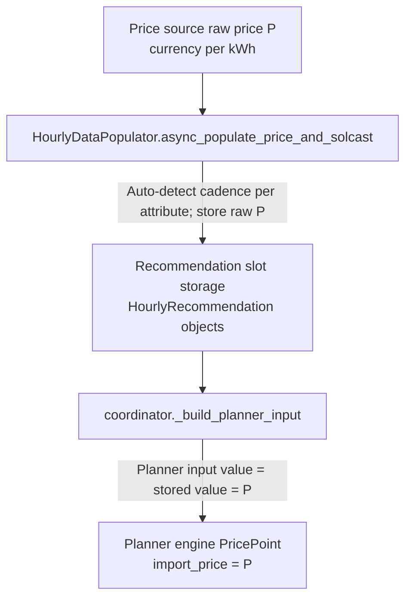

# HSEM Price Interval Semantics and Scaling

This document explains how HSEM handles the interaction between electricity price
update intervals and planning slot widths.

---

## The problem

HSEM supports two independent interval settings:

| Setting | Values | What it controls |
|---|---|---|
| `electricity_price_update_interval` | 15, 30, or 60 minutes | How often the price source publishes records |
| `recommendation_interval_minutes` | 15 or 60 minutes | The width of each planning slot |

HSEM auto-detects the cadence of each price attribute array independently from
its timestamps. When these differ (most commonly: a 60 min forecast sensor and
15 min recommendation slots), the raw rate is passed through unchanged and the
planner always sees the full currency/kWh value.

---

## The current contract

| Source cadence | Slot width | Effect |
|---|---|---|---|
| 60 min | 15 min | Hourly price fans out to all four slots, unchanged |
| 15 min | 15 min | Each slot keeps its own raw price, unchanged |
| 30 min | 15 min | Each half-hour price fans out to two slots, unchanged |
| 60 min | 60 min | One hourly price per slot, unchanged |

---

## Scaling pipeline

```mermaid
flowchart TD
    A[Price source raw price P\ncurrency per kWh]
    B[HourlyDataPopulator.async_populate_price_and_solcast]
    C[Recommendation slot storage\nHourlyRecommendation objects]
    D[coordinator._build_planner_input]
    E[Planner engine PricePoint\nimport_price = P]

    A --> B
    B -->|Auto-detect cadence per attribute; store raw P| C
    C --> D
    D -->|Planner input value = stored value = P| E
```

### What this is NOT

- prices are rates, not energy
- cadence detection is based on timestamps, not config labels

---

## Price sources

HSEM is provider-agnostic. Prices are read from generic electricity price sensors:

| Config key | Purpose |
|---|---|
| `hsem_import_electricity_price_sensor` | Live import price (required) |
| `hsem_export_electricity_price_sensor` | Live export price (required) |
| `hsem_import_electricity_price_forecast_sensor` | Optional dedicated import forecast (e.g. Amber Electric) |
| `hsem_export_electricity_price_forecast_sensor` | Optional dedicated export forecast |

Supported providers include Energi Data Service, Nordpool, Amber Electric, and any
sensor that publishes hourly (or sub-hourly) price records with a `raw_today` /
`raw_tomorrow` attribute structure. The populator reads the full time-series from
sensor attributes, detects each attribute's cadence independently, and projects
the raw values onto the planning horizon.

---

## Invariants

For any configuration:

1. A 60-min price source value of `P` must reach the planner as `P` (not `P/4`
   or `P*4`)
2. A 15-min price source value of `P` must reach the planner as `P`
3. Intermediate per-slot stored values must equal the raw price `P`
4. Changing `electricity_price_update_interval` must not change the price seen
   by the planner engine when the source timestamps are the same
5. Negative prices must survive the full pipeline unchanged (no absolute-value
   clipping, no zero-flooring)

---

## Multi-day price data

For horizons beyond 24 hours, prices and PV data are projected onto the shared
time-series index per calendar day:

| Field | Source | Day offset |
|---|---|---|
| Today's prices | Live price sensor attributes | `day_offset = 0` |
| Tomorrow's prices | Tomorrow sensor attributes (or same sensor) | `day_offset = 1` |
| Day+2 prices | Day+2 sensor attributes (if available) | `day_offset = 2` |

Missing future-day data is surfaced in `DataQuality` as:
- `tomorrow_price_missing_hours`
- `day2_price_missing_hours`
- `tomorrow_pv_missing_hours`
- `day2_pv_missing_hours`

Non-critical missing data triggers `Degraded` mode (writes allowed).
