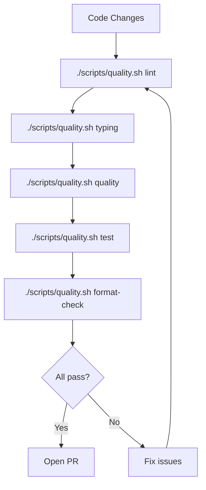

# HSEM Static Quality Checks

This document describes the static quality tools available in HSEM and how to run them locally.

---

## Tools

| Tool        | Purpose                                        | Config                       |
| ----------- | ---------------------------------------------- | ---------------------------- |
| **Pyright** | Type checking (CI-friendly Pylance equivalent) | `pyrightconfig.json`         |
| **Vulture** | Dead-code and unused-symbol detection          | `vulture_whitelist.py`       |
| **mypy**    | Type checking                                  | `pyproject.toml [tool.mypy]` |
| **ruff**    | Linting and formatting                         | `pyproject.toml [tool.ruff]` |

---

## Local Commands

### Run all lint/format checks (ruff + prettier)

```bash
./scripts/quality.sh lint
```

This runs ruff format, ruff check, and prettier (markdown/YAML/JSON). Must pass before a PR
can be opened.

### Verify formatting and lint without writing (CI mode)

```bash
./scripts/quality.sh format-check
```

The non-mutating counterpart of `lint`: `ruff format --check`, `ruff check`
(no `--fix`) and prettier `--check`. It never touches the tree, so a violation
fails instead of being quietly repaired.

This is the target that actually gates formatting and lint in CI. `lint` and
`all` both _fix_ in place, which means that in an ephemeral CI container they
can never fail on anything auto-fixable — the fix is applied, the tree is
discarded, and the run goes green. `format-check` is what the GitHub Actions
workflow calls, and the pinned prettier version and every invocation live only
in `scripts/quality.sh`, so CI, the pre-commit hook and a local run cannot
drift apart.

### Run mypy type checking

```bash
./scripts/quality.sh typing
```

### Run Pyright type checker

```bash
python -m pyright
```

This reads `pyrightconfig.json` and checks `custom_components/hsem` and `tests/`.

### Run Vulture dead-code detector

```bash
python -m vulture custom_components/hsem tests vulture_whitelist.py --min-confidence 80
```

The `vulture_whitelist.py` file suppresses false positives for Home Assistant lifecycle
methods (e.g. `async_setup_entry`, config flow steps) that Vulture would otherwise flag as
unused because they are called dynamically by HA.

### Run all quality checks (Pyright + Vulture)

```bash
./scripts/quality.sh quality
```

### Run tests with coverage

```bash
./scripts/quality.sh test
```

This runs `pytest` with coverage reporting.

### QA pipeline quick reference



---

## Pyright Configuration

`pyrightconfig.json` is set to `typeCheckingMode: "basic"` — a safe starting point for an
HA integration that uses many dynamic patterns. Do **not** upgrade to `strict` mode without
first resolving the known false-positive list.

### Severity levels

| Rule                               | Level | Reason                                               |
| ---------------------------------- | ----- | ---------------------------------------------------- |
| `reportMissingTypeStubs`           | none  | HA stubs are incomplete                              |
| `reportUnknownMemberType`          | none  | HA uses `Any` extensively                            |
| `reportUnknownVariableType`        | none  | HA uses `Any` extensively                            |
| `reportUnknownArgumentType`        | none  | HA uses `Any` extensively                            |
| `reportTypedDictNotRequiredAccess` | none  | HA flow results use TypedDict with all-optional keys |

### Known remaining warnings (~156 total)

Most remaining warnings fall into two categories that are **HA framework limitations**,
not bugs in HSEM:

1. **`CoordinatorEntity` generic invariance** (~38 warnings in `custom_sensors/*.py`):
   All HSEM sensors inherit from `CoordinatorEntity[HSEMDataUpdateCoordinator]` but HA's
   generic `CoordinatorEntity[DataUpdateCoordinator[dict[str, Any]]]` is invariant.
   These are safe at runtime; the correct fix is to wait for HA to widen the generic.

2. **Test mock patterns** (~100 warnings in `tests/`):
   Tests use partial mocks, `MagicMock`, and stub objects that don't have full type
   annotations. These are safe and intentional.

---

## Vulture Whitelist

`vulture_whitelist.py` documents all HA dynamic entry points. **Before deleting any function
that Vulture flags**, check whether it belongs to one of these categories:

- HA integration lifecycle: `async_setup_entry`, `async_unload_entry`, `async_migrate_entry`
- Config/options flow steps: `async_step_user`, `async_step_init`, etc.
- Diagnostics: `async_get_config_entry_diagnostics`
- Platform setup: `async_setup_entry` in `sensor.py`, `select.py`, `switch.py`, `time.py`
- Entity properties used by HA: `device_info`, `native_value`, `is_on`, etc.

If in doubt, **add to the whitelist** rather than deleting.

---

## CI Integration

`.github/workflows/lint-and-test.yml` runs the checks in two jobs:

- **`validate`** calls `./scripts/quality.sh format-check`, which verifies
  `ruff format`, `ruff check` and prettier without writing. This is what gates
  formatting and lint — `lint` and `all` fix in place, so in an ephemeral CI
  container they cannot fail on anything auto-fixable.
- **`quality`** runs `./scripts/quality.sh all` in the devcontainer, covering
  typing (mypy), static quality (pyright + vulture), translations and the test
  suite with its per-module coverage floor.

Nothing is set to `continue-on-error`; every check blocks the job on failure.

**Known gap:** `main` has no branch protection, so no check is _required_ to
merge. A failing check shows red on the PR and blocks anyone following the
documented workflow, but auto-merge (e.g. Dependabot) can still merge past it.
Making the `validate` and `quality` jobs required status checks would close
that loop.
